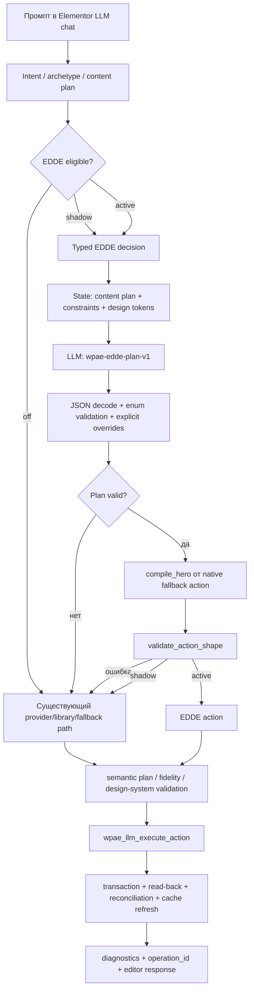

# WP AI Executor — полный handoff-отчёт по архитектурным изменениям

Дата отчёта: 2026-09-21 04:13:33 +05 (Asia/Almaty)

Репозиторий: `/Users/diasmazhenov/vibecode/wp-ai-executor`

Ветка: `main`

Последний кодовый commit: `6d0d3e60e2ca075f2a59352004b0bf246a93747e`

Последовательность архитектурных commit-ов: `e549f64` → `4751210` → `a1cb55f` → `6d0d3e6`.

## 1. Результат этапа

В WP AI Executor введён ограниченный **Elementor Design Decision Engine (EDDE)**. Он отделяет принятие визуального решения от генерации Elementor-дерева:

1. LLM принимает только bounded typed plan по версии схемы `wpae-edde-plan-v1`.
2. Сервер проверяет план, отбрасывает неизвестные поля и принудительно применяет ограничения из исходного запроса пользователя.
3. Typed plan компилируется в уже существующую native Elementor fallback-композицию.
4. Получившееся native action проходит существующую shape/content-fidelity/transaction-проверку.
5. Запись, read-back, editor reconciliation, rollback и render-cache refresh остаются в общем `wpae_llm_execute_action()` pipeline.

Таким образом, провайдер больше не является владельцем произвольного Elementor JSON. Он выбирает небольшое число разрешённых решений, а структура, безопасность и запись остаются за плагином.

Область EDDE намеренно ограничена hero vertical slice. Pricing, process, targeted edits, Vision repair/regenerate и существующие transaction-контракты используют прежние маршруты.

## 2. Почему понадобилось изменение

До EDDE один provider composition мог одновременно определять:

- смысловую иерархию;
- структуру контейнеров и виджетов;
- ширины колонок;
- цветовые ключи Elementor;
- responsive settings;
- CTA и вспомогательную visual zone.

Это смешивало решение о дизайне с сериализацией Elementor. Валидный JSON мог быть синтаксически корректным, но потерять обязательный текст, слить две CTA, выбрать неправильный widget type или превратить visual panel в повтор надзаголовка. При недоступном `openrouter/free` fallback также должен был самостоятельно сохранять весь пользовательский контент.

Новая граница решает эту проблему минимальным изменением: LLM выбирает только typed decisions, а native builder и write boundary остаются едиными для provider, EDDE и deterministic fallback.

## 3. Хронология введения изменений

| Commit | Изменение | Архитектурный смысл |
|---|---|---|
| `e549f64` | `Add feature-flagged EDDE hero decisions` | Добавлены schema/state/decoder/decision/compiler, настройка режимов и интеграция в chat pipeline. |
| `706838f` | Обновлена handoff-контекстная запись | Зафиксированы границы EDDE и текущая live-проверка. |
| `4751210` | `Preserve natural hero copy in active generation` | Active path сохраняет естественные тексты hero и не подменяет их техническим prompt. |
| `a1cb55f` | `Use explicit hero eyebrow as badge` | Явный надзаголовок стал единственным root-level badge. |
| `6d0d3e6` | `Fix hero fallback visual panel and ownership` | Visual zone переведена на native icon, брендовый заголовок сделан нейтральным, generated roots получают ownership marker после rekey. |

## 4. Новая архитектурная схема



Главный инвариант: ни один новый EDDE слой не пишет напрямую в WordPress meta и не обходится вокруг Elementor transaction boundary.

## 5. EDDE: контракты и компоненты

### 5.1. Typed plan

`includes/llm/decision-engine.php` содержит схему `WPAE_LLM_DESIGN_ENGINE_SCHEMA = 'wpae-edde-plan-v1'`.

Разрешённые поля:

| Поле | Разрешённые значения |
|---|---|
| `schema` | `wpae-edde-plan-v1` |
| `archetype` | `hero` |
| `composition` | `split_60_40`, `split_50_50`, `split_40_60`, `stacked_left` |
| `content_alignment` | `left`, `center`, `right` |
| `vertical_alignment` | `start`, `center` |
| `spacing_rhythm` | `compact`, `balanced`, `spacious` |
| `surface` | `minimal`, `soft_panel`, `outlined` |
| `typography` | `display`, `neutral` |
| `cta_hierarchy` | `single_primary`, `primary_secondary` |
| `responsive_strategy` | `copy_first_stack` |

Провайдеру запрещено возвращать Elementor JSON, CSS, произвольные цвета, `confidence` и пояснения. Decoder отклоняет неизвестные ключи, отсутствующие поля, значения вне enum и неверный schema/archetype.

Отдельная state-схема `wpae-edde-state-v1` передаёт decision stage только необходимый контекст:

- выбранный archetype и content plan;
- required/content slots и CTA contract;
- ограничения, извлечённые из запроса;
- идентификатор и ключи активной design system;
- наличие post и число выбранных элементов;
- имя провайдера и модели.

Полный Elementor snapshot и секреты в EDDE prompt не передаются.

### 5.2. Explicit constraints

`wpae_llm_design_engine_explicit_constraints()` извлекает из естественного языка только поддержанные ограничения: пропорции `60/40`, `40/60`, `50/50`, stack, выравнивание, spacing, outlined/soft panel/minimal, display/neutral и иерархию CTA.

Ограничения пользователя имеют приоритет над планом провайдера. Decoder возвращает список `explicit_overrides`, поэтому diagnostics показывает, какое решение было исправлено сервером. Например, план `split_40_60` принудительно становится `split_60_40`, если это явно написано в запросе.

Регулярные выражения для alignment ограничены словами о тексте/контенте/выравнивании. Поэтому фраза о visual panel справа не ошибочно превращается в `content_alignment=right`.

### 5.3. Decision stage

`wpae_llm_design_engine_decide()`:

- запускается только для нового action hero с post ID;
- не запускается для targeted edit, Vision repair или Vision regenerate;
- использует `temperature=0`, JSON response format и максимум 700 completion tokens;
- работает с общей provider transport-политикой, HTTPS и ограниченным deadline 25 секунд;
- возвращает bounded trace с `calls`, `max_calls`, `status`, `reason`, plan и overrides;
- при недоступном runtime, HTTP-ошибке, invalid JSON или invalid plan возвращает `ok=false`, после чего основной pipeline использует существующий маршрут.

EDDE не создаёт бесконечных retry-циклов и не считает факт ответа провайдера доказательством успешной записи.

### 5.4. Native compiler

`wpae_llm_design_engine_compile_hero()` получает проверенный plan и результат `wpae_llm_build_fallback_action()`.

Компилятор меняет только native settings:

- `split_60_40`, `split_50_50`, `split_40_60` и `stacked_left` переводятся в desktop widths;
- mobile width для copy и visual zone всегда становится 100%, а shell — `column`;
- `compact`, `balanced`, `spacious` переводятся в rem-based gaps;
- `start/center` задают native flex alignment;
- `minimal`, `soft_panel`, `outlined` задают native background/border settings;
- `display` и `neutral` задают responsive typography;
- второй button при `primary_secondary` получает transparent background и native hover/text colors;
- явно указанный в prompt hex-фон имеет приоритет над preset surface.

План `40/60` в тесте сохраняется как `38.4%/57.6%` внутри существующего 96%-го layout budget; это не потеря пропорции, а применение plan к реальному native shell.

После компиляции action проходит `wpae_llm_validate_action_shape()`. Только валидный action допускается до общего semantic/fidelity/write слоя.

## 6. Режимы rollout

Новая настройка хранится в уже существующей `WPAE_LLM_SETTINGS_OPTION`. Отсутствующее или неизвестное значение нормализуется в `off`.

| Режим | Decision call | Кто строит action | Кто пишет | Назначение |
|---|---:|---|---|---|
| `off` | нет | Существующий provider/library/fallback path | Существующий executor | Безопасное значение по умолчанию и полная обратная совместимость. |
| `shadow` | да | Существующий provider path | Существующий executor | Сравнение EDDE decision в diagnostics без изменения результата. |
| `active` | да | EDDE compiler поверх native fallback | Существующий executor | Ограниченный hero vertical slice. |

В админке добавлен select `Design Decision Engine` с тремя режимами. Подпись прямо сообщает, что pricing, process и targeted edits остаются на прежних контрактах.

Shadow-проверка подтверждает: при двух provider calls выполняется только одна запись, а `diagnostics.action_path` остаётся `provider`. Active-проверка подтверждает: `action_path=edde`, decision trace успешен, и запись идёт через тот же executor.

## 7. Изменения fallback и ownership

### 7.1. Hero copy и visual zone

Последний fix в `6d0d3e6` устраняет визуальное дублирование:

- явный надзаголовок `АРХИТЕКТУРА ПОВСЕДНЕВНОСТИ` остаётся одной root-level badge;
- бренд `Тихая форма` получает нейтральный цвет `#514b42`, чтобы не конкурировать с акцентом;
- правая outlined visual zone больше не повторяет надзаголовок heading-виджетом;
- вместо него используется native Elementor `icon` widget `fas fa-building`, `#a84c36`, `4rem`, centered;
- обе CTA остаются отдельными native Button widgets со ссылками `#contact` и `#projects`;
- mobile shell остаётся вертикальным stack.

### 7.2. Ownership marker

Общий `wpae_llm_execute_action()` после rekey Elementor IDs добавляет каждому новому top-level container:

- `wpae-generated-root`;
- `wpae-generated-<archetype>`, например `wpae-generated-hero`.

Существующие классы сохраняются, дубликаты удаляются. Маркер используется operation-owned cleanup, editor reconciliation, Vision replacement и rollback-контролями. Это предотвращает удаление чужих или пользовательских roots при восстановлении.

## 8. Diagnostics и границы утечки данных

Generation response расширен bounded diagnostics:

- `action_path`: `edde`, `provider`, `library`, `repair` или `fallback`;
- `design_engine` trace со схемой, режимом, status/reason, model/provider, calls, plan, overrides и compile stats;
- `design_engine_active` в final validation;
- `response_type=design_engine` и schema marker для active path;
- execution status, operation ID, blocking checks и безопасные failure details.

Diagnostics не возвращает полный Elementor tree, raw provider payload, API key или auth headers. В ответ попадают только типизированные counters, sanitized reasons и bounded provider metadata.

Существующие security boundaries сохранены:

- LLM permission проверяет `llm_chat`, `edit_posts` и `edit_post` для каждого post ID;
- custom base URL допускается только по HTTPS и без user/pass/query/fragment;
- API key расшифровывается только для runtime request и хранится зашифрованным в options;
- provider request использует существующие timeout/size/rate-limit/deadline ограничения;
- write boundary по-прежнему подтверждает before-state, metadata, read-back и rollback conflict;
- ни одна новая настройка не позволяет EDDE писать напрямую в `_elementor_data` в обход transaction API.

## 9. Изменённые файлы

| Файл | Роль |
|---|---|
| `includes/llm/decision-engine.php` | Новая изолированная реализация EDDE: mode, schema, state, constraints, prompt, decoder, decision stage и native compiler. |
| `includes/llm/llm.php` | Подключение EDDE, eligibility gate, compile/shape validation, active/shadow routing, diagnostics и ownership marker в общем executor. |
| `includes/llm/transport.php` | Чтение/сохранение `design_engine_mode` с allow-list и default `off`. |
| `includes/admin/dashboard.php` | Админский select `off/shadow/active` и объяснение scope. |
| `tests/flex-generation-runtime.php` | Runtime-проверки schema, overrides, unknown fields, active write boundary, 40/60, outlined surface, shadow compatibility, hero badge/icon и ownership. |
| `tests/llm-chat-contract.test.js` | Контрактные проверки наличия EDDE schema/functions, settings field и active execution call. |
| `wpae-package.json` | SHA-256 manifest для `decision-engine.php` и обновлённых runtime files. |

Не изменялись контракты pricing/process/targeted edit, существующие Elementor transactions, design-system token map, authorization и Vision security contracts.

## 10. Live-приёмка на существующей странице 5214

Все live-операции после правила single-page выполнялись на одной существующей странице:

- post ID: `5214`;
- title: `Pricing Contract Live v123`;
- редактор: Elementor;
- новые WordPress pages для этой проверки не создавались;
- существующий pricing content сохранён.

Использованный brief:

```text
Создай на пустой странице hero-блок для архитектурной студии «Тихая форма». Используй эти точные тексты: надзаголовок «АРХИТЕКТУРА ПОВСЕДНЕВНОСТИ», заголовок «Пространство для вашей жизни», описание «Проектируем спокойные, светлые интерьеры с вниманием к каждой детали». Основная кнопка «Обсудить проект» со ссылкой #contact; вторичная «Смотреть проекты» со ссылкой #projects. Сделай композицию 40/60 (текст слева, визуальная зона справа), выравнивание по центру, outlined surface, ритм spacing 3, крупная типографика, на мобильном сложи в одну колонку, фон #F6F0E6. Это новая hero-секция, не редактирование существующих элементов.
```

Зафиксированы операции:

| Операция | Результат |
|---|---|
| `wpae-20260920231834-df9c9118` | Первичная active generation, HTTP 200, существующий root сохранён. |
| `wpae-20260920232047-1597f6e0` | Ограниченный repair/fallback после content/render проверки, HTTP 200, hero записан через общий executor. |

DOM Elementor после записи содержит:

- `АРХИТЕКТУРА ПОВСЕДНЕВНОСТИ` ровно один раз;
- `Тихая форма`;
- `Пространство для вашей жизни`;
- `Проектируем спокойные, светлые интерьеры с вниманием к каждой детали`;
- link `Обсудить проект` → `#contact`;
- link `Смотреть проекты` → `#projects`;
- native icon glyph `` в `.wpae-hero-visual-icon`.

Свежие screenshots были сняты в Elementor для desktop и mobile. На mobile подтверждены badge, heading, description, обе CTA и отдельная visual zone в одной колонке; icon wrapper имеет видимую геометрию `64×70`, `display:block`, `visibility:visible`.

После repair endpoint AI Vision временно не вернул новый capture. Поэтому итоговая live-приёмка зафиксирована честно как manual DOM/render acceptance по свежим desktop/mobile screenshots; автоматический Vision score после repair не объявляется успешным.

## 11. Локальная верификация

Последняя проверка текущего HEAD дала:

```text
php -l includes/llm/llm.php
No syntax errors detected

php -l includes/llm/decision-engine.php
No syntax errors detected

php -l tests/flex-generation-runtime.php
No syntax errors detected

php tests/flex-generation-runtime.php
flex generation runtime: 310 checks OK

node --test tests/llm-chat-contract.test.js
llm chat contract: OK

node --test tests/flex-generation-runtime.test.js tests/vision-security-contract.test.js
flex generation runtime: 310 checks OK
vision security contract: OK

wpae-package.json hash audit
package hashes OK

git diff --check
pass
```

Особые EDDE regression checks:

- unknown `confidence` field отклоняется;
- explicit composition constraint переопределяет provider plan;
- visual panel справа не меняет copy alignment;
- explicit background `#123456` не заменяется preset color;
- active path делает одну bounded decision call и одну запись;
- shadow path не меняет provider write route;
- native 40/60, center alignment, outlined border и mobile stack сохраняются;
- hero badge не дублируется, visual icon — native widget;
- generated root получает ownership marker.

## 12. Packaging, push и текущий статус

- `wpae-package.json` обновлён и проверен по SHA-256.
- `6d0d3e6` pushed в `origin/main`.
- Время commit: `2026-09-21 04:13:33 +05`.
- Установленная live-линейка остаётся `v02.11.123`; EDDE включается настройкой, а не отдельным плагином или отдельной страницей.
- Исторические untracked reports, `.DS_Store`, `.codex/`, `.openchamber/`, `docs/`, `graphify-out/` и lock-файлы в commit не добавлялись.

## 13. Rollout и rollback

Безопасный rollout:

1. Оставить `design_engine_mode=off` для обычной эксплуатации.
2. Включить `shadow` на существующей странице и сравнивать `design_engine` diagnostics с текущим provider result.
3. Включать `active` только для hero prompts с подтверждёнными exact copy, CTA и desktop/mobile screenshots.
4. После live generation проверять operation ID, selected/rendered DOM и свежие screenshots на той же странице.

Rollback не требует удаления страниц или изменения Elementor content:

- переключить mode обратно в `off`;
- при необходимости выполнить существующий operation rollback по operation ID;
- при code rollback вернуться на commit до `e549f64` или выбрать предыдущий tag/commit из Git;
- отсутствие `design_engine_mode` после downgrade безопасно трактуется как `off`.

## 14. Ограничения и следующий этап

1. EDDE сейчас поддерживает только hero. Расширение на pricing/process должно начинаться с отдельных typed schemas и отдельных compilers; нельзя расширять hero enum до универсального Elementor DSL.
2. Финальный AI Vision capture после repair в текущем live run недоступен. Manual DOM/render evidence есть, но новый автоматический score нужно получить в отдельном запуске на той же странице.
3. Screenshot bytes доступны для in-session review, однако локальная gallery из CUA не создаётся автоматически. Для долгосрочного handoff нужны writable screenshot artifacts либо штатный artifact export.
4. Не следует включать active для targeted edits, Vision repair/regenerate и process/pricing, пока для них не появятся отдельные typed contracts и regression matrix.
5. Текущее состояние `context.md` содержит историческую формулировку о pending active acceptance; этот отчёт фиксирует более поздний live run на post 5214 и является актуальной handoff-записью для commit `6d0d3e6`.

## 15. Итог

Архитектурное изменение введено без второго write path и без обхода существующей защиты. EDDE ограничивает LLM ролью bounded design decision, сохраняет пользовательские constraints, компилирует решение в native Flexbox/Widget tree и передаёт результат в проверенный executor. Последний fallback fix устраняет дублирование hero-копии и добавляет operation ownership marker, а 310 PHP checks и Node contract/security suites подтверждают локальную целостность.

Практическая граница релиза: active EDDE готов для hero vertical slice на существующей странице 5214 с ручной screenshot/DOM-приёмкой; pricing/process/targeted edits остаются на стабильных прежних маршрутах.
