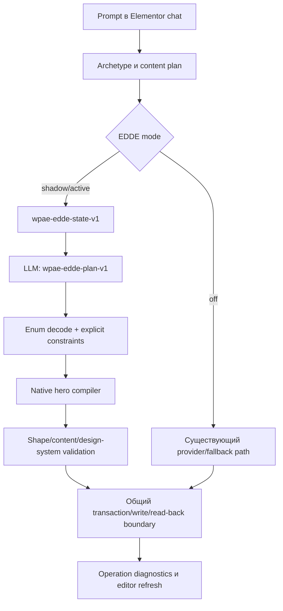

# WP AI Executor — отчёт о введении архитектурных изменений

Дата: 2026-09-21, Asia/Almaty
Репозиторий: `/Users/diasmazhenov/vibecode/wp-ai-executor`
Ветка: `main`
Кодовый commit: `511dbd0af26347c6ec1b500f9b2e3a015c205cba`
Push: `origin/main`, 2026-09-21 05:42:35 +05
Целевая страница: WordPress/Elementor `post=5214`; новые страницы не создавались.

## 1. Что изменено

В плагине введён ограниченный Elementor Design Decision Engine (EDDE) для hero-блоков. EDDE принимает от LLM только типизированное визуальное решение, а нативную структуру Elementor, валидацию, запись и восстановление оставляет существующему pipeline.

Поток теперь выглядит так:

Главный инвариант: EDDE не пишет `_elementor_data` напрямую, не передаёт провайдеру полный произвольный Elementor JSON и не обходит `wpae_llm_execute_action()`.

## 2. Типизированный контракт EDDE

Схема `wpae-edde-plan-v1` в `includes/llm/decision-engine.php` разрешает только:

| Поле | Значения |
|---|---|
| `schema` | `wpae-edde-plan-v1` |
| `archetype` | `hero` |
| `composition` | `split_60_40`, `split_50_50`, `split_40_60`, `stacked_left` |
| `content_alignment` | `left`, `center`, `right` |
| `vertical_alignment` | `start`, `center` |
| `spacing_rhythm` | `compact`, `balanced`, `spacious` |
| `surface` | `minimal`, `soft_panel`, `outlined` |
| `typography` | `display`, `neutral` |
| `cta_hierarchy` | `single_primary`, `primary_secondary` |
| `responsive_strategy` | `copy_first_stack` |

Decoder отклоняет неизвестные поля, пропущенные поля, значения вне enum, неверный schema и неверный archetype. `confidence`, CSS, цвета, пояснения и Elementor JSON не входят в контракт.

Состояние decision stage (`wpae-edde-state-v1`) содержит только archetype, content plan, обязательные content slots/CTA, explicit constraints, design-system identifiers, редакторский контекст и provider/model. Секреты и полный snapshot страницы в EDDE prompt не передаются.

## 3. Исправление Vision regeneration

До этого этапа Vision regeneration при низкой визуальной оценке откатывал action и собирал обычный fallback. Такой fallback имел фиксированное соотношение `58/38`, поэтому терял явное требование пользователя `40/60` или `60/40`, а также часть surface/alignment решений.

В `includes/llm/llm.php` ветка regeneration теперь:

1. строит fallback тем же существующим builder-ом;
2. создаёт bounded hero plan с безопасными defaults;
3. накладывает `wpae_llm_design_engine_explicit_constraints($message)`;
4. повторно компилирует fallback через `wpae_llm_design_engine_compile_hero()`;
5. сохраняет план в diagnostics как `vision_regenerate_design_plan`;
6. продолжает через прежние fidelity, design-system, transaction, read-back и editor-refresh проверки.

Это устраняет расхождение между первым EDDE action и fallback после Vision, не создавая отдельный архитектурный write path.

В `includes/llm/decision-engine.php` исправлено распознавание alignment. Граница регулярного выражения теперь останавливается на запятых, точках с запятой и переводах строк. Фраза `текст слева, визуальная зона справа` даёт `content_alignment=left`; отдельное положение visual zone справа больше не ошибочно означает выравнивание текста справа.

## 4. Остальные изменения релиза

| Файл | Изменение |
|---|---|
| `includes/llm/llm.php` | Constraint-preserving Vision regeneration через EDDE compiler. |
| `includes/llm/decision-engine.php` | Точная граница alignment parser для текста и visual zone. |
| `tests/flex-generation-runtime.php` | Regression для `40/60 + text left + visual right`, explicit background/mobile stack и Vision regeneration. |
| `tests/llm-chat-contract.test.js` | Контракт версии `v02.11.124`. |
| `wp-ai-executor.php` | Версия плагина `v02.11.124` в header и `WPAE_VERSION`. |
| `wpae-package.json` | Пересчитаны SHA-256 для изменённых runtime-файлов; всего 80 файлов. |
| `context.md` | Актуальное состояние source/live и границы доказательств; единственный canonical context. |

## 5. Локальная проверка

| Проверка | Результат |
|---|---|
| `php -l includes/llm/llm.php` | PASS |
| `php -l includes/llm/decision-engine.php` | PASS |
| `php -l wp-ai-executor.php` | PASS |
| `php tests/flex-generation-runtime.php` | PASS — `313 checks OK` |
| `node --test tests/llm-chat-contract.test.js tests/flex-generation-runtime.test.js tests/vision-security-contract.test.js` | PASS — 3 suites |
| Direct SHA-256 verification against `wpae-package.json` | PASS — 80 files |
| `git diff --check` | PASS |
| `php docs/audits/2026-09-12/package-probe.php` | НЕ ЗАСЧИТАН: untracked historical fixture failed its own unsafe-path assertion at line 92; runtime files and direct manifest verification passed. |
| `git commit` / `git push origin main` | PASS — `511dbd0` pushed to `main`. |

## 6. Live evidence on the single existing page

Live editor URL during this этап: `https://mazhenov.kz/wp-admin/post.php?post=5214&action=elementor`.

The editor header and chat showed live `v02.11.123`, provider `openrouter/free`, and EDDE diagnostics with `mode=active` and `action_path=edde`. The earlier pre-fix generation on the same page produced:

- initial EDDE operation `wpae-20260921003314-b7099337`;
- typed plan with `composition=split_40_60`, but the old parser reported `content_alignment=right`;
- initial content validation `requested_count=6`, `matched_count=6`, no missing slots;
- Vision score `68`, which triggered regeneration;
- regeneration operation `wpae-20260921003459-e0d55742`, Vision score `88`;
- generated fallback geometry `58/38` and generic visual surface, proving the defect that this release fixes.

The existing pricing root `86b0aea` remained visible with the exact saved content and links:

- `Старт` — `от 50 000 ₸` — `#start`;
- `Проект` — `от 150 000 ₸` — `#project`;
- `Поддержка` — `от 80 000 ₸/мес` — `#support`.

After the latest editor reload, the current `ElementorConfig.initial_document` read-back exposed one saved pricing root. The old hero history remained visible in the editor overlay, but it is not counted as a v02.11.124 server read-back.

No new WordPress page was created. All actions stayed on `post=5214`.

## 7. Deployment status

Source deployment is complete: commit `511dbd0` is on `origin/main`.

Live plugin deployment is **BLOCKED**. The existing in-app browser tab continued to show `v02.11.123` after reload. Direct attempts to open the WordPress plugins screen, the non-Elementor editor URL, and plugin settings were rejected by the browser with `net::ERR_ABORTED`. The Elementor menu’s `Выход в WordPress` action did not navigate, and no second tab or page was opened in accordance with the one-page instruction.

Therefore this report does not claim that `v02.11.124` is installed, and it does not claim that a fresh fixed-code EDDE render was saved.

## 8. Acceptance matrix

| Сценарий | Статус | Evidence boundary |
|---|---|---|
| EDDE active mode reported by live diagnostics | PASS (old live v123) | `mode=active`, `action_path=edde` visible in existing chat diagnostics. |
| Fixed source compiles explicit 40/60 | PASS local | Runtime regression and compiler assertions; live v124 not installed. |
| Fixed source compiles independent 60/40 | NOT RUN as a dedicated regression | The enum/compiler path supports it, but no dedicated 60/40 assertion or live generation was run. |
| 40/60 live save/reload/render on v02.11.124 | NOT RUN | Current live remains v02.11.123. |
| Independent 60/40 live save/reload/render | NOT RUN | Current live remains v02.11.123. |
| Exact hero text and CTA links on prior v123 run | PASS for prior run | DOM/chat showed exact six requested slots and `#contact/#projects`; prior fallback geometry was wrong. |
| Pricing preservation on post=5214 | PASS for existing saved pricing root | Root `86b0aea`, three cards and exact links remained present. |
| Desktop/mobile fresh screenshots for fixed release | BLOCKED | CUA returned screenshot bytes without a filesystem path. |
| Screenshot export/gallery | BLOCKED | `targetPageTab.content.export()` returned exact error: `Codex in-app browser does not support command "tab_content_export"`. |
| Vision incomplete-capture A/B scenarios | NOT RUN | No fresh fixed-code run was available. |
| Unsaved neighboring pricing edit safety scenario | NOT RUN | No additional page or destructive neighboring edit was introduced. |

## 9. Screenshot evidence

No downloadable screenshot paths are reported. The CUA session produced inline visual observations only; `targetPageTab.screenshot()` returned `Uint8Array` bytes without a path, and content export was rejected as recorded above. The screenshot gallery is therefore `BLOCKED`, not silently treated as complete.

## 10. Final state

- Source: `v02.11.124`, commit `511dbd0`, pushed.
- Live: `v02.11.123`, one existing Elementor tab on `post=5214`.
- EDDE scope: hero only; pricing/process architecture unchanged.
- Existing pricing content preserved in the current page evidence.
- Fresh fixed-code live acceptance and screenshot files remain unproven because the browser could not reach the WordPress update screen.
