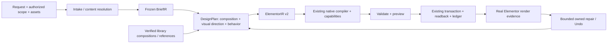

# Миграция генератора дизайна целиком

Дата source-аудита: 2026-10-04, Asia/Almaty. Baseline: `main`, HEAD `d9f6639516ae76af632bab8fb1dc8e3c1fea8b2d`; runtime commit `ae4f175b33458271822d0fc6cbcab29bd29ba396`; source `v02.11.244` (header и `WPAE_VERSION` в `wp-ai-executor.php`). До аудита tracked tree чистый; 776 untracked-файлов по `git ls-files --others --exclude-standard`, включая содержимое каталогов, сохранены. Этот документ — проверенная карта source и предлагаемый план, не новая реализация и не live acceptance.

## 1. Главный вывод и границы доказательств

Переиспользовать BriefIR → DesignPlan → ElementorIR v2 → существующий native compiler → preview/transaction/readback. Устранить повторные решения до и после compiler; распространить typed composition/slot contracts на разные семейства, сохранив специализированные сущности и реальные interactive widgets. Новая DSL, второй compiler и постоянный параллельный генератор не нужны.

Services — частичная реализация этого направления: canonical groups, точные links/media refs и три recipe topology уже существуют. Это не универсальный intake, visual-direction selector или доказательство текущего render. [Services migration](services-generation-migration.md) сохраняет этапы и исторические evidence.

Подтверждено чтением определений и production callers в текущем HEAD:

1. **Повторная интерпретация.** `chat_request` сначала определяет action/family; для non-Services `content_plan` независимо разбирает message и Brief, а orchestration строит Brief/DesignPlan снова. Raw-message fallback, library adapter и CTA/media helpers могут снова извлекать содержание. Services передаёт canonical Brief большей части downstream, но до него остаётся classifier, а recipe decision повторяется при enrichment media (не при каждом запросе).
2. **Routing зависит от каталога.** `library_agent_eligible` исключает Services, но для остальных active families наличие candidates переключает `wpae_design_generation_route(..., true)` на `library_agent`. `library_only_archetype` значит отсутствие typed family в schema, а пользовательский library-only — другая policy. Каталог способен менять исполнителя дизайна без нового пользовательского решения.
3. **Фиктивные advertised variants.** `/elementor/compose` валидирует variant, но всегда берёт одно `recipe.elementor_data`; variant участвует в instance identity/rekey и response metadata. Ни topology, ни responsive, ни визуальное направление не выбираются по variant.
4. **Несколько visual/control owners.** Provider raw settings, template settings, EDDE Hero, fallback variant, токены, compiler и normalizers меняют пересекающиеся поля. Даже active compiled tree проходит generic normalization и финальный Process contract в execute. Компилятор сам заменяет низкоконтрастный muted token. Утверждение «validation только проверяет» пока неверно.
5. **Охват слоёв расходится.** Classifier catalog — 12 families плюс отдельное распознавание Services (13 в совокупности); typed DesignPlan — 9; compiler registry — container плюс 8 widgets. Forms, navigation, dynamic content и arbitrary carousel не становятся поддержанными из-за импортированного шаблона. Lifecycle хранит hashes/state, но не полный canonical Brief/Plan для воспроизводимого repair.

Source read-only аудит не запускал PHP/Node suites, provider calls, browser, WP writes, release или screenshots. Исторические v242 live observations и v244 install/readback отделены ниже. Исчезновение render post=5214 имеет **неустановленную причину** и не блокирует этот source-аудит. Graphify index найден (mtime 2026-09-01); bounded query использован только для навигации, его старые line numbers перепроверены по source. Graph не обновлялся и не включается в коммит.

## 2. Production source map: путь → вход → владелец → выход → write boundary

REST callbacks проверены в `includes/rest/routes.php`: `/llm/chat` → `wpae_llm_chat` → `wpae_llm_chat_request`; `/llm/undo` → `wpae_llm_undo`; `/design-operations/target` → target diagnostics; `/elementor/compose` → composer; `/elementor/update`, `/elementor/patch`, `/elementor/page` → page-update endpoints. Chat JS `assets/js/elementor-llm-chat.js` отправляет request context, sync/readback и review/repair; composer — отдельный API, не тождественен chat pipeline.

| Путь | Вход | Текущий владелец решения | Выход | Write boundary |
|---|---|---|---|---|
| Chat create/edit/repair intake | message, selected elements, post, flags, identity | `chat_request`, `is_action_request`, `is_targeted_edit_request`, replacement shape/guard | scope flags, family, target/revision | Пока no-write; conflicting append/edit и чужой replacement отклоняются |
| Family | message/intent head/labeled pairs | `detect_block_archetype`, `brief_ir_archetype`, content extractors | archetype; unknown/ambiguous | Классификация сама не даёт permission |
| Content/semantic plan | message; для Services переданный Brief | `content_plan`, extract requested/labeled content; `services_content_plan_from_brief` | pairs/counts/fidelity expectations | No-write; non-Services повторно парсит |
| Canonical Brief | source text + допустимый context | `brief_ir_parse` + validators; structured Services adapter opt-in | exact_text/spans, content refs/groups, links, constraints, media intent | No-write; structured adapter не вызывается автоматически production |
| Typed plan | Brief + post/recipe context | `design_plan_from_brief`, Services recipe decision/plan | sections/roles/items, composition/responsive/tokens/slot bindings | Active invalid plan отказывает до legacy write; shadow только диагностирует новый план |
| Retrieval/preflight | message/family + catalog | `block_library_retrieve_for_prompt`, `preflight_library_candidates` | максимум 3 adapted compatible candidates | Adapter/shape/fidelity/semantic checks до provider; preflight tree переиспользуется |
| Library agent | candidate keys + original prompt | provider выбора, `resolve_library_choice`, template adapter | адаптированное native tree, source diagnostics | `execute_action` → existing update transaction; abstain/no compatible — no-write |
| Active typed | validated Brief/Plan/LayoutReport | `elementor_ir_from_design_plan` → `native_elementor_compile` | native tree, compile report, deterministic operation IDs | execute preview → update → finalize/readback; replacement через owner guard |
| EDDE Hero | bounded model plan + legacy tree | `decision-engine.php` | ширины/direction/surface/type/CTA controls Hero | Далее legacy/shared execute; это не универсальный DesignPlan compiler |
| Legacy provider | prompt/runtime/editor context | `WPAE_LLM_Design::prompt`, transport/provider, action decode/repair | raw Elementor action/settings | shape/fidelity gates → execute; targeted edits идут patch branch |
| Legacy fallback | original message после invalid provider/repair или quality failure | `build_fallback_action` + extraction/variant helpers | новый deterministic native tree | fallback policy checks; затем shared execute. Routing metadata `fallback_allowed=false` не устраняет эту ветку |
| Normalization/visual grammar | tree, message, archetype, preserve flags | normalize.php, library geometry/type, CTA/media, bento/process helpers, token map | изменённые controls/content/layout | Chat/preflight/execute callers; не только проверка |
| Validation | Brief/Plan/IR/native data, runtime widgets, scope | validators, capabilities, preflight/design contract | refusal/report | No provider/write при hard failure; static LayoutReport не render |
| Preview/write | expected current tree, proposed delta, ownership context | `execute_action` / `execute_patch_action`, `page-update.php` | dry run, snapshot, append/replace/patch | Единственная сохраняемая transaction boundary |
| Save/readback | expected-before snapshot + expected-after + autosave/cache state | transactions `save`, `verify`, `finalize` | durable saved match/rollback/status | `_elementor_data` save/readback, optimistic conflict protection, cache refresh |
| Target/lifecycle | operation identity/post/root/revision/hash/fingerprint | operation ledger, editor root map, JS `targetedDesignReplacement` | unique eligible owner, refusal/reconcile | Нельзя вывести owner только из CSS class/root ID |
| Render/repair/Undo | scoped current revision, browser evidence/findings | editor sync + Vision/review handlers, patch/replacement guard, Undo | report, bounded repair либо guarded restore | Каждая новая запись через тот же update/patch/readback; repair не append |
| Composer/blueprint/library instantiate | explicit recipe/slots или imported record | compose.php, blueprint.php, block-library instantiate | native JSON или отдельная instantiation action | compose не сохраняет страницу; direct mutation endpoints не равны typed chat |

Определения с проверенными line anchors приведены в §11. Основные callers: `llm.php` строки 10893–11029 (classify/content/Brief/Plan), 11092–11124 (library switch/preflight), 11219–11220 (shadow compile), 11247–11296 (active compile/execute), 10385 (preflight adaptation), 11907/11942/11992/12116 (legacy fallback), 12055–12214 (visual normalization), 10503–10707 (execute/preview/write). Это карта путей, а не обещание, что все ветки работают на установленном сайте.

## 3. Coverage/capability matrix

«Планируется/компилируется» означает существующую source-ветку. «Запись условная» требует runtime availability, scope, fidelity, validation и transaction; это не runtime-подтверждение. Live-column — только исторические записи canonical reports, без нового прогона и без переноса PASS на v244.

| Класс | Распознаётся | Brief / typed DesignPlan | IR/compiler | Разрешено к записи | Elementor/live evidence |
|---|---|---|---|---|---|
| Hero/intro | Hero | exact copy/CTA/media; split/stack | copy/media/actions | Условно active; candidates могут перевести в library agent | Исторические editor/public кадры; v244 не принят |
| About/editorial | About | family есть в Brief detection; нет About в typed schema | generic split primitive существует для Hero/CTA, About recipe отсутствует | Library/legacy условно; typed About нет | v232 About generation/patch наблюдались; нет общей новой приёмки |
| Services | Services | canonical groups + три recipe | photo grid, selected lead split, icon rows | Active typed; mapped library-only только photo map | v242 три topology и content; mobile obstructed; v244 repair BLOCKED |
| Features/Benefits | Benefits aliases | paired feature title/body | feature cards icon/copy | Active/library условно | Исторические no-write preflight/plan отказы; нового PASS нет |
| Team | Team | person fields name/position/bio/media | native person cards | Условно | Исторические generation/отказы разных releases; v244 не принят |
| Testimonials | Testimonials | quote/author/meta/rating refs | native testimonial cards, не специальный testimonial widget | Условно | Исторические отказы/кадры; текущая полноценная приёмка отсутствует |
| Logos/partners | Часто Carousel | Нет отдельного typed logo contract | image доступен; carousel compiler нет | Imported/legacy при runtime compatibility | Reference Partners patch/readback v235; это не general carousel acceptance |
| Stats | Нет самостоятельного typed family | Нет typed metric entity plan | heading/text возможны; generic output не Stats support | Только совместимые legacy/imported деревья | Нет выделенной общей приёмки |
| Process/timeline | Process | step refs, connector/layout constraints | native heading/text/divider/container | Условно; final execute может перестроить timeline | Историческая v213 left/right/horizontal/alternating проверка; v244 не принят |
| Pricing/comparison | Pricing | price/period/description/CTA в pricing_items | pricing cards из native heading/text/button | Условно; полноценной comparison-table contract нет | Исторический v230 save/reload; exact price formatting caveat |
| FAQ/accordion | FAQ | question/answer pairing | classic native accordion | Условно; runtime widget probe | Историческая v213 dual-root/tab binding; текущая новая приёмка отсутствует |
| Tabs | Не отдельный typed family | Нет typed tab behavior contract | standalone tabs отсутствует в registry/compiler | Не подтверждено; не выдавать accordion за tabs | Нет выделенной приёмки |
| Gallery/Portfolio | Portfolio; gallery через aliases/legacy зависит от prompt | Нет typed project/gallery plan | image есть; portfolio collection plan нет | Library/legacy условно | Исторические failures; general collection acceptance нет |
| Carousel | Carousel | Нет typed slide/card contract | Нет image-carousel/nested-carousel compiler support | Legacy/imported runtime check не достаточен для нового adapter | Исторический no-write carousel; произвольные slides не приняты |
| CTA/contact copy | CTA | 1–2 buttons, copy/media, exact links | native copy/actions optional split | Условно | Исторические CTA evidence; current v244 не принят |
| Forms | Contact aliases могут попасть в CTA | Нет submit/actions/validation contract | form/MetForm widgets отсутствуют в typed registry | Декоративный contact block возможен; working form не обещана | Submit/delivery acceptance отсутствует |
| Posts/products/dynamic | Не отдельный typed family; retrieval aliases blog/project | Нет query/entity/dynamic binding schema | Woo widgets/dynamic tags не покрыты typed compiler | Imported widgets требуют dependencies; dynamic scope неподтверждён | Нет query/render acceptance |
| Navigation/header/mega menu/footer | Mega menu/header; footer retrieval CTA alias | Нет typed navigation/tree/document binding | nav-menu/theme-site-logo не в registry | Page append не устанавливает theme-builder locations/menu assignment | Исторический mega fallback FAIL; навигация не принята |
| Popup/special documents | Нет typed document kind contract | Нет conditions/triggers/document settings | Присутствие popup JSON не compiler support | Page endpoint создаёт `post_type=page`; update валидирует existing post без полноценного special-scope contract | Нет popup/theme-builder acceptance |

`capability-registry.php` поддерживает `container`, `heading`, `text-editor`, `button`, `image`, `icon`, `icon-list`, `divider`, `accordion`. Availability для widgets требует зарегистрированный Elementor runtime; unknown/registration-not-ready — отказ, а не предположение «Free установлен». Единственный разрешённый semantic downgrade registry — heading → text-editor. Button/image не теряют behavior/media через generic fallback.

Проверенные imported примеры: `block-partners.json` содержит 6 image, `block-brand-logos.json` — heading + 5 image: это статические logo collections. `copyelement/image-carousel-a4516bb.json` — отдельный image-carousel source, не произвольная карусель карточек. `menu.json` содержит theme-site-logo/nav-menu/social-icons и dynamic settings; Theme Builder header имеет nav-menu. `block-contact-form.json`/`metform-contact.json` используют `mf-*` (MetForm); `optin-popup.json` — `form` (Elementor Pro); `single-product.json` — WooCommerce product widgets/dynamic tags. Требуются конкретная установленная dependency, compiler adapter, assets и правильный document scope. Дополнительные плагины/Pro автоматически не устанавливаются. Нормализатор знает специальную конверсию `jkit_heading` → native heading; это не поддержка всего JKit.

## 4. Реальная вариативность

Два разных recipe механизма: `recipes.php` + compose API возвращает заранее готовые native trees; typed Services recipes в `design-plan.php` строят semantic slots и IR. Нельзя приписать исправления typed Services старому compose API.

Для всех 8 composer recipes variant выбирает **одно и то же дерево и controls**, независимо от значения. При одинаковых slots и удалённых generated IDs деревья совпадают; если задан одинаковый instance_id, совпадают и IDs. Проверено чтением полного compose implementation; runtime tests здесь не запускались.

| Advertised recipe/variants | Что реально меняется | Topology / responsive / visual direction | Причина |
|---|---|---|---|
| hero.editorial: minimal, split-proof, metric-led | identity/IDs/metadata | Все три одинаковые | compose:74 берёт одно elementor_data |
| feature.grid: three-cards, dense, proof-led | То же | Одна сетка трёх карточек | Нет variant-specific branches |
| process.steps: linear, split, timeline | То же | Один native layout | Название timeline не создаёт connector topology |
| pricing.comparison: two-packages, three-packages | То же | **Всегда две** package cards и два slots | В definitions только package_1/package_2; третьего дерева/слота нет |
| faq.accordion: simple, compact | То же | Одинаковые две tabs и spacing | Compact не меняет density |
| cta.band: dark, light, accent | То же | Один цвет/дерево/settings | Variant не применяет palette |
| proof.timeline: three-points, case-led | То же | Один tree | Variant только accepted label |
| contact.block: direct, split | То же | Один tree | Split не меняет grouping/direction |

Другие источники вариативности действительно меняют некоторые controls, но не равны новой композиции:

- Fallback variant делит variant index на группы по 10 (`intdiv(...,10)`), меняет root padding/gap, card palette/radius, grid widths/justify и иногда direction/width. Это layout-control diversity одного дерева; разные цвета внутри группы не новая topology. Later bento/process normalizers могут перезаписать ширины/структуру. Нужен canonical signature после последней compilation boundary, не count variant IDs.
- Typed Hero split_60_40 / 50_50 / 40_60 меняют ratio, stacked_left меняет direction; copy/media node roles часто те же. Mobile copy-first общий. Это настоящая геометрическая вариативность, но не четыре разные структуры дерева и не четыре visual directions. EDDE отдельно принимает alignment/surface/type и потом меняет legacy native settings.
- Typed Benefits/Team/Testimonials имеют специализированные item roles, но одна основная карточная структура на family. Pricing — специализированные поля в карточках; наличие schema composition enum само не доказывает несколько работающих compositions для каждого family.
- Services photo/split/text — три различимых topology (image/card grid; image lead + remaining rows; icon/copy rows). Media ownership, lead order и responsive policies различаются. Source доказан, v242 live исторически подтверждал topology, v244 render acceptance остаётся BLOCKED.

Целевая variant signature хранит semantic node hierarchy, slot ownership/order, behavior, direction/wrap/basis и responsive policy. IDs, texts, случайные palette values и operation metadata исключаются из topology signature. Visual-direction signature хранится отдельно. Просьба «предложи варианты» возвращает 2–3 планы/preview decisions без записи всех вариантов; пользователь выбирает перед единственным append.

## 5. Минимальные целевые контракты A–F



Repair использует сохранённые Brief/Plan и guarded delta; повторное выполнение intake по первоначальному message не требуется.

Расширяем существующие структуры с versioned migration/default adapters. Имена ниже — предлагаемые поля, не уже реализованный API.

| Граница | Контракт / минимальное расширение | Что не решает downstream |
|---|---|---|
| A: BriefIR content/intent | intent action/family/confidence/ambiguity; scope intent; entities + stable groups/content refs; exact/generated copy; links; media intent + approved assets; source spans; library/fallback policy | Не переклассифицирует исходный текст, не парсит CTA заново, не придумывает clients/prices |
| B: DesignPlan composition | recipe_id/version/source, ordered semantic slot_bindings, lead ref, allowed structure, responsive decision, alternatives before selection | Template availability не меняет route; compiler не выбирает recipe |
| C: DesignPlan visual direction | resolved token refs/provenance, hierarchy/density/surfaces/accent/media treatment, accepted overrides and permitted defaults | Normalizers не перекрашивают/не заменяют принятые typography/layout decisions |
| D: Native behavior | typed accordion pairs/state; carousel item kind/slides/navigation; tabs; form fields/actions; navigation tree/menu ref + capability result | Не заменяет interaction плоским copy и не выводит working form из button |
| E: ElementorIR/compiler | existing semantic nodes + structure roles → single native-control resolution, runtime capabilities/control schema, units/global refs/device mapping, deterministic IDs | Модель не emits widgetType/settings/IDs; output не переинтерпретируется visual grammar |
| F: Existing lifecycle | immutable bounded canonical Brief/Plan decision payload + hashes, recipe/compiler versions, ownership/revision/state; preview/write/readback/render evidence; bounded repair/Undo | Editor global pending candidate не определяет owner выбранного root |

Общие структуры: **stack**, **split**, **wrapping grid**, **repeat/list** с copy/media/actions. Реализовать как расширение текущих section/children/layout/responsive fields и helpers в existing DesignPlan/IR; не универсальную runtime DSL. `repeat` хранит entity_kind и refs, не превращает всё в title/body. Pricing сохраняет price_text/currency/period/features/CTA; person — name/position/bio/portrait; testimonial — quote/author/meta/rating provenance; navigation item — label/href/children/menu identity; FAQ — question/answer pair. Общая геометрия не меняет entity semantics.

Canonical Brief freeze происходит **после** intake + permitted content generation + asset resolution; все derivations используют один hash. Services сейчас может enrich media и повторить recipe selector: в общем пути media resolution вынести перед freeze, recipe decision выполнять один раз. Compile/refusal никогда не меняет family или запускает другой generator.

Exact mode требует сохранить предоставленные строки/порядок/links с source spans. Generated mode разрешает написать title/body при отсутствии готового copy, сохраняет `provider_generated`, instruction provenance/model и запрет выдумывать бизнес-факты. Hybrid разрешает generate только явно отсутствующие разрешённые slots. Неоднозначные факты/ссылки/обязательные assets уточняются; отсутствие готового заголовка у творческого запроса само по себе не причина отказа.

## 6. Единственные владельцы решений

| Решение | Current owners | Target owner | Ветки, перестающие решать |
|---|---|---|---|
| Intent/family | chat classifier, Brief classifier, extractors/fallback | Intake → frozen Brief.intent | downstream raw-message classify и branch-by-regex |
| Content grouping | labeled pairs, content_plan, Brief roles, template repeat adapter | Brief typed entities/groups | adapter pairing/count inference, fallback reparsing |
| Copy fidelity | substring needles, Brief refs, content repair injection | Brief exact/generated + validator compare | clear/apply fallback copy, placeholder injection |
| Links | Brief URL, requested CTA regex, template/fallback links | Brief per-action link ref | normalize_requested_cta выбирающий URL; template URL retention |
| Assets | Brief media, planner defaults, reference catalog, library images, normalizer | Pre-freeze asset resolver + ReferenceSet provenance | planner stock substitution, compiler reassignment/group inference |
| Composition | Plan, EDDE, candidates, provider tree, fallback variants/bento | DesignPlan recipe/slot decision | library auto-route, raw provider tree, postcompile layout selection |
| Visual direction | project defaults/token map/template/EDDE/normalizers/compiler | DesignPlan resolved direction → token-resolution | generic color/type/spacing rewrites после compile |
| Behavior | provider/template widget choice, capabilities/IR | Typed behavior contract + runtime capability adapter | silent accordion/carousel/form degradation |
| Scope | prompt regex, selected IDs, page endpoint, replacement flags | Brief scope intent + lifecycle authorized scope guard | model grants page/theme scope, wrong selected-root association |
| Fallback policy | routing metadata, prompt regex, invalid-output branches | Brief policy interpreted once by orchestration | sequential provider→repair→fallback→new tree attempts |
| Native controls | provider/imported settings, normalizers, IR/compiler | Existing compile_node + control schema/capabilities | raw model settings, postcompile visual normalization |
| Operation/target | global pending UI, ledger, selected IDs | Ledger unique post/root/revision owner + immutable decision state | stale global selection/ID-class ownership guesses |

Services `groups`, exact spans, CTA refs, slot map validation и distinct topology helpers переиспользуются. Его 2–6 cardinality, icon defaults, pill style и service lead правила не распространяются автоматически на price/person/FAQ. Raw compatibility wrappers сохраняются для unmigrated callers временно и явно; в migrated route они не вызываются.

## 7. Модель, библиотека, references и отказ

Модель работает на двух ограниченных задачах внутри одного orchestration: intake/content (когда локальный parser неоднозначен либо нужен generated copy) и composition/direction selection из проверенного списка. Можно объединить в один typed response для полного запроса, но final Brief/Plan validation независимы. Она не владеет raw Elementor tree, IDs, widget settings или permission. Current structured Services adapter существует opt-in и ещё не включается этим аудитом; реальную activation принимать после cross-family regressions и deterministic render acceptance, а не ради обхода live blocker.

Library — optional источник проверенных composition records со slot maps, template/version/hash, dependencies, behavior kind, responsive contract, asset policy. Preflight сначала проверяет структуру/runtime/assets/content binding, потом максимум три кандидата доступны selector. Current production adapted-tree cache сохранить на переходе, но финально materialize slots через existing compiler; source JSON/reference не считается автоматически executable. Явный library-only без map — refusal. Обычный native запрос не переводится на provider-library path при появлении кандидата.

ReferenceSet уже хранит asset/group/source/alt/focal/crop/object_fit/license/provenance; design image reference задаёт направление, а не разрешённый asset URL или исполняемые controls. Отдельно различать style reference и approved content asset.

Один общий deadline/call budget в orchestration с фактическим telemetry. Timeout/invalid output/abstain: сохраняется diagnosis; допустим **один** deterministic decision default только когда frozen Brief полон, capability подтверждена и policy разрешает; он выбирается как explicit fallback decision до compilation. Exact creative ambiguity, required missing asset, library-only/no map, unsupported behavior/scope — no-write clarification/refusal. Не запускать цепочку независимых generators для получения любого дерева. Ограниченный retry исправляет schema того же решения и расходует тот же budget; не меняет family/recipe. Конкретные SLA численно закрепить после измерений, текущие routing budget поля не считать фактическим enforced latency (legacy observations достигали 90 секунд).

## 8. Design system и compatibility boundary

Current tokens: `includes/design/system.php` читает option `wp_ai_executor_design_tokens` и заполняет bundled defaults; `token-resolution.php` переводит palette/native_tokens в semantic refs. `wpae_design_token_precedence(explicit,reference,page,project,defaults)` задаёт правильный merge порядок, **но production callers в includes отсутствуют**. В active chat compiler передаются project tokens; page/site kit resolution не подключено этой функцией. Template globals/explicit controls имеют отдельные normalization/materialization пути. Нельзя заявлять уже единый приоритет.

Target: valid explicit request → approved reference direction → page overrides → actual site Elementor kit/global refs → plugin defaults. Resolve один раз до native controls с provenance каждого выбранного значения и конфликтами. Запрос локального блока не меняет site kit. Если explicit contrast/capability constraint невозможен, отказ/уточнение либо заранее объявленный permitted correction; текущую compiler muted-color замену перенести в этот decision boundary, логировать и включать в final plan/hash.

Сохранить group-control enable (`typography_typography=custom`), slider `{unit,size}`, four-side dimensions, native flex gap shape, widget-specific width keys и responsive suffixes. Registry widgets availability и control kind validators — разные проверки; наличие widget не подтверждает units/control schema его версии. Для library import legacy schema coercion выполняется **до** semantic acceptance; после compiler разрешена только проверяемая идемпотентная structural serialization (никаких новых layout/copy/style решений). Differential before/after compile checks требуют нулевой потери slot refs, order, links, media, typography hierarchy.

Typography: различать display/section/item/body/caption/button roles; page content width брать из runtime context, не из произвольного default. Разрешение global fonts/colors оставляет ссылку на подтверждённый kit ID или materializes validated snapshot; missing globals не объявлять сохранёнными. `normalize.php` меняет provider dimensions/flex/typography aliases, `token-map.php` переписывает native tokens, llm.php geometry/type/CTA/media helpers способны менять принятый дизайн; для migrated output эти visual calls отключаются.

Breakpoints сейчас LayoutReport использует 1440/1024/768/390 как static assumptions. Target compiler получает фактические enabled Elementor device names/breakpoints из versioned runtime context; live меряет viewport/clientWidth, ±1 px вокруг site boundary, narrow desktop и mobile. Static width report остаётся preflight estimate с `visual_render_verified=false`. Media: approved association/alt/load/natural size/focal/object-fit + rendered crop; no URL fabrication/blank placeholders. И отдельный HTML preview не доказывает Elementor compatibility.

## 9. Общая regression/visual matrix: 24 сценария

Это открытая calibration + deferred matrix, **не закрытый holdout**: все prompts уже опубликованы и могут повлиять на настройку. Для независимой поздней оценки нужен новый пользовательский набор, не прочитанный разработчиком. D означает отложенный сценарий после базового milestone; его refusal можно проверить раньше, реализацию не обещаем.

Во всех положительных случаях desktop/mobile acceptance включает exact native readback после save/reload, editor и public source, desktop 1440, narrow desktop 1100, mobile 390/320, фактические site boundaries ±1, отсутствие overflow/clipping/neighbor changes. Public mobile не заменяется editor mobile. Ниже D/M уточняет индивидуальное поведение. Для отрицательных сценариев acceptance — no provider/write где gate предшествует модели, `write_count=0`, неизменный root set/hash; блок-скриншот не нужен, failure evidence нужен.

| № / класс | Естественный запрос | Assets/capabilities | Семантика и допустимая композиция | Content/link constraints | D/M acceptance и критерий отказа |
|---|---|---|---|---|---|
| 01 Hero exact | «Первый экран: “Проектируем сайты”; описание “От идеи до запуска”; “Обсудить” → #contact. Фото справа.» | Approved hero asset с alt; image/button | Split copy/media, copy-first mobile | Три точные строки/link; asset роли hero | Иерархия/loaded crop; отказ если фото не resolved |
| 02 Hero generated | «Напиши первый экран для небольшой дизайн-студии. Спокойный тон, без обещаний сроков и клиентов. Без фото.» | Heading/text/button если destination задан | Stack; generated copy помечен | Не выдумывать факты/CTA URL | Читаемость короткого copy; отказ при fabricated claims/media |
| 03 About long | «О нас: сохрани приложенный длинный текст полностью, фото слева; “Подробнее” → /about/.» | Asset + точный fixture 600 слов | Editorial split, mobile copy-first | Без сокращения, correct href | Нет fixed text height/clipping; отказ если slot потерян |
| 04 Benefits repeat | «Три преимущества: “Ясность” — “Понятная структура”; “Гибкость” — “Редактируемые блоки”; “Поддержка” — “Связь после запуска”. Без фото.» | Icon optional | Wrapping grid или ordered icon list | Exactly 3 groups, no invented CTA | Grid/list geometry + full order; отказ если groups смешаны |
| 05 Team | «Команда: Алия — дизайнер, Руслан — разработчик. Используй их приложенные портреты; имена и роли точно.» | Two permitted portraits с person association | Person cards | Exact name/role; no invented bios | Portrait crop не режет лицо; wrong portrait → refusal |
| 06 Testimonials exact | «Два синтетических отзыва из fixture; автор и компания строго по данным, без рейтинга.» | quote/author/meta refs | Quote cards/list | Quote punctuation/authorship exact; no stars | Quote emphasis/readability; refusal invented rating |
| 07 Stats D | «Покажи только предоставленные “12 проектов” и “4 года”, без новых цифр.» | metric entity contract | Two metric groups, stack/wrap | Exact value/unit; label ownership | Value/label hierarchy; missing verified facts → no invented stats |
| 08 Process | «Этапы: “Бриф” → “Согласуем задачу”; “Дизайн” → “Утверждаем макет”; “Запуск” → “Публикуем сайт”.» | Native dividers/containers | Linear/alternating timeline | Order/count exact; no CTA insertion | Connectors/order mobile; refuse detached label/body |
| 09 Pricing exact | «Тарифы: “Старт” — “50 000 ₸/мес”; “Рост” — “80 000 ₸/мес”. CTA “Выбрать” с /start/ и /growth/.» | price/period entities + button | Two specialized cards | Exact price formatting; different hrefs | Price hierarchy/CTA pairing at D/M; refusal period/link loss |
| 10 Pricing long | «Три пакета с длинным списком включений из fixture. Второй выдели, цены не меняй.» | Feature list per tier | Wrapping three cards, featured second | Tier identity + inclusions/price exact | Unequal copy height without clipping; refusal field regrouping |
| 11 FAQ native | «FAQ: “Можно редактировать?” — “Да, в Elementor”; “Есть поддержка?” — “По договорённости”.» | Runtime accordion available | One native accordion + heading | Exact Q/A pairs | Pointer/keyboard toggle, expanded state, accessible order; unavailable → no flat substitute |
| 12 Tabs D | «Три вкладки с указанными заголовками и текстами, первая открыта.» | Confirmed tabs adapter | Native tabs behavior | Pair ownership/state | Click/keyboard/state after reload; no compiler adapter → refusal |
| 13 Portfolio D | «Покажи три проекта из fixture: фото, название и отдельная ссылка на каждый.» | Three approved project assets | Media grid/editorial collection | Project/image/href associations | Crop + labels + exact per-project links; unresolved assets → refusal |
| 14 Logo carousel D | «Карусель пяти предоставленных логотипов, без autoplay.» | image-carousel runtime + new behavior adapter; contain crop | Logo-only native carousel | Exact logos/alt; no card copy | Arrows/swipe/responsive slides/no autoplay; missing adapter → refusal |
| 15 Card carousel D | «Карусель карточек: изображение, описание и CTA каждого проекта.» | Distinct nested/card carousel capability | Typed card slides | Three fields + href per slide | Native slide interactions; image-carousel alone → refusal |
| 16 CTA | «Блок “Готовы обсудить?”; “Написать” → mailto:test@example.invalid и “Позвонить” → tel:+70000000000. Без фото.» | Two native buttons | Stack/compact action row | Exact labels/safe schemes | Wrap on 320, readable labels; missing href → refusal |
| 17 Contact form D | «Форма: имя, email, сообщение; отправка на утверждённый адрес.» | Confirmed form/actions adapter + authorized delivery config | Native actual form | Required/email fields; no destination invention | Validation/error/success/submission evidence; absent dependency/actions → refusal |
| 18 Posts/products D | «Последние три записи категории с данным ID, карточки динамические.» | Query/entity adapter + actual category permission | Native dynamic collection | No hardcoded fake posts | Query/render changes after fixture update; unsupported dynamic contract → refusal |
| 19 Navigation scope D | «Header: О нас → /about/, Услуги → /services/, Контакты → /contact/. Не менять page roots.» | Nav widget/menu + authorized header document/location | Native navigation tree | Exact URLs/order; separate scope | Keyboard/mobile menu/location; page append is refusal |
| 20 Popup Pro absent D | «Popup подписки с native form и показом по кнопке.» | Pro popup/form scope deliberately unavailable | No substitute page section | No guessed trigger/config | Explicit unsupported dependency, zero writes |
| 21 Services unresolved | «Фото-карточки трёх услуг из Services fixture; фотографии обязательны», без assets | Required unresolved media | photo_cards requested | No stock/placeholder substitution | No-write media refusal; original roots preserved |
| 22 Ambiguous intent | «Сделай три варианта наших пакетов и процесса», без entities | Intake clarification | Нельзя молча считать pricing | Не придумывать prices/steps | Clarification без tree/write; ambiguity recorded |
| 23 Alternatives | «Для Hero предложи два разных расположения с тем же текстом и фото. Пока не вставляй.» | Same Brief/assets, two valid recipes | Split vs stack, topology/control signature distinct | Same copy/href/media ownership | Compare preview decisions; zero page writes; cosmetic-only variants fail |
| 24 Repeat + repair | «Повтори тот же request identity; затем исправь только отступ выбранного блока.» | Saved operation/root/revision + neighbor fixtures | Reconcile; bounded plan delta | Content/links/media immutable | No duplicate root; hash guard, same-target repair + Undo; stale/foreign root → refusal |

### Метрики и rubric

End-to-end success denominator — все исходные поддерживаемые запросы, а не только успешно распарсенные. Отдельно report safe refusal accuracy для unsupported/ambiguous. Каждая запись имеет request, source versions, Brief/Plan hashes, route/decision source, assets, provider attempts/count, latency, operation/root/revision, write/readback, first result и final result. Unavailable latency/tokens = unknown, не 0.

Content/link fidelity: 100% exact slots и CTA destinations/ownership, generated provenance/claims проверяются отдельно. Native/render correctness: реальные widgets/controls/behavior, asset load/crop, D/M DOM и save/reload. First-result quality оценивается до repair; repairs-to-acceptance — число записанных изменений того же root, исходное evidence сохраняется. Distinguishability: topology/behavior/responsive signatures + визуальная проверка, отдельно visual direction. Save/readback success и neighbor preservation обязательны. Assertion totals/manifest counts — technical coverage, не design score.

Rubric 0–2 по каждой оси: 0 — дефект, 1 — работает с заметной проблемой, 2 — соответствует запросу и читается уверенно. Оси: hierarchy (section/item/CTA различимы), spacing (единый ритм/нет overlap), typography (размер/line-height/длина строки), media (association/load/crop), contrast (фактические colors/фон и читаемость), responsive (перенос/порядок/нет overflow), brief fit (выбранная композиция/тон/ограничения). Для принятия нет 0, hierarchy/responsive/brief fit = 2; единицы перечислены и согласованы как limitations. Fidelity/safety/behavior gates нельзя усреднить хорошими баллами. Vision лишь advisory findings с scoped evidence; произвольный Vision score не заменяет DOM/manual review.

## 10. Внедрение: общие milestones и lifecycle track

Runtime изменения — будущие этапы. Feature gating использует существующий off/shadow/active механизм с явным migration coverage; shadow не live acceptance и не постоянный второй генератор. После принятия семейства старый route для него выключается. Unmigrated callers сохраняют старый контракт временно; fixed removal criteria ниже.

| Фаза | Reuse / конкретные изменения | Ветки, отключаемые для migrated callers | Compatibility / regression | Live acceptance / rollback |
|---|---|---|---|---|
| L: обязательный lifecycle track параллельно source migration | `data.php`, `operation-ledger.php`, editor-chat.php, JS sync, transactions: различать missing saved data/empty saved array/render unavailable/editor unavailable; post-scoped diagnostics; сохранять canonical bounded payload/version в ledger | Empty-render treated as empty saved document; global pending target; append on repair failure | target diagnostics/identity/revision/fingerprint, autosave, optimistic conflict, lost response/reconcile, foreign roots, Undo | Existing page read-only saved/editor/public reconciliation до write; no overwrite как восстановление. Rollback runtime release + scoped snapshots через guards, без полного document reset |
| M1: первый cross-family implementation | `brief-ir.php`, `design-plan.php`, `routing.php`, `llm.php`: one frozen Brief; composition/visual decision; generalized slot binding; `elementor-ir.php` helpers stack/split/repeat/grid. **Hero/About split + Benefits repeat/grid/list + Pricing typed tiers + native FAQ**. Services reuse без нового Services-only gate. Token resolution до compiler | Non-Services content_plan reparsing, library-candidate auto-switch, raw provider/EDDE/fallback/visual normalizers для этих routed families; compiler contrast mutation переносится до freeze | Existing API wrappers retain unmigrated paths; explicit version/default adapter для старых Brief/Plan. Tests design-pipeline-contract/flex-generation-runtime/llm-chat-contract + control/patch guard; cases 01–04,09–11,16,22–24 | Installed source+editor versions, exact native readback, first result D/M, FAQ actual toggles; no user roots lost. Per-milestone flag rollback before write; after write existing guarded Undo/snapshot |
| M2: библиотека и honest alternatives | `block-library.php`, `recipes.php`, `compose.php`, DesignPlan slot mapping; versioned verified composition records; remove unsupported variant labels или реализовать distinct trees/policy. Preserve REST composer response compatibility с capability metadata | Variant-only rekey masquerading as composition, heuristic repeat mapping для migrated catalog, raw settings direct adoption | Strip-ID topology signatures for every advertised variant; same Brief content/link/media fidelity; compose remains no-write; explicit instance_id compatibility | Chosen alternatives compare in actual Elementor; only selected plan writes. Rollback catalog version/selection gate; existing saved trees preserved |
| M3: другие static entities | Brief/DesignPlan/IR roles for Team/Testimonial/Stats/Process/Portfolio/CTA; shared geometry with typed fields; reuse ReferenceSet and transaction | Family-specific raw copy regrouping/fallback builders and postcompile timeline/bento rebuild для migrated families | Cases 05–08,13,16; exact author/person/project/metric ownership and media rules; old direct helper wrappers isolated | D/M first result + real crop + all fields/links; rollback per family source version before writes, guarded Undo after |
| M4: behavior adapters, capability gated | `capability-registry.php`, IR/compiler + behavior fields: accordion already native; logo carousel adapter only if runtime+control contract confirmed; card-carousel/tabs/form/query separately | Interaction downgrades to text/image grids, Pro/third-party assumption from template | Cases 12,14–15,17–18,20; widget missing/not-ready/version mismatch, keyboard/swipe/forms/query fixtures | Browser interactions/save/reload/native readback + public mobile; unavailable adapter refusal is valid boundary, not feature PASS. Rollback adapter gate + owned snapshot |
| M5: document scopes and final retirement | scope contract in Brief/lifecycle; explicit header/footer/theme-builder/popup adapters, assignment/conditions only when supported/authorized; retire old production generators after caller audit | Page-as-header/popup substitution; remaining provider raw-tree route and duplicate ownership decision | Cases 19–20,24; ordinary page APIs keep compatibility; scope capability denies by default | Correct document/locations/triggers + unchanged page roots, per-scope rollback covering settings actually owned by operation |

Конкретные точки изменения по фазам: L — `wpae_design_operation_create/update/editor_targets/replacement_target`, `wpae_get_elementor_data_for_post`, JS `targetedDesignReplacement`/sync; M1 — `wpae_llm_chat_request`, `wpae_brief_ir_parse/validate`, `wpae_llm_content_plan`, `wpae_design_generation_route`, `wpae_design_plan_from_brief/validate`, `wpae_elementor_ir_from_design_plan/compile_node/compile`, `wpae_design_token_precedence`; M2 — `wpae_elementor_recipe_definitions/compose`, `wpae_block_library_retrieve_for_prompt/compatibility_report`, `wpae_llm_preflight_library_candidates/apply_library_template`; M3 — existing Brief group builders, `wpae_design_plan_grouped_items/pairs`, `wpae_elementor_ir_card_nodes` и Process roles; M4 — `wpae_widget_capability_registry/resolve`, behavior branches в тех же Plan/IR/compile validators; M5 — `wpae_elementor_page/update`, protected scope preflight и ledger selected_scope. Имена с перечисленными suffixes обозначают существующие отдельные функции с общим prefix, а новые entity/behavior поля проектируются внутри них. Transaction/save/readback API сохраняется во всех фазах.

M1 не обязан завершить весь deferred behavior/scope список: недоступные capabilities должны честно отказать. Carousel включён как отдельная adapter проверка, не prerequisite для split/Pricing/FAQ. Lifecycle failures не подменяют дизайн rubric: восстановленный target ещё не доказывает хороший блок, хороший блок ещё не доказывает safe lifecycle.

Отключение old branches проверяется call trace: после canonical Brief нет raw classify/parse; после accepted Plan нет recipe/visual replacement; после compilation нет semantic mutations; ровно одна owned transaction на submit. На последней фазе wrappers остаются только как documented external compatibility APIs, не постоянный альтернативный chat generator. Удалять старые branches только после inventory всех callers и passing cross-family matrix; rollback не должен автоматически повторять prompt старым generator и создавать второй root.

## 11. Проверенная file/function map

Каждый anchor ниже извлечён из определения в baseline HEAD. Caller map §2 даёт конкретные active paths. Future function names в плане — явно новые расширения, здесь только существующие symbols.

| Function | Source definition |
|---|---|
| `wpae_llm_chat_request` | [includes/llm/llm.php:10853](../../includes/llm/llm.php#L10853) |
| `wpae_llm_is_action_request` | [includes/llm/llm.php:367](../../includes/llm/llm.php#L367) |
| `wpae_llm_detect_block_archetype` | [includes/llm/llm.php:1200](../../includes/llm/llm.php#L1200) |
| `wpae_llm_content_plan` | [includes/llm/llm.php:1501](../../includes/llm/llm.php#L1501) |
| `wpae_brief_ir_parse` | [includes/llm/brief-ir.php:371](../../includes/llm/brief-ir.php#L371) |
| `wpae_brief_ir_archetype` | [includes/llm/brief-ir.php:78](../../includes/llm/brief-ir.php#L78) |
| `wpae_brief_ir_validate` | [includes/llm/brief-ir.php:1296](../../includes/llm/brief-ir.php#L1296) |
| `wpae_brief_ir_services_structured_extract` | [includes/llm/brief-ir-structured.php:377](../../includes/llm/brief-ir-structured.php#L377) |
| `wpae_design_plan_from_brief` | [includes/llm/design-plan.php:856](../../includes/llm/design-plan.php#L856) |
| `wpae_design_plan_validate` | [includes/llm/design-plan.php:1379](../../includes/llm/design-plan.php#L1379) |
| `wpae_design_plan_services_recipe_decision` | [includes/llm/design-plan.php:406](../../includes/llm/design-plan.php#L406) |
| `wpae_design_plan_services_photo_template_slot_map` | [includes/llm/design-plan.php:324](../../includes/llm/design-plan.php#L324) |
| `wpae_design_generation_route` | [includes/llm/routing.php:9](../../includes/llm/routing.php#L9) |
| `wpae_llm_route_policy` | [includes/llm/routing.php:24](../../includes/llm/routing.php#L24) |
| `wpae_llm_design_engine_compile_hero` | [includes/llm/decision-engine.php:244](../../includes/llm/decision-engine.php#L244) |
| `wpae_block_library_retrieve_for_prompt` | [includes/elementor/block-library.php:867](../../includes/elementor/block-library.php#L867) |
| `wpae_block_library_compatibility_report` | [includes/elementor/block-library.php:230](../../includes/elementor/block-library.php#L230) |
| `wpae_llm_preflight_library_candidates` | [includes/llm/llm.php:10366](../../includes/llm/llm.php#L10366) |
| `wpae_llm_apply_library_template` | [includes/llm/llm.php:5058](../../includes/llm/llm.php#L5058) |
| `wpae_llm_build_fallback_action` | [includes/llm/llm.php:8963](../../includes/llm/llm.php#L8963) |
| `wpae_llm_apply_fallback_variant_recursive` | [includes/llm/llm.php:8048](../../includes/llm/llm.php#L8048) |
| `wpae_llm_execute_action` | [includes/llm/llm.php:10503](../../includes/llm/llm.php#L10503) |
| `wpae_llm_execute_patch_action` | [includes/llm/llm.php:911](../../includes/llm/llm.php#L911) |
| `wpae_llm_undo` | [includes/llm/llm.php:12638](../../includes/llm/llm.php#L12638) |
| `wpae_elementor_ir_from_design_plan` | [includes/elementor/elementor-ir.php:207](../../includes/elementor/elementor-ir.php#L207) |
| `wpae_elementor_ir_compile` | [includes/elementor/elementor-ir.php:1572](../../includes/elementor/elementor-ir.php#L1572) |
| `wpae_elementor_ir_compile_node` | [includes/elementor/elementor-ir.php:698](../../includes/elementor/elementor-ir.php#L698) |
| `wpae_widget_capability` | [includes/elementor/capability-registry.php:54](../../includes/elementor/capability-registry.php#L54) |
| `wpae_elementor_normalize_data` | [includes/elementor/normalize.php:756](../../includes/elementor/normalize.php#L756) |
| `wpae_elementor_normalize_flex_settings` | [includes/elementor/normalize.php:444](../../includes/elementor/normalize.php#L444) |
| `wpae_elementor_native_control_error` | [includes/elementor/validation-rules.php:37](../../includes/elementor/validation-rules.php#L37) |
| `wpae_elementor_update` | [includes/elementor/page-update.php:17](../../includes/elementor/page-update.php#L17) |
| `wpae_elementor_patch` | [includes/elementor/page-update.php:156](../../includes/elementor/page-update.php#L156) |
| `wpae_elementor_page` | [includes/elementor/page-update.php:318](../../includes/elementor/page-update.php#L318) |
| `wpae_save_elementor_page_data` | [includes/elementor/transactions.php:303](../../includes/elementor/transactions.php#L303) |
| `wpae_verify_saved_elementor_transaction` | [includes/elementor/transactions.php:497](../../includes/elementor/transactions.php#L497) |
| `wpae_finalize_elementor_transaction` | [includes/elementor/transactions.php:705](../../includes/elementor/transactions.php#L705) |
| `wpae_design_operation_create` | [includes/elementor/operation-ledger.php:551](../../includes/elementor/operation-ledger.php#L551) |
| `wpae_design_operation_editor_targets` | [includes/elementor/operation-ledger.php:354](../../includes/elementor/operation-ledger.php#L354) |
| `wpae_design_operation_replacement_target` | [includes/elementor/operation-ledger.php:423](../../includes/elementor/operation-ledger.php#L423) |
| `wpae_layout_report_for_plan` | [includes/elementor/layout-report.php:38](../../includes/elementor/layout-report.php#L38) |
| `wpae_build_elementor_design_review` | [includes/elementor/design-review.php:5](../../includes/elementor/design-review.php#L5) |
| `wpae_reference_set_normalize` | [includes/elementor/reference-set.php:13](../../includes/elementor/reference-set.php#L13) |
| `wpae_design_token_precedence` | [includes/design/token-resolution.php:103](../../includes/design/token-resolution.php#L103) |
| `wpae_get_project_design_tokens` | [includes/design/system.php:132](../../includes/design/system.php#L132) |
| `wpae_apply_design_token_map` | [includes/elementor/token-map.php:273](../../includes/elementor/token-map.php#L273) |
| `wpae_elementor_compose` | [includes/elementor/compose.php:41](../../includes/elementor/compose.php#L41) |
| `wpae_elementor_recipe_definitions` | [includes/elementor/recipes.php:53](../../includes/elementor/recipes.php#L53) |

Дополнительные boundaries: `includes/elementor/native-compiler.php::wpae_native_elementor_compile` делегирует в existing IR compiler; `includes/llm/design.php::WPAE_LLM_Design` предоставляет raw-tree prompt и responsive normalization; `includes/llm/transport.php` — общий provider transport; `assets/js/elementor-llm-chat.js::targetedDesignReplacement` (строка 804) использует root map; `includes/elementor/editor-chat.php` локализует ledger/editor config. `includes/rest/routes.php` содержит callbacks всех перечисленных endpoints. Новые submodules создавать только при реальном сокращении пересекающейся ответственности, не ради количества слоёв.

## 12. Историческое live evidence, риски и открытые решения

Source v244 проверен этим аудитом, installed runtime **не перечитывался**. Последние сохранённые observations: v242 три Services roots `[023bd70,e939025,8b79d6c]`, exact content/links/media, desktop/tablet measurements; public mobile был obstructed chatbot. v243/v244 поправили source badge/layout/target mapping; предыдущая v244 install-проверка подтверждала Plugins/PHP 8.3.22/editor badge, затем empty editor/public render, `pendingOperation=null`, empty root map, blocked read-only diagnostic route. Saved root set и причина empty render остаются unknown. Current browser state в этом documentation-only этапе не менялся и заново не проверялся. Evidence paths и failure PNG остаются в Services doc и LUNA report; никакого нового visual PASS здесь нет.

Риски: generated copy quality/provenance; карточные entity cardinalities вне старых лимитов; kit/global token drift; enabled custom breakpoints; dependency control-version differences; imported dynamic/external URLs; retrieval/adaptation latency; bounded immutable ledger payload size/retention и redaction; compatibility direct REST callers; concurrency/autosave/editor sync; unsupported theme/popup scope. Source review не измеряет real-model accuracy или latency и не устанавливает причину post=5214.

Перед M1 уточнить технически (не через выдуманные assumptions): enabled runtime controls/breakpoints, actual kit values, external REST consumers, допустимый ledger payload/retention, source-authorized asset catalogs. Пользовательский выбор действительно требуется только для новых preference overrides (например, default visual direction) и разрешения новых special scopes/dependencies при их будущей реализации. Для предложенного source architecture plan обязательного дополнительного подтверждения пользователя нет. Existing Services preference сохраняется локальной policy, не навязывается всем семействам.

Критерий завершения архитектурного этапа: current source map и разные evidence layers, honest coverage/variants, единственные owners, reuse existing compiler/transaction, cross-family M1 и 24 сценария с отказами/behavior/scope/first-result rubric представлены. Implementation/live остаются будущими отдельными статусами. Runtime/version/manifest не изменены; PHP/Node tests и WordPress operations не запускались.


## 13. M1 implementation — 2026-10-04

Разделы 1–12 сохраняют baseline audit `1f7baa508ff123eb0da1edf4e90a64e9c90b2378`; source findings там исторические. В M1 часть ownership conflicts устранена actual chat code. Source plugin остаётся v02.11.244, Brief parser v11. [Полный source-only отчёт](../audits/2026-10-04-generator-m1/REPORT.md) и [семь compact demo records](../audits/2026-10-04-generator-m1/demo.jsonl) фиксируют новые факты.

### Общая production-compatible граница

Active ordinary create Hero/About/Benefits/Pricing/FAQ: canonical intake Brief → derived fidelity/content expectations → single composition DesignPlan → existing ElementorIR/native compiler → existing execute/transaction/readback + ledger. Services сохранён совместимым recipe path. Единственный schema `wpae_design_plan_schema()` задаёт migrated_create и family_compositions; About включён через весь рабочий path, а не только enum.

Brief v11 хранит exact byte source spans, copy_status, group owners/role refs, Pricing feature refs, CTA links, media role/owner и visual constraints. Locally supplied Brief проверяется с исходным запросом; structured extraction остаётся opt-in. Любая unbound explicit copy, unknown ref/composition, cross-group field, forbidden/unresolved media или invalid capability заканчивает selected typed path отказом.

Hero split и stack, Benefits grid и editorial list различаются деревом type/widget/children после удаления IDs/settings. About семантически about при общей Hero split geometry. Pricing refs принадлежат tier; FAQ использует native Accordion без text downgrade. Plan фиксирует identity/source/slot bindings/responsive; downstream не выбирает иную композицию.

Visual decisions для новых пяти families разрешаются в Plan existing token helpers: defaults/project/confirmed page/confirmed reference/explicit Brief; контраст до compile. Compiler получает flat resolved tokens и создаёт native controls. Existing context не считается подтверждённым только из-за наличия массива. Real kit/viewport не измерялись в source этапе.

Candidate retrieval может сохраниться как diagnostic metadata, но availability не включает library-agent для migrated create. Explicit library-only без verified map — refusal; Services verified map compatible. EDDE/provider tree/legacy fallback/postcompile Process/Bento/CTA/library semantic rebuild не владельцы нового create. Normalizer проверяется frozen semantic signature, security/native-control/capability guards остаются включёнными.

Execute frozen create передаёт expected-before и не превращает saved read error в []; helper отвергает JSON object/malformed/missing, genuine [] допустим. Compiled/readback signature и ledger hash/owned roots сверяются. Post-write mismatch — failed diagnostic с учтённой записью и сохранённым hash, без повторной генерации/новой rollback boundary. Existing transaction/rollback остаются единственными владельцами записи.

### Изменённые definitions

- `includes/llm/brief-ir.php:78` — `wpae_brief_ir_archetype()`.
- `includes/llm/brief-ir.php:376` — `wpae_brief_ir_parse()`.
- `includes/llm/brief-ir.php:1373` — `wpae_brief_ir_validate()`.
- `includes/llm/design-plan.php:18` — `wpae_design_plan_schema()`.
- `includes/llm/design-plan.php:859` — `wpae_design_plan_from_brief()`.
- `includes/llm/design-plan.php:1385` — `wpae_design_plan_validate()`.
- `includes/llm/design-plan.php:1732` — `wpae_design_plan_resolve_visual()`.
- `includes/llm/llm.php:10855` — `wpae_llm_chat_request()`.
- `includes/llm/llm.php:10503` — `wpae_llm_execute_action()`.
- `includes/llm/llm.php:12887` — `wpae_llm_content_plan_from_brief()`.
- `includes/llm/llm.php:12896` — `wpae_llm_decision_signature()`.
- `includes/elementor/elementor-ir.php:208` — `wpae_elementor_ir_from_design_plan()`.
- `includes/elementor/elementor-ir.php:706` — `wpae_elementor_ir_compile_node()`.
- `includes/elementor/elementor-ir.php:1585` — `wpae_elementor_ir_compile()`.
- `includes/elementor/data.php:26` — `wpae_get_elementor_data_for_post()`.
- `includes/elementor/reference-set.php:9` — `wpae_reference_set_roles()`.
- `includes/design/token-resolution.php:31` — `wpae_design_token_value()`.

### Evidence и оставшиеся этапы

M1 fixtures: Hero stack/split, About split, Benefits grid/list, Pricing, FAQ — local PASS actual chat, 0 providers/1 mock write/1 final-write attempt, exact neighbor preservation и signature readback. Runtime 773; contracts 319; Node 6/6; patch guard, catalog, lint и package 250/0/4 PASS. Refusal matrix и topology hashes — в отчёте. Injected stale/protected boundary tests доказывают caller termination, не live concurrency.

Off/shadow/unmigrated/targeted/Vision compatibility сохранена, shadow не гарантирует no-write. Services historical recipe redecision при enrichment не объявлен устранённым. Generated copy, real-model calibration, произвольный language understanding, behavioral Carousel/forms/special scopes и kit/breakpoint/live visual validation остаются последующими границами. Install/editor/live/visual acceptance NOT RUN; post=5214 не тронут, empty-render cause неизвестна. Этот M1 завершён как общий локальный implementation, не как визуальная приёмка.


## 14. M2.1 implementation — 2026-10-04

M1 и исторические audit sections сохранены. [Source/mock report](../audits/2026-10-04-generator-m2-1/REPORT.md), [24 fixture records](../audits/2026-10-04-generator-m2-1/demo.jsonl) и [imported tree inventory](../audits/2026-10-04-generator-m2-1/imported-reference-audit.json) фиксируют фактический срез, source v02.11.244/parser v11 без release bump.

`wpae_composition_records()` в recipes.php — единственный источник family_compositions нового пути. Records v1: Hero/About 60/40,50/50,40/60 × left/right; text-only Hero; Benefits grid/editorial_list; typed linear alias; Pricing tiers; native FAQ. Они описывают page scope, slots/bindings, media/groups bounds, existing Plan composition/responsive, profiles/capabilities/provenance/hash. Не содержат imported JSON/executable DSL. Default либо explicit Brief constraints сохраняются, incompatible explicit record возвращает no-write refusal. Composition decision фиксирует record/version/hash/source/policy/kind/distinct до freeze. Structural/layout/visual signatures отделены от IDs и accounting.

Profiles editorial_light и soft_cards_light доступны только явным выбором для Hero/About/Benefits. Precedence: defaults → project → selected profile → confirmed page → confirmed reference → explicit Brief. Plan содержит final values/sources и validation; compiler только применяет согласованные responsive native typography/gaps/padding/boxed widths/cards. Profile contrast/value failures не ремонтируются поздно. Default без profile сравнен с семью M1 native results. Это source evidence, не visual acceptance.

Ordinary active canonical create skips raw-message library retrieval/seed; trace reason конкретный. Explicit library-only и unmigrated/off/shadow/targeted compatibility не отключены. Existing Services map/caller contracts сохранены, enrichment redecision отдельно не устранён. Execution по-прежнему existing execute/transaction/readback/ledger; accepted signature дополнительно проверяется до normalization/write. Node и Accordion repeater IDs исключены из semantic signature, ответы/порядок/native settings не исключены.

REST composer legacy recipes не адаптируются автоматически в typed Hero: metric/proof slots остаются у hero.editorial. Все восемь recipes имеют по одному настоящему tree; 12 остальных labels — legacy aliases, distinct=false, alternatives=[]; explicit old requests/instance_id/response fields compatible. Новый typed input — canonical_brief object + composition_record, optional integer composition_version/profile/instance_id и confirmed token layers. Composer не парсит свободный message, не пишет, повторяет resolver/Plan/IR/compiler/validation; mixed legacy payload отказывает до потери полей. Полный input/response contract — в report.

Imported references в M2.1 имеют отдельный статус NOT_IMPLEMENTED slot map / NOT_ACCEPTED fidelity; actual trees показывают empty columns, stax dependency, дополнительные CTA и ekiticons. Не создаются карты по совпадению category/name. Общий imported map validator/new maps не реализованы этим срезом.

Checks: runtime1053, DesignPlan319, Node6/6, patch guard, imported catalog158/156/156, lint и package250/0/4 PASS. 24 chat fixtures доказывают один selected root/mock transaction/readback и matching no-write composer preview, same-Brief alternatives/profile differences/IDs invariance, отказы без retry/fallback. Real WP/storage/concurrency/DOM/assets/kit/breakpoints/render не подменены mocks. Install/deploy/live/visual NOT RUN; post5214/браузер не тронуты. Source commit/push фиксируются после scoped staged review в Git и appended result record.

M2.1 publication: implementation commit `13315c0d5b0fce322eacda3110371fd74483b0e9` опубликован в `origin/main`; отдельный `git ls-remote origin refs/heads/main` подтвердил тот же SHA 2026-10-04 18:47:05 Asia/Almaty. Scoped staged review и diff check выполнены; 14 файлов включают runtime, regressions, package hashes, canonical docs и audit artifacts. Install/deploy/live остаются NOT RUN. Эта запись добавлена после подтверждения публикации.


## 15. M2.1 editor integration — v02.11.245, 2026-10-04

Prepared source: safe server projection of 17 distinct composition records into WPAELLMChat; grouped composition/profile UI, immutable delivery snapshot/replay and busy guards, no selection on selected-element/targeted/replacement/Vision/off/shadow paths. Services automatic and API-key-only recipes authorization retained. Static LayoutReport uses accepted responsive gaps and boxed copy clamp; visual_render_verified=false. Runtime1072, DesignPlan319, Node8/8 and patch guard PASS. Separate install/readback/live matrix A–J is pending; current v244 editor/public render empty and initial document [], saved state still needs confirmation. [Report](../audits/2026-10-04-generator-editor-v245/REPORT.md). 776 foreign untracked files preserved.

## Live v245 and marker repair v246

v245 source commit bd03882dc749476c5ecf5d7077750bbdc9d209ed independently matched origin/main. WP Pusher reported successful update; Plugins and reloaded editor confirmed v02.11.245, composition-ui-v1, 17 records, active mode. Actual PHP 8.3.22 (Site Health). Saved baseline valid_array, roots [], SHA256 4f53cda18c2baa0c0354bb5f9a3ecbe5ed12ab4d8e11ba873c2f11161202b945; no unsaved changes before reload.

A first result: FAIL before write, operation wpae-c1d5962e969af28c, hero.text_only/editorial_light, provider_calls=0, write_count=0, no root. frozen_decisions_changed_by_normalization: production required wpae-ds was added after compiler freeze. Diagnostic preserved in A-first-diagnostic.json; first-failure editor PNG 1238x923 visually inspected. No visual acceptance.

v246 emits required root design-system classes before freeze in native compiler. Signature exclusions unchanged; author class mutation remains detected. Regression uses actual required classes and empty saved baseline matching live target; historical neighbor fixtures remain unchanged. Runtime 1075, DesignPlan 319, patch guard and package250/250 passed. Installation and affected live retry pending.

## Verified installation, A readback and blocked continuation

Source v246 commit `7a8b62449bba636613d6acb30f45da26273755e9`; push succeeded and independent ls-remote matched. WP Pusher successful-update notice, Plugins v02.11.246, same editor tab4 after reload v02.11.246/build composition-ui-v1/active/17 records. Actual PHP 8.3.22 previously read from Site Health. Two existing tabs only.

A request (unchanged for v245 refusal and v246 retry):
```text
Создай Hero text-only без фото
Надзаголовок: «СТУДИЯ»
Заголовок: «Работа со смыслом»
Описание: «Согласуем задачу и доведём проект до результата.»
Кнопка: «Начать», ссылка #start
```
No assets requested or inserted. First v245 result refused before write; runtime fix v246 described above. First v246 operation `wpae-486ca1951e866c95`, root `37b84f9`, Brief hash `1bc00c81f7fb753224a0ae227333c3557662bd251bc9a393563f32fa6ae87fb9`, provider_calls=0/write_count=1/no library retrieval; trace explicit record hero.text_only/version1/profile editorial_light. Native four widgets: heading/heading/text-editor/button.

Existing automatic Vision evaluated first render score60/confidence95 and initiated guarded replacement before manual first-result PNG capture. It reported sparse layout/weak hierarchy. This advisory score does not establish the rubric; operation-bound report ID is not confirmed (ledger vision_report_id empty). Original first-render screenshot unavailable. `A-v246-first-editor.png` filename is historical: it actually shows the replacement transaction and MUST NOT be called a first-render screenshot. Both original and replacement diagnostic traces preserved in A-v246-diagnostics.json.

Automatic replacement operation `wpae-6a8fc1faa4a4e95b`, same root37b84f9, provider_calls=0/write_count=1, Brief hash343c1c272e52116f8fb06ac878b222235d66932f7e9a3b93267511348c5c0843. Trace composition source explicit_brief; resolved_visual=[]; selected editorial_light not retained. A therefore FAIL for selection fidelity even though exact copy/CTA survives. No manual cosmetic patches used. Preview sync subsequently reported no widgets; after normal Publish/save and same-tab reload editor and public have root and all four native widgets.

Saved readback baseline hash `4f391944c856d1a024be825d77bb4275ad863eab616d534c12e0531e8fb46d4d`, root set [37b84f9]. Public exact eyebrow/title/body/button and href #start match saved native JSON. Desktop public measured1280x900, scrollWidth1280; mobile390x844/scrollWidth390; narrow320x844/scrollWidth320. At320 title32px/35.2px line height wraps into two lines; all content within horizontal bounds. Desktop title52px/57.2px, body17px/28.05px, component gap20px. Mobile measured widget y positions86/126.398/175.602/242.398, no overlap; title at320 y126.398 h70.406. Final screenshot visual inspection: copy readable and CTA distinct, sparse white presentation, not requested profile. Root copy boxed width38rem in saved native tree. Screenshot before Publish differs (beige background/left alignment), so only after-reload PNGs below describe final state. Static LayoutReport remains visual_render_verified=false.

Final-result rubric: hierarchy2, spacing1 (sparse), typography2, media N/A (text-only), contrast1 (readable by visual inspection; full computed ancestor-background contrast not measured), responsive2 for measured1280/390/320 only, brief fit0 (profile lost). First-result rubric NOT VERIFIED: auto replacement preempted manual evidence. Tablet/boundary and operation-bound Vision acceptance not complete; no blanket design PASS.

**Cleanup BLOCKED:** After required save/reload, chat is re-created without action history or Undo button. Current normal UI provides no guarded Undo for saved operation. No guard rejection is claimed: Undo request was not sent. Manual delete, endpoint fetch and whole-document restore were not used. B–J dependent generations stopped according to task instruction. Their requests/assets/operations remain not run; no fictitious media permissions or tests. Final root set [37b84f9]; no root removed; initial confirmed user root set[] preserved (there were no user roots). No new pages/drafts/tabs, other plugins/settings unchanged. Public viewport override reset.

Source/UI and installation confirmed; A generation/write/save/native/public readback verified; first visual/profile acceptance FAIL; B,C,D,E,F,G,H,I,J BLOCKED by safe cleanup unavailable. UI lifecycle/automatic Vision profile retention remain unresolved. Structured model extraction remains disabled.

Final v246 validation: runtime1075/DesignPlan319/patch guard/package250 and four probe scenarios PASS; full Node suite8/8 PASS with --test-concurrency=1. Concurrent full Node run hit the existing subprocess timeout; no assertion/timeout weakened. PHP lint and git diff --check PASS.

## Correction of historical A evidence — lifecycle audit

The v246 replacement trace loses authoritative record/profile and reparses a different Brief: confirmed contract failure. Final A-v246-native-readback.json contains original child IDs and editorial controls. Loss of styling in final saved tree is NOT confirmed. Same root37b84f9 does not prove PNG binding to wpae-6a8fc1faa4a4e95b; final PNG operation binding is UNVERIFIED. Restoration of stale editor model by Publish is a hypothesis, not an established cause. Earlier profile-loss/brief-fit0 and replacement-bound screenshot captions are superseded by this correction, retained as historical observations. First-result visual acceptance remains unverified.

## Typed lifecycle v247 — source implementation, 2026-10-04

Accepted contract is server-owned, immutable and linked by ID/hash to ledger: canonical Brief/Plan, composition record/version/hash, profile/resolved visual provenance, compiler schema/signature, owned before/after trees, initial saved revision and repair lineage. Retention: 7200 seconds, 20 global contracts, 256 KiB each; prepare reserves sealed payload overhead before write. Only owned trees stored; no raw HTTP context/history/credentials. Missing historical contract refuses, no reconstruction.

Explicit scoped repair loads exact operation/post/identity/revision plus provider report with matching saved hash/fingerprint/root binding. First supported delta compact_spacing reduces accepted section/component D/T/M spacing by 20 percent with floor; unsupported findings refuse without write. Brief/copy/links/media/groups/record/profile preserved, frozen IR/compiler and existing execute/transaction/readback reused. Two attempts per parent and maximum two repair generations; no append fallback. Legacy migrated replacement flags refuse. Typed review is separate from application and negative gate never completes operation.

Server/model check precedes dependent review. Documented Elementor 4.1.1 elementor/document/save/data filter compares owned decisions before element/settings writes; after_save verifies persisted owned tree and refreshes ledger binding. Pending mismatch/expiry blocks only that document Save, without changing local edits or globally disabling Save. Guarded resync accepts only known before/after owned model. Actual visible Publish disabled state plus full root baseline protect UI reload during Undo.

Undo bootstrap descriptors derive availability from server contract independently of pending review. Creation removes only owned root; repair restores exact before-owned tree. Fresh whole-document expected-before, existing preview/transaction/readback and operation lock preserve other roots and post fields. Historical snapshots retain strict full-post guard and restore now receives expected fingerprint again. Legacy TTL/limit unchanged.

Official hooks verified against [Elementor 4.1.1 Document::save](https://raw.githubusercontent.com/elementor/elementor/4.1.1/core/base/document.php). Browser access remains built-in Browser Plugin via node_repl browser-client runtime and existing browser16/tab3/tab4; no alternate transport. Source v247 install/editor/live statuses remain pending until separately observed. Structured extraction remains disabled.

Local source verification: runtime1172, DesignPlan319, Node10/10 serial, patch guard, PHP/JS lint, package252/252 plus four probe scenarios, diff check PASS. Affected Graphify layer refreshed once on isolated seven-file copy (336 nodes/1079 edges); foreign graph untouched. Source commit/install/live tracked separately.

## Live v247 first result and v248 serialization correction

v247 source commit50ca593ee88216734f322cfe85a502238235e326 independently matched origin/main. WP Pusher update initially timed out Runtime.evaluate/Emulation.setFocusEmulationEnabled; re-get of existing tab3 restored control, notice confirmed success. Plugins/editor confirmed v247/typed-lifecycle-v1; existing tabs3/4, no new tabs. Baseline root37b84f9/hash4f391944 unchanged; Publish disabled before reload. Browser access recovered through the same Browser Plugin browser16/tabs.get, without alternate transport.

A v247 first operation wpae-bcc79c703996210b revision4, root7c1e27f, explicit hero.text_only/v1/editorial_light, Brief hash1bc00c81f7fb753224a0ae227333c3557662bd251bc9a393563f32fa6ae87fb9, provider0/write1. Accepted contract contract-a32c657c1fa0c18c99389506. UI blocked dependent Vision at typed_editor_model_mismatch. PNG1238x923 captured before Save/repair, verified and opened; not after-reload visual acceptance. Original evidence in A-v247-first-ui-evidence.json, selected native model and authored-decision-diff.json ([]). No second append.

Cause: root collector did not unwrap actual Elementor Container.model; live full serialization also materialized registered defaults. v248 unwraps Container.model and uses settings.toJSON({remove:['default']}); server projection tolerates only values verified against actual native element get_settings defaults (never browser-provided defaults). All authored controls, extra nondefault controls, ordered topology and IDs remain checked; immutable v247 contract/hash unchanged. This correction supports existing accepted root, no retroactive contract. Negative review still not PASS. Official source: [BaseSettingsModel serialization](https://github.com/elementor/elementor/blob/main/assets/dev/js/editor/elements/models/base-settings.js), [native document element commands](https://github.com/elementor/elementor/blob/main/docs/assets/dev/js/editor/document/elements/readme.md).

v248 regressions: registered-default materialization/removal, changed authored spacing and extra nondefault control refusal, actual Container unwrap/settings options. Runtime1175; Node final result below; new installation and same-root lifecycle retry pending.

v248 checks complete: runtime1175, DesignPlan319, Node11/11, patch guard, lint, package252/252 and four probe scenarios, diff check PASS. Date crossed to 2026-10-05 Asia/Almaty during acceptance; source and evidence timestamps retained.

## Live A after v248 installation — 2026-10-05

v248 source f59293c0b3ae21d72ffd0c9ed8fb7028621b8843 push independently matched origin/main. Plugins v248 confirmed; editor tab5 v248/typed-lifecycle-v2 loaded after safe duplicate and closure of stale tab4, retaining exactly two tabs. Old and reloaded A authored decision diffs are empty; accepted contract unchanged. Native Publish has NOT been accepted: creation was persisted by plugin transaction and reloaded, Publish then disabled.

First A public evidence captured in Browser Use tab5 after save/reload: desktop CSS/PNG1280x900 and true public mobile CSS/PNG390x844. Native public tab3 ignores viewport override, so its fixed1238x923 capture is not called mobile. Actual heading52px desktop/32px mobile, body17/16px, CTA #start; no horizontal overflow at1280/390/320 or1025/1024/768/767 boundaries. First desktop/mobile PNG verified and visually opened. Historical37b84f9 preserved above A7c1e27f. Sparse presentation and negative Vision score45 are retained as first-result evidence, not PASS.

One explicit scoped repair from provider report: child wpae-op-1318474b42f475fc / identity4edb0ee5-e242-49da-9e49-4980022adf7c / revision4 / root7c1e27f / parent wpae-bcc79c703996210b. Brief remains1bc00c81f7fb753224a0ae227333c3557662bd251bc9a393563f32fa6ae87fb9; accepted contract contract-75cef79220b7398bc71cbd57; saved hash d3b18fc981f9ff7fb98145c578e4e17b6865d9072383e008f7dbcbe2abfc80ba. Dropdown deliberately changed to hero.split_40_60.right/soft_cards_light; accepted hero.text_only/editorial_light preserved. Section D/T/M5/3.5/2.5rem→4/2.8/2rem; component1.25/1/0.875rem→1/0.8/0.7rem, provider0/write1. Same root replaced, no append.

Server compile/readback succeeded; UI model comparison again refused typed_editor_model_mismatch despite full copied model matching all authored compiled controls. First refusal PNG1280x900 verified/opened; native Publish and Undo NOT RUN for repair. B–J remain dependent on A lifecycle. Source v249 adds bounded node/control/reason mismatch diagnostics without settings values, a read-only model-check action after reload, and fixes negative pending review phase/status. It does not claim the underlying second mismatch resolved before live diagnosis. Current roots[37b84f9,7c1e27f].

v249 local checks: runtime1176, DesignPlan319, Node12/12, patch guard/lint/package252/252 +4 probes and diff check PASS. Foreign native model differs only captured_at between before/after repair; node trees unchanged.

## v249 live diagnosis and v250 native validation correction

v249 commit175b031ff41571539d4e0659119707bf201e7b61 push independently matched remote; WP Pusher notice/Plugins v249 confirmed. Auto-review refused navigation with enabled Publish; explicit user approved reload. Browser Use navigation remained ERR_ABORTED, so previously agreed duplicate/close used: editor6 v249/typed-lifecycle-v3, old5 closed, exactly two tabs. Server saved baseline remains repair hashd3b18fc/rootset[37b84f9,7c1e27f], Undo repair available.

Read-only model check produced exact failure: nodec5d12fe/controlcontent_width/authored_control_changed. Root cause verified in source: JS native serialization omits registered default boxed; generation normalizer synthesizes full for nested containers before comparing, overwriting native meaning. v250 removes generation normalization from check_model/resync/Elementor Save validation. Comparison uses exact native node topology and authored settings, restoring omissions only against actual server element defaults; explicit changed full width still refuses. Technical dimension equivalence stays in decision signature. This does not modify compiler/accepted Plan/Brief or append a new generation. Read-only bootstrap model check offers guarded native resync, allowing normal Save cycle of existing owned server result while preserving other roots.

Regression traverses real check_model/Save/resync boundaries with a server native-default manager double: omitted boxed accepted, Save payload unchanged, explicit full refused. No broad control ignore or generation fallback introduced. Live v250 installation/Publish/Undo/public acceptance remain pending until observed.

v250 checks: runtime1181/DesignPlan319/Node12 of12/patch guard/lint/package252 hashes +4 probes/diff check PASS.

## v250 Save/readback and Undo UI refusal

v250 source2fb27d91afb962bdf523b5bcac00d9667d83ffb0 independently matched origin/main; Plugins v250/editor6 typed-lifecycle-v4 verified. Native check_model succeeded on existing repair; guarded resync write0 updated only owned model, native Publish succeeded (button disabled), reload child revision5/contract75cef792 unchanged, saved hashcc7c29d877b8c8ae686e8eb84a22164f701024fc305cc31109ad18f7b7027644. Copied full repaired/foreign native models after Publish exactly match their pre-Save models (except captured_at). Wrong earlier foreign-pre-v250-reload.json actually contains root7c1e27f; it is not foreign preservation evidence. Correct foreign-v250-confirmed.json/foreign-after-Publish.json contain37b84f9 and match baseline.

Repaired public DOM after Save: sectionpadding64/44.8/32px, componentgap16/12.8/11.2px; title52/40/32px, CTA#start and exact copy. Desktop1280x900 PNG verified/opened. Initial immediate post-resize mobile raster was390x274 and invalid for acceptance; refreshed capture after viewport stabilization gives actual CSS/PNG390x844, verified/opened. Boundary767 initially read768 due transient resize; separately measured actual767 title32px and retained exact DOM. No overflow at1280/390/320/1025/1024/768/767.

Guarded Undo repair action after reload stopped locally despite visible Publish disabled and authored trees unchanged: no Undo server request/write occurred. Existing full-model fingerprint includes render caches/editor metadata, an unsafe basis for authored dirty detection. v251 switches root fingerprints to recursive native settings/topology serialization; render-cache change regression stable, actual authored text mutation still detected. Actual cache-field cause of this particular refusal not independently extracted; v251 live retry required. Runtime unchanged from1181; Node13/13, DesignPlan319, patch guard/lint/package252 +4 probe/diff PASS. B–J remain pending safe A cleanup.

## v251 Undo refusal retained; v252 fresh document guard

v251 source6e77a43fb33ba0c20f59a516aeb9bb2f82c9046a independently matched origin/main. WP Pusher tab3 focus/runtime errors prevent separate Plugins recheck; editor6 reload confirmed PHP configv251/frontendtyped-lifecycle-v5. Repair revision5/immutable contract/saved baseline unchanged. Undo repair still refused locally with Publish disabled; no Undo server request/write. Thus render-cache-specific cause is NOT confirmed by v251 retry; earlier cache diagnosis is a hypothesis, not a resolved live defect.

v252 replaces reload dirty heuristic with exact read-only server document comparison through existing lifecycle path, before owned Undo. Server validates all native roots against current saved document and registered defaults, storing no foreign tree/LLM context. Active visible Publish refuses locally. During-check native changes refuse before Undo; during-Undo changes prevent reload and retain local editor. Existing scoped inverse still rechecks operation identity/revision/owned fingerprint/current document under lock. No stale bootstrap snapshot, fake eligibility or guard bypass. Tests: whole-document match and changed foreign root refusal for Hero/Benefits/Pricing/FAQ; positive descriptor flow requires check_document_model then Undo; active Publish and in-flight native edit refuse. Runtime1189/DesignPlan319/Node14of14/patch guard/lint/package252+4 probes/diff PASS.

## A lifecycle accepted and B first refusal / v253 — 2026-10-05

v252 installed PHP/editor config confirmed. Native Publish/reload on repaired A succeeded earlier; scoped Undo repair now passed (child wpae-op-1318474b42f475fc revision6 already_undone), restoring exact initial A model/hash28020b7ca428f0b6862fb0e2628232dbdb590d0a87baef482b26a4e851809780. Scoped Undo creation then passed (wpae-bcc79c703996210b revision6 already_undone), restoring baseline hash4f391944c856d1a024be825d77bb4275ad863eab616d534c12e0531e8fb46d4d/rootset[37b84f9]. Neighbor preserved. A lifecycle PASS; negative first Vision and sparse first design remain separate limitations, no blanket first visual PASS. Evidence: docs/audits/2026-10-04-typed-lifecycle-v247/A-Undo-{repair,creation}-binding.json and baseline-after-A-public.json.

B first ordinary chat attempt on v252: hero.split_60_40.right/editorial_light, exact request B-C-D-exact-request.txt, approved Unsplash architecture photo1766230976347-c5badd3f76c9, alt«Современный архитектурный интерьер.», Unsplash License/Pietro Bolzonetti. identityf02e2c49-bc57-4c50-bc23-d08ff4adbc91; Plan refused unbound_explicit_content:text, provider0/write0/no new root. Source cause: quoted-content intake recognized English License but omitted Russian Лицензия already recognized by media-reference extraction; the same quoted license entered block copy. First refusal retained B-v252-first-{diagnostics.json,chat.txt}.

v253 fixes common intake aliases for Russian license/alt metadata; parser versionv12. Regression covers exact metadata retention/native compilation, real ordinary chat one write/provider0 and unknown quoted copy refusal/write0 (no broad quote discard). Checks runtime1191, DesignPlan321, Node14/14, patch guard/lint/package252 hashes+4 probes PASS. v253 installation/retry and B–J visual acceptance remain pending until live evidence. No structured model extraction activated.

## B v253 first rendered defect / v254 native width correction

v253 source6c4239e442d7bb639dd21e952723d032f770c1a8 push independently matched origin/main; WP Pusher success/PluginsPHPv253/editorconfigv253/frontendtyped-lifecycle-v6 confirmed. Exact B retry created rootf9b123e/opwpae-ea4dae98c4476833/identity5d1cb20e-132d-4586-adeb-939c0d6cad0b, provider0, one transaction, Brief3aa85d2e19936c14b2829a03bbe8c7095e2bb7476e3a772e638b6ea890a8b8a7. Native owned model check passed; Publish/reload revision6, contracted312789760041b9d7aa785f, hashd766a1cd85983916dc5924126b70e85687da4d1f4aefbc894712e7651e591fcc. Native elements before/after exactly equal (wrapper metadata differs); foreign37 copied unchanged.

First public desktopCSS/PNG1280x900 and true mobile390x844 captured after Save/reload, PNGformat verified/opened. Exact copy/CTA#start/photoURL/alt preserved; photo complete1200x675, natural16:9 presentation. Mobile stacks copy first and image second with no horizontal overflow. Existing site chatbot overlaps part of mobile image; it was not altered. Vision85/confidence95 advisory does not detect actual desktop defect: measured columns800/320px with20px gap instead of60/40; outercopy --width100% vs authoredwidth60%. CSS confirms Elementor does not emit percentage --width for boxed container. Profile boxed reading width38rem made composition column boxed, overriding layout intent. First rendered B FAIL, no cosmetic repair.

Scoped Undo B passed revision7 already_undone, exact baselinehash4f391944c856d1a024be825d77bb4275ad863eab616d534c12e0531e8fb46d4d/rootset[37b84f9] restored. v254 compiler separates full native composition column from boxed native reading-measure child, retaining accepted profile width and responsive text controls; no custom CSS/manual widget write. Shared copy_group covers Hero/About and other profile copy groups. Regression tests both media sides/profiles/Hero/About, nested reading clamp, sparse native-default Save/resync guard at new boxed child. Runtime1207/DesignPlan321/Node14/14/patchguard/lint/package252+4probes/diff PASS. v254 install and corrected B public measurement pending. B–J not accepted.

## B corrected / C / D public matrix — v254 installed

v254 source bcd63409d0ade8ff2dcc34955fa2dab185a4b666 push independently matched origin/main; WP Pusher success, Plugins PHPv254/editorconfigv254/frontendtyped-lifecycle-v6 confirmed. B repeated exact fixture after common compiler correction; no scoped cosmetic patch. B root562f19b/opwpae-55fa0d1af966dd66, C root11e61ec/opwpae-3b2ac8c692cad6bb, D root184cc98/opwpae-3553d9f57e726763. All deterministic provider0/write1; exact common Brief hash3aa85d2e19936c14b2829a03bbe8c7095e2bb7476e3a772e638b6ea890a8b8a7, same approved image/alt/CTA#start/copy. Native Publish disabled after save, reload bindings/native root JSON retained. B revision6/hashaddf76dc137564162716c983472ec7146b333c410db17f00337473f60f89e213; C revision5/hashb8738d9aebfaeae1c710a13c72b95e09605745d3965b7a832401d6307af56931; D revision6/hash99f8b4c01357d947f3107bda8bb8e46303cc24a1eeeea954e259ff989ecc5d36. Scoped creation Undo for each restores exact baseline4f391944/rootset[37b84f9]; no manual delete, neighbor unchanged.

Public DOM: B columns672/448px gap20; C448/672px (photo left, copy right) gap20; D667.203/444.797px gap28. Ratios preserve requested60/40 after gap. B/C copy reading width608px,title52px/700/57.2px; D512px,title44px/600/52.8px, backgroundrgb241,245,249 and section64px vs80px, real profile changes. Images loaded1200x675; actual rendered16:9 without forced crop or distortion. Mobile390 stacks copy first/image second even for left photo; native topology/ordering recorded. Each measured at1025/1024/768/767/320 actualCSS widths, no horizontal overflow or own clipping; heading wraps naturally at320. PNGdesktop1280x900/mobile390x844 formatverified and opened, fresh after Save/reload. Existing site chatbot can overlay lower photo in mobile viewport; preserved as surrounding site behavior, excluded from generated-tree clipping claim.

B/C/D controlled block visual rubric: hierarchy2, spacing1 (sparse rhythm), typography2, media2, contrast2 (observed CTAwhite/accent5.085:1, heading dark/light; body separately captured C/D), responsive2, brief_fit2. Result PASS WITH LIMITATIONS for generated block; firstBv253desktopFAIL retained, site overlay/sparse spacing prevent unrestricted whole-page visual PASS. C Vision68 alleged word gaps contradicted fresh public pixels/DOM; advisory retained, no automated cosmetic rewrite. B/D Vision85 advisory.

## E first About semantic defect / v255 correction

E first exact prompt in E-exact-request.txt, about.split_50_50.right/editorial_light. v254 root19c5869/opwpae-e8e8d50cfc791540/identity327267ee-4441-469b-965f-cd830b78cc48/provider0/write1. Native Publish/reload revision6/contract82a57876925bb27c1c531376/hash eb9dbfbe98d016f5fa3b541edc115829b0206bdf032cbdacb019f0a50b111725. Public split560/560px with20gap, exact About copy and CTA#about; approved stock photograph complete1200x675, correct alt. No overflow at1280/390/1025/1024/768/767/320. DesktopPNG1280x900; first full-page mobilePNG375x844 with actualCSSviewport390x844/clientWidth375 (scrollbar), visually opened. Separate viewport screenshot returned375x812 rather than requested390x844 and is not acceptance evidence; retained as Browser Use raster limitation. No editor-mobile substituted for public. Existing chatbot overlays lower photo, preserved.

E first semantics FAIL: About section title emitted H1, because generic title role unconditionally defaulted H1 without accepted section family. v255 carries semantic heading_level from accepted section into title IR (Hero h1; other section copy titles h2); compiler applies bounded native header_size independently of visual typography. No CSS patch/title text change/model extraction. Regression verifies ordinary chat Hero h1/About h2 with exact title. Runtime1209/DesignPlan321/Node14/14/guard/lint/package252+4probes/diff PASS. First E retained; scoped Undo restores exact baseline4f391944/rootset[37b84f9]. Corrected E live pending; F–J not run.

## v255 install, corrected E/F acceptance and first G defect / v256

v255 sourcea0bd97ec276219a965c490a282ccc5df2caeefa4 independently matched origin/main. WP Pusher success/PluginsPHPv255/editorconfigv255/frontendtyped-lifecycle-v6 confirmed. E exact repeat root153e6df/opwpae-2104e873c6abbc88/identity7d15d267-4255-4efb-8e29-787ce882c186, provider0/write1. Native Save/reload revision6/contractb551404f58814cce5f856d75/hash25af451f1a26bcbf2004e26e41ef64036921332ea609a5369696582d202a013e. Actual public About H2 with accepted52px desktop/32px mobile, copy/CTA#about/media exact, native split560/560 with20gap. Corrected E controlled block PASS WITH LIMITATIONS (sparse rhythm1, preserved site chatbot overlap); first E H1 FAIL retained. Corrected PNGdesktop1280x900 and mobile375x844 (CSS390x844/client375) verified/opened, boundary1025/1024/768/767/320 no overflow. Undo creation revision7 exact baseline4f391944/rootset37 restored.

F exact F-G-H-exact-request.txt, benefits.grid/editorial_light, root9a851c8/opwpae-23525bfdc94b519d/identitybcb69453-5ddd-413d-9f05-cb0626a066fe/provider0/write1. Native Save/reload revision5/contracte86ddc42a8e4794230cfbe4c/hashde33f0bdd645cd84bbd5f907645be45607d493832e0179b7c92371f15225bc41. Native H2/H3 editable headings/icons/body preserve both benefits/order; no image. Desktop2cards547.195px,20gap, cardpadding20/14px; mobile stack, no overflow at1280/390/1025/1024/768/767/320. DesktopPNG1280x900, mobile390x844 retained (chatbot overlaps second heading). Readable true mobile PNG390x1000 captured by increasing viewport height only; both cards readable and site widget below generated content. All PNGverified/opened. F controlled block PASS WITH LIMITATIONS (sparse rhythm/centered header vs left cards spacing1; Vision68 retained advisory, not completed review). Undo revision6 exactbaseline37 restored. Authored-control comparisons generated→native after Save for B-v254/C/D/E-v255/F all zero differences.

G first same Benefits Brief/forbidden-media, benefits.editorial_list/editorial_light; roote2f5f76/opwpae-99946205884a8fbb/identity77971f6a-fdea-4caf-a0bc-b01821db8636/provider0/write1. Save/reload revision5/contract4f77f3766835ba881daf6b75/hash9850e05bad1426d96961a44f32de83d453fe398d664e94615b91457fde228e1d. First public CSSdesktop1280x900/PNG1265x939 full document (client1265, vertical scrollbar) and mobileCSS/PNG390x1000 verified/opened. First G desktop FAIL: icon ends at135px but actual title begins341.09px; intended native gap16px becomes206px due profile reading width38rem centering item copy inside988px column. Vision68 separation/sparsity concern partly supported here; do not call it false or patch spacing cosmetically. Mobile aligns naturally due100% reading-width override, but desktop first fails.

v256 gives explicit section reading_measure scope to IR; profile copy width/native reading wrapper applies to section copy only, never list item copy. Same Brief/composition/profile/transaction authority; no custom CSS. Regression verifies nested item copy remains full native width and direct heading, both profiles; section reading clamp regressions preserved. Runtime1211/DesignPlan321/Node14/14/patchguard/lint/package252+4probes/diff PASS. First G guarded Undo restored exactbaseline4f391944/rootset37, revision6. Corrected G/H/I/J still pending. No model extraction/catalog expansion.

## G corrected / H / first I and v257 — 2026-10-05

Installed v256 PHP/editorconfig/frontendtyped-lifecycle-v6 confirmed. G corrected rootc5962b5/opwpae-55ff43593d0499be/identitya578c3ad-964b-4277-97d1-f796bf805f57, provider0/write1. Native Publish/reload revision5/contract7954269a4a287df82502a730/hash478ab04f80ae564057306361d0ce6e211407c23374350fc3a1fe4a9d749a289c. Public icon ends135px/title starts151px: actual gap16px, former206px removed by shared reading-measure scope correction. DesktopCSS1280x900/PNG1265x939, mobileCSS/PNG390x1000; verified/opened. Actual1025/1024/768/767/320 no overflow, owned minHeight0. Vision60 negative header relationship retained; technical fidelity/save/Undo PASS, visual review remains REQUIRED. Undo revision6 restored exactbaseline4f391944/rootset37.

H same F/G Benefits Brief89aa68ade81152988f2a7468191283d7d7f0a301b3fe25ba0b11d9622c8c1f92, benefits.grid/soft_cards_light. Root97c16e5/opwpae-d09de5a84ae87b56/identityddba6dba-305d-4b19-bc40-ea8e690d6a8b/provider0/write1. Native Publish/reload revision6/contract30f45765fde4aff2fa7b6f29/hash79096a205d49822d34fee198fd60161b7208e39f5c6bf6cd394b1eba1c55fde8. Actual softprofile changes: title44px/600, reading512, gap/cardpadding28, background#f1f5f9. Exact Benefits/order/native headings/icons, no photos. DesktopPNG/CSS1280x900/mobile390x1000 readable verified/opened; actual1025/1024/768/767/320 no overflow, minHeight0. Vision85 minor spacing; centered section header versus left grid noted, visual REVIEW REQUIRED rather than unconditional acceptance. Undo revision7 exactbaseline37.

I first pricing.tiers/no profile on v256, exact I-exact-request.txt. Rootb157657/opwpae-93a35dc0a99aa616/identity41e0b470-d7f9-4c21-9086-e13bf7f5d488/provider0/write1. Native Publish/reload revision5/contract7fb9e857111c8e3773e1b152/hashd4ff6a192dd3eaea8a8e7286c28dbfa0976ea04377c4c6e5e0c6043c1ea6d302. Exact two prices/periods/features/CTA#start vs#project preserved; labels actually visible, contradicting Vision68 missing-label allegation. First desktop FAIL: two50% native cards plus24px gap wrap into two rows at1280. Fresh desktopCSS1280x1100/PNG1265x1166 and mobileCSS/PNG390x1800 retained, PNGverified/opened. Scoped Undo revision6 exactbaseline37.

v257 compiler applies gap-aware48% width to two native Pricing cards, retaining equal columns, and carries accepted gap-aware basis to tablet for Pricing two/three cards. Native full-width mobile stack preserved. No manual controls/JSON insertion/custom CSS added. Regression checks actual ordinary-chat native two-tier desktop/tablet48%, mobile100%. Runtime1214, DesignPlan321, Node14/14, patchguard/lint/package252+4 probes/diff checks. Install and corrected I/J live pending. Structured extraction remains inactive.

Status clarification: earlier “PASS WITH LIMITATIONS” means technical fidelity/native lifecycle passed plus listed design limitations; it does not assert user-approved visual acceptance. Negative Vision remains negative; spacing/header alignment review remains outstanding.

## Final lifecycle live matrix — 2026-10-05 (current status)

Source/push: v257 runtime commit `4104935ec1a95e28a7f6ee7a9dffed0b66e80206`, independently matched origin/main. Install: WP Pusher success; Plugins PHP v02.11.257; reloaded editor config v02.11.257/frontend typed-lifecycle-v6. Runtime1214/DesignPlan321/Node14/14/patch guard/lint/package252 hashes+4probes/diff PASS. No further runtime changes after this release.

A lifecycle (including one scoped repair and separate repair/creation Undo) and B–J generations have been exercised. Corrected I rootd520087/opwpae-89417843d0576daa/identity403a4f68-02d8-409c-aa4f-8c0a2200ce57, pricing.tiers/no profile, provider0/write1, same original Pricing Brief1029d67d34917aeb74a70dea85e48735ae88446d0b53da61e82c4d4177a44136. Native Publish/reload revision6/contract3b072cd2946feda763d43604/hash8a6b91f07606da2b1077c38836a07f7ae508393cfb48e17f3f535b893fb0c95c. Actual desktop cards547.195px each/samey/gap24px, corrected from first stacked FAIL; exact prices/periods/features and visible CTA#start/#project. Publicdesktop CSS/PNG1280x900; mobile390x1300, verified/opened. Actual1025/1024/768/767/320 no overflow; mobile full-width stack. Scoped Undo revision7 restores exactbaseline.

J exact request J-exact-request.txt has short answer «Обсудим задачу.» and a long three-sentence answer; faq.native/no profile, native Accordion (not HTML imitation). Root6a0d2cb/opwpae-17b5777408c3cb8c/identityf477c561-c0e9-4b48-880c-ff5b11ae54f4/provider0/write1/Brief6736225f9b09f80b93763a48b452499a9482b7a244f3f828bf97a750c4a0daac. Native Publish/reload revision5/contract9c58192e9b86c6b2b1ea6156/hashcf0aa5ac74a3fc7e970b414a1b35ecb0218657e2dfd515503ef8cb466da28316. First Vision68 negative “missing second answer” retained; actual first state has second native Accordion collapsed. Ordinary public button opens complete exact long answer (aria-expandedtrue/displayblock), switches back to short answer (secondcollapsed); no content loss. Open answer height76desktop/236px at320, overflowvisible and no horizontal overflow atactual1025/1024/768/767/320. Publicdesktop CSS/PNG1280x900/mobile390x1200 verified/opened, full long answer readable. Scoped Undo revision6 restores exactbaseline.

G-v256/H/I first/I-v257/J generated authored controls compared recursively with selected native JSON after Publish/reload: zero differences, additional native defaults permitted. F/G/H Brief hashes equal. First failures B/E/G/I remain retained separately; corrections are compiler/intake fixes with regressions and affected scenario repeat, not cosmetic patch loops. Technical fidelity/save/readback/scopedUndo pass; visual review remains required for sparse rhythm/centered header relationships B–H and negative advisories. I/J controlled block rendering verified by public pixels/DOM; whole-page site-chatbot overlay remains a separate limitation. A creation native Publish was not exercised (already disabled after reload); repaired A native Publish did pass. B–E original DOM lacks explicit minHeight field: limited measurement coverage, not claimed as measured.

Final post5214 root set `[37b84f9]`, editor saved hash `4f391944c856d1a024be825d77bb4275ad863eab616d534c12e0531e8fb46d4d`, exact original baseline; independently confirmed public rootset/heading/overflow. Historical root37 retained, no backfilled snapshot/legacy Undo bypass. No structured model extraction or catalog/imported-map expansion. All test roots removed only by guarded owned Undo. Two existing tabs remain: WP Pusher3 and one Elementor6.

Browser focus recovery (documented, confirmed v256/v257): `browser.tabs.list()` → `visibilityCapability.set(true)` → `browser.tabs.get('6')` → `playwright.domSnapshot()` using the existing Browser Plugin runtime/browser16. WP Pusher mutation completed despite subsequent Runtime.evaluate timeout; notice and Plugins version checked before proceeding, no repeat Update click. No alternative transport, direct endpoint writes, hidden app globals or screen-context tool.

Full request/assets/first-failure/readback/PNG bindings: [audit REPORT](docs/audits/2026-10-04-typed-lifecycle-v247/REPORT.md), [final-live-matrix.json](docs/audits/2026-10-04-typed-lifecycle-v247/final-live-matrix.json). Earlier pending entries are chronological source/install observations, superseded by this final status.

## Pill-badge restoration — source v02.11.258, 2026-10-05

User requested restoring pill-badges and adding them to recipes where absent. Cause: Services defaults eyebrow_presentation to pill, while general typed Plan default was empty, so Hero/About/Benefits supplied eyebrows compiled as plain headings. Shared recipe default now declares pill; catalog advertises container.badge-pill and typed_recipe_defaults. Plan freezes pill presentation and container capability on section copy groups containing an actual supplied eyebrow, including Hero/About/Benefits and FAQ/CTA intro. No eyebrow text is invented; sections without one remain without a badge. Explicit plain-text presentation remains authoritative. Pricing/Services existing badge paths retained. Badge label uses semantic native H6; existing native pill container/radius999/fit-content/accent style reused.

Historical accepted Plans and saved post5214 roots were not rewritten; prior PNG evidence remains evidence for v257 and earlier. New source v258 PHP syntax and git diff checks passed; package252 hashes refreshed. No tests added or executed for this request. Installation/editor version and live pill rendering: NOT RUN for v258; no new visual PASS is claimed. Source publication is separate from installation. Existing historical root37b84f9 and foreign/untracked files preserved.

## Accepted visual policy v259 — source preparation 2026-10-05

New canonical creates freeze role visual decisions in accepted DesignPlan; IR binds them and native compiler translates them. Reading width and container alignment are separate; section measure does not constrain item copy. New collections use native Grid fr columns with frozen gaps and tablet/mobile stack; Pricing intro H2; separate intro/item/CTA rhythm. Badge container is the sole box owner and negative/plain intent retains supplied eyebrow. Historical frozen operations use compatibility path, without rewriting existing roots.

Local evidence: DesignPlan365, runtime1269, Node14/14, patch guard/catalog158/156/156/lint/package252 hashes plus4 scenarios/diff PASS. Source v259 prepared with one bump; commit/push/install/live pending. Current post5214 baseline is actually []/hash4f53cda18c2baa0c0354bb5f9a3ecbe5ed12ab4d8e11ba873c2f11161202b945, independently read in editor/public, not historical root37b84f9. Current editor v258/frontendtyped-lifecycle-v6 and Publish disabled. No live writes in this task. [Audit](docs/audits/2026-10-05-visual-policy/REPORT.md).

## v259 installed / first B / empty-baseline Undo correction — 2026-10-05

Source42b88d589da7bffd419b21fc5d2d7f3f5ef4c4e8 pushed and remote matched. WP Pusher update only Executor; PluginsPHP/editorconfig v259 confirmed. Brootb861b04/opwpae-61af2ec3fbd5889b/revision5, provider0/write1; ownership check/Publish/reload/native authored readback PASS. Fresh publicdesktop1280×900/mobile390×1000 PNG verified/opened; exact pill/text/CTA/photo intact, boundaries320/767/768/1024/1025 no overflow. Vision68 fragmented-word claim not supported by public pixels. No repair applied.

Creation Undo refused before write because generic design-system contract rejects empty baseline. Dependent C–J writes stopped; server remains[b861b04]. Scoped correction attests exact current creation identity/revision/ownership and absence of foreign roots before allowing empty inverse through existing validator/preflight/transaction. Empty create remains invalid; operation protection retained. Runtime1293/DesignPlan365/Node14/14/patchguard/lint/package252+four probes/diff PASS. One version bump retained(v259); correction commit/install/real Undo retry pending. Full evidence in [audit](docs/audits/2026-10-05-visual-policy/REPORT.md).

## Empty inverse readback propagation correction

Source correction b8a57e4c2380980ef3f4f1eb7ade3a367c096b49 pushed/remote confirmed. WP Pusher update attempted; editor remains v259. Retry demonstrates new preflight policy loaded, but actual finalize/readback validator lacked verified inverse context: transaction refused after write and rolled back. Reload confirmed exact B root/hash/revision5, so baseline restoration remains pending; dependent C–J writes stopped. Original second refusal retained. Server-attested context now propagates into transaction verification only when expected empty data exactly equals readback; ordinary empty write and mismatched readback remain refused. Real transaction probe verifies these three cases along with prior autosave/concurrent rollback checks. No owner guard disabled and no manual root removal.
