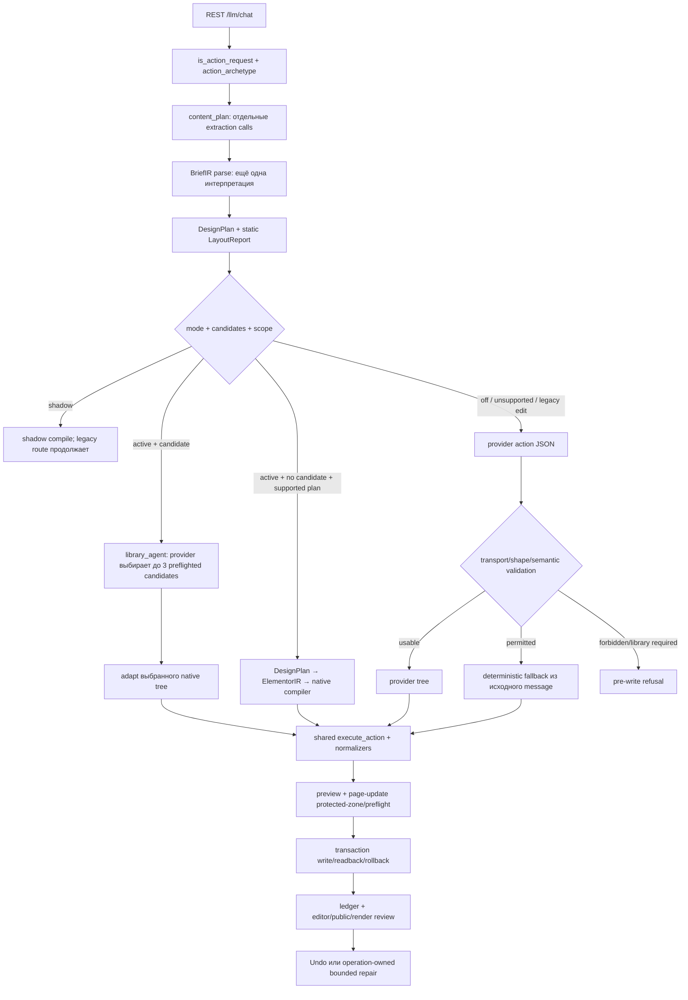

# Services generation: архитектура и план миграции

**Аудит исходников:** 2026-10-03
**Checkout:** `main`, HEAD `e758651`, source `v02.11.238`
**Назначение:** первый проектный шаг миграции Services; только чтение исходников и документация.

Runtime, WordPress, страница `post=5214`, настройки, зависимости, package manifest и релиз в этом аудите не менялись. `context.md` и `LUNA_HANDOFF_REPORT.md` уже содержали незакоммиченные пользовательские дополнения; они сохранены. Другие untracked-файлы не тронуты. PHP/Node-тесты не запускались по условию задания; проверен только `git diff --check`.

## Вывод

Единственным штатным Services design path должен стать **BriefIR → Services DesignPlan с recipe slots → ElementorIR → native compiler → текущая preview/write transaction/readback**. Для обычного Services-запроса выбор любой найденной library-кандидатуры не должен переключать маршрут. Явная политика `library-only` остаётся отдельным source constraint внутри того же typed plan: если подходящий шаблон нельзя сопоставить со слотовой картой — отказ до записи, без fallback.

Текущий source уже содержит почти всю механическую базу этого направления: BriefIR сохраняет `exact_text`, span и provenance; DesignPlan группирует service fields; ElementorIR строит native-дерево; capability registry, native compiler и транзакция с compare-before-write/readback уже существуют. Основной дефицит — не отсутствие нового генератора, а **две параллельные интерпретации текста, неявный приоритет library route и единственная фактическая Services recipe, спрятанная в generic card branch**.

Рекомендация для обычного запроса: по умолчанию выбирать photo cards с изображением над отдельной непрозрачной текстовой областью. Это согласуется с ранее заданным предпочтением пользователя по Services и с текущим bundled Services reference. Варианты split/editorial и text/icon выбирать только по явному запросу или по подтверждённому решению из canonical Brief.

## Состояние доказательств

### Подтверждено исходниками текущего checkout

- REST chat входит через `POST /ai-executor/v1/llm/chat` → `wpae_llm_chat()` → `wpae_llm_chat_request()`: [routes.php:80-84](../../includes/rest/routes.php#L80), [llm.php:10623-10702](../../includes/llm/llm.php#L10623).
- До построения плана production отдельно получает `action_archetype` из `wpae_llm_detect_block_archetype()`, строит `content_plan`, а затем независимо вызывает `wpae_brief_ir_parse()` и `wpae_design_plan_from_brief()`: [llm.php:10727-10783](../../includes/llm/llm.php#L10727), [llm.php:10820-10849](../../includes/llm/llm.php#L10820).
- Для Services BriefIR, DesignPlan и library content plan используют отдельные извлечения. `wpae_llm_content_plan()` ещё раз запускает BriefIR; Services content extraction запускает его снова и также отдельно строит `wpae_llm_extract_services_content()`: [llm.php:1381-1425](../../includes/llm/llm.php#L1381), [llm.php:1879-1935](../../includes/llm/llm.php#L1879).
- При `design_pipeline_mode=active` production выбирает `library_agent`, если для распознанного archetype есть candidates. Это решение зависит от доступности кандидатов, а не от явного пользовательского `library-only`: [llm.php:10779-10805](../../includes/llm/llm.php#L10779), [llm.php:10863-10885](../../includes/llm/llm.php#L10863), [routing.php:9-25](../../includes/llm/routing.php#L9).
- Если активен typed pipeline без library-agent, BriefIR → DesignPlan компилируется без provider-generated Elementor tree и завершается до legacy provider ветки. Невалидный активный plan отклоняется до legacy/fallback: [llm.php:10911-10930](../../includes/llm/llm.php#L10911), [llm.php:10958-11071](../../includes/llm/llm.php#L10958).
- Typed Services plan требует 2–6 полных title/body items. При неявном media intent planner добавляет plugin-default service media; явный `forbidden` и конфликт intent меняют это поведение: [design-plan.php:218-224](../../includes/llm/design-plan.php#L218), [design-plan.php:450-500](../../includes/llm/design-plan.php#L450), [design-plan.php:820-865](../../includes/llm/design-plan.php#L820).
- В native IR уже есть service title/body/CTA роли, отдельный Image node и контентный child-container. Но `service_cards` фиксирует одну повторяемую структуру; его responsive rule сейчас задаёт desktop row и tablet/mobile column: [elementor-ir.php:40-106](../../includes/elementor/elementor-ir.php#L40), [elementor-ir.php:591-610](../../includes/elementor/elementor-ir.php#L591).
- `LayoutReport` — статическая оценка ширины по предположительным 1440/1024/768/390 px, не реальный Elementor DOM/render: [layout-report.php:9-26](../../includes/elementor/layout-report.php#L9), [layout-report.php:38-58](../../includes/elementor/layout-report.php#L38), [layout-report.php:143-171](../../includes/elementor/layout-report.php#L143).
- Existing transaction сохраняет ownership и write boundary: protected-zone guard, expected-before сравнение, rollback snapshot, `_elementor_data` save/readback и cache refresh: [page-update.php:17-118](../../includes/elementor/page-update.php#L17), [transactions.php:303-351](../../includes/elementor/transactions.php#L303), [transactions.php:497-589](../../includes/elementor/transactions.php#L497), [transactions.php:705-760](../../includes/elementor/transactions.php#L705).
- Operation ledger сохраняет hash-ы Brief/Plan/compiled/saved tree, состояния, root IDs, revision и rollback identity, но не полный canonical Brief/Plan payload: [operation-ledger.php:480-530](../../includes/elementor/operation-ledger.php#L480), [operation-ledger.php:531-565](../../includes/elementor/operation-ledger.php#L531).

### Подтверждено историческим live-наблюдением, но не является текущей runtime-проверкой

- На v179/v180 Services реально прошёл через `action_path=library_agent`; в v179 unusable provider/repair завершились fallback-композицией, а в v180 кандидат был принят, но его точный catalog ID не surfaced. См. [LUNA_HANDOFF_REPORT.md:618-649](../../LUNA_HANDOFF_REPORT.md#L618).
- Исторический v179 результат содержал утёкший command heading, чёрную карточку и нечитаемый цвет текста; v180 устранил эти конкретные проявления нормализаторами, а не изменением write boundary: [LUNA_HANDOFF_REPORT.md:624-635](../../LUNA_HANDOFF_REPORT.md#L624).
- На v230 Browser Use наблюдал различие между `semantic_plan` и archetypes Brief/DesignPlan для About/Portfolio/Mega Menu/Carousel. Этот срез относится к старой версии и доказывает уже встречавшийся симптом повторной классификации, но не доказывает, что текущий v238 снова воспроизводит его: [context.md:5-26](../../context.md#L5).
- На v177 пользователь отверг выбеленные фото на фоне текста и потребовал фото сверху и отдельную текстовую область; позднее v180 получил три таких Image widgets с точным текстом. Это историческое предпочтение и live-результат, а не доказательство текущего runtime: [context.md:318-327](../../context.md#L318), [LUNA_HANDOFF_REPORT.md:643-649](../../LUNA_HANDOFF_REPORT.md#L643).

### Гипотезы, которые надо проверить на этапе внедрения

- Разные Services extractors могут дать разные item counts, labels и CTA associations для одного естественного запроса. Это следует из независимых parser calls, но конкретный конфликт требует фиксированного regression case.
- Общий `LayoutReport` может принять/отклонить не ту сетку, потому что оценивает section children, а не фактические повторяемые service card widths. Нужен recipe-aware report и сравнение с реальными viewport-значениями.
- Присутствие единственного Services candidate может менять active route с zero-provider native compiler на provider-dependent library-agent. Проверить матрицей route и конкретным запросом; каталог сам по себе не доказывает полезный охват.
- Quality gate может не обнаружить все нелегальные переклассификации image references, конфликт generated/user copy и служебную утечку. Это отдельные assertions на Brief/Plan/source provenance, не только rendered-text substring checks.

## Схема фактических production-путей



`shadow` не является production-write миграцией: новый pipeline компилирует теневой результат, но legacy ветка выполняет ответ. `active` — текущий переключатель в `wpae_design_pipeline_mode()`; отдельный Services feature flag не нужен: [design-plan.php:9-16](../../includes/llm/design-plan.php#L9).

### Ветки от запроса до записи

| Ветка | Файл/функция | Вход → выход | Граница/условие |
|---|---|---|---|
| Новый action request | `includes/rest/routes.php::wpae_llm_chat`; `includes/llm/llm.php::wpae_llm_chat_request` | message + editor context/post → operation identity, target, flags | Capability и selected post проверяются отдельно; intent начинается в `wpae_llm_is_action_request()` и `wpae_llm_detect_block_archetype()`. |
| Legacy content plan | `includes/llm/llm.php::wpae_llm_content_plan` | original message → units, pairs, repeatable count, widgets, CTA/media constraints | Только retrieval/library/fidelity contract; не тот же набор grouped item objects, который compiler получает из BriefIR. |
| Typed Brief/Plan | `includes/llm/brief-ir.php::wpae_brief_ir_parse`; `includes/llm/design-plan.php::wpae_design_plan_from_brief` | raw message + малый editor context → exact content refs / constraints / media refs → typed section roles/items | Plan сейчас детерминированный. Отдельной structured-model интерпретации natural brief нет. |
| Active native pipeline | `includes/llm/llm.php` active pipeline branch | validated BriefIR/Plan → `ElementorIR v2` → native compiler action | Для поддержанного archetype и route=`pipeline`; ошибки плана возвращают 422, не уходят в legacy fallback. Успех возвращается раньше provider path. |
| Library-only/agent | `includes/elementor/block-library.php::wpae_block_library_retrieve_for_prompt`; `llm.php::wpae_llm_preflight_library_candidates` | message + archetype → ranked source templates → адаптированные, shape/content/fidelity preflight candidates (до 3) → model `choice_key` → сохранённый candidate tree | Agent автоматически получает приоритет, если candidate есть; отказ выбора при активном library route — no-write. Explicit requirement на библиотеку проверяется отдельно. |
| Legacy generation | `includes/llm/llm.php::wpae_llm_chat_request`, provider decode/validation branch | system prompt + `content_plan` + editor context → provider action JSON → normalization/semantic checks | Used when pipeline off/unsupported, targeted edit, or route falls through. Model может предложить tree, но write всё равно идёт через `wpae_llm_execute_action()`. |
| Разрешённый fallback | `includes/llm/llm.php::wpae_llm_build_fallback_action`; fallback selection in `wpae_llm_chat_request` | original message → locally assembled archetype tree | Legacy fallback independently calls `wpae_llm_detect_block_archetype()` and extracts content again. `wpae_llm_forbids_fallback()` is a negative textual guard. Route policy says critical write fallback is disallowed, while legacy control flow can build fallback; this mismatch must be resolved before using that branch for migrated Services. |
| Targeted patch | `includes/llm/llm.php::wpae_llm_execute_patch_action`; `includes/elementor/data.php::wpae_apply_elementor_patches` | selected tree/element IDs + patch JSON → property-level patch | Outside new-block compiler. Selection scope and patch guard stay unchanged. |
| Visual repair/replacement | `includes/llm/llm.php::wpae_llm_build_vision_feedback_prompt`; `wpae_llm_chat_request` replacement guard | message + Vision findings + operation-owned root/revision → regenerated/patch tree | Existing operation/root identity, revision and saved readback required; replacement route available only via active pipeline where supported. The repair input remains prompt/findings, not a loaded canonical plan. |
| Undo | `includes/llm/llm.php::wpae_llm_undo` | post/snapshot/operation/revision/root IDs → guarded restore | Rejects foreign post/root, stale revision and fingerprint mismatch; preserves newer page edits. |
| Write/readback | `includes/llm/llm.php::wpae_llm_execute_action`; `includes/elementor/page-update.php::wpae_elementor_update`; `includes/elementor/transactions.php` | one action + current `_elementor_data` → preview → protected zone + preflight → atomic save → readback / rollback | Keep exactly this boundary. Do not write post meta from any new Services compiler. |

### Два конкретных policy несоответствия

1. `library_only_archetype` в `wpae_llm_chat_request()` означает *семейство вне списка typed DesignPlan*, а не то, что пользователь просит только библиотеку. Services входит в typed list. Пользовательский `requires_library_template` — отдельный regex constraint. Нельзя использовать первое поле как policy второго.
2. `wpae_llm_route_policy('elementor_write')` возвращает `fallback_allowed=false`, но legacy provider path содержит deterministic fallback build. Для Services migration нужен один проверяемый `fallback_policy` в canonical request policy; сейчас это поведение нельзя считать согласованным только по названию routing metadata.

## Повторное принятие решений: конфликты и целевые владельцы

| Решение | Текущие владельцы | Целевой владелец | Что больше не должно решать его повторно |
|---|---|---|---|
| Create / edit / repair intent | `is_action_request`, selected elements, vision flags, targeted-edit regex в `llm.php` | Intake scope decision в `wpae_llm_chat_request`, один раз до planning; сохранять operation type | Fallback и library adapter не выводят новый intent из исходной строки. |
| Семейство block | `action_archetype` через LLM detector; BriefIR intent; fallback detector; library retrieval aliases | Валидированное `BriefIR.intent.archetype`; `action_archetype` — только derived compatibility field из Brief | content extractor, retrieval и fallback не переопределяют family. |
| Точный контент и grouping | BriefIR content; `wpae_llm_content_plan`; service-specific extraction; library heuristics/fidelity | BriefIR grouped item refs + exact spans/provenance; `DesignPlan` только назначает refs в recipe slots | No second raw-message parse, no substring repicking, no header inferred from instruction line. |
| Links | BriefIR URL extraction/normalization; content pairs; legacy button normalizers/fallback URL | Canonical Brief URL per CTA; require explicit safe destination when link requested; compiler copies it | No `#contact`/new URL for exact Services CTA, no template URL retention. |
| Media intent/assets | BriefIR regex + asset references; DesignPlan plugin-default images; imported template images; generic image normalizers | `BriefIR.media_policy` + trusted ReferenceSet catalog and source IDs. Default curated Unsplash is allowed only as an approved source, with separate provenance | Compiler/adapter does not change forbidden → allowed, add blank Image, cycle unknown assets, or claim user-provided provenance. |
| Composition | DesignPlan default; library choice; template structure; legacy fallback visual variants; normalizers | `DesignPlan.recipe_id` with explicit choice provenance: user → approved preference → deterministic default | Validator checks selected recipe constraints; it does not switch composition because another candidate/normalizer failed. |
| Visual parameters | Design tokens, recipe defaults, library colors, multiple legacy normalizers, compiler controls | Compiler-owned defaults + explicitly supported user tokens stored in plan | Normalizers must not change text hierarchy, media role, slot order or recipe identity. |
| Responsive policy | DesignPlan section flags, IR card branch, template breakpoint settings, `normalize_library_layout`, Elementor globals | Recipe contract in DesignPlan, compiled to responsive properties; runtime breakpoint report validates it | Generic library layout/bento normalizers do not replace Services responsive recipe. |
| Elementor controls / IDs | Provider tree on legacy route; native compiler on pipeline; imported template settings on library route | `native-compiler.php` and capability registry. Compiler exclusively owns IDs, widget types, settings and responsive control keys | Model never emits controls; imported JSON is never copied to output without explicit slot map and sanitization. |
| Write permission / ownership | REST capability, selected post, page update protected zones, operation replacement guard | Existing capability + page transaction + operation-owned root/revision/fingerprint checks | Brief/Plan never grants page scope; repair never appends when it intended replace. |
| Operation state | `operation-ledger.php` stores hashes/state/roots/revision | Extend the same ledger with bounded immutable recipe/version + normalized decision payload needed to replay; retain current state machine | Browser/chat layer doesn't infer success from HTTP 200 or a model response. |
| Visual repair | Vision findings + current message + legacy action prompt; targeted patch branch; guarded pipeline replacement | Read saved plan → bounded recipe-slot changes → compile → validate → replace only operation-owned root | Repair should not reparse/retag original request or change recipe unless user asks. |

## Минимальный целевой путь для Services

```text
request + post/editor context + approved asset references
→ one canonical Brief
→ Services composition decision (recipe ID + provenance)
→ explicit recipe slots and grouped content refs
→ ElementorIR v2
→ native compiler / capability registry
→ semantic + content + responsive validation
→ existing execute_action + preview + transaction/readback
→ real render review
→ bounded repair of saved plan and owned root
```

### Canonical Brief: модель, evidence и контент

- **Где понимать естественный запрос:** один bounded structured-output call в intake для Services, если локальный parser не может однозначно заполнить контракт. Он получает source text, разрешённый page/editor context и список доступных asset references. Он возвращает только typed semantic Brief fields: intent/family, 2–6 grouped service items, exact-content references/source spans, optional generated-copy fields, safe link references, media intent/asset IDs, requested composition(s), fallback/library policy и ambiguity/warnings. Он не возвращает Elementor JSON, IDs, widget types, CSS или controls.
- **Неизменность пользовательского текста:** каждая `user_supplied` строка ссылается на span в исходном message или контексте и проверяется exact substring equality. Normalization хранится отдельно для сопоставления, исходное значение не переписывается. Любой несовпавший span/текст делает structured result невалидным, а не поводом заменить original copy.
- **Generated copy:** хранить в отдельных typed slots с `provenance.source=provider_generated`, `instruction_span`, generation/model metadata и explicit permission. Не перезаписывать user slot и не приписывать сгенерированную формулировку пользователю.
- **Недостающий/неоднозначный контент:** требуемые title/body pairs, число карточек вне 2–6, неразрешимый service grouping, конфликт media/composition или пустое обязательное поле → clarification/refusal до `operation generated` и до page write. Не угадывать `title` из первой строки-команды.
- **Разрешение модели:** валидатор сверяет family с перечислением `DesignPlan`, поля с ролями, ID/span/provenance, group_id, cardinality, link scheme и asset ID. Модель не может создать несуществующую attachment/URL ссылку. При невалидном JSON или timeout — разрешён только один local parser downgrade, если он независимо построил полный и однозначный Brief из исходного текста. В противном случае operation завершается до записи с ясной ошибкой; не запускаются последовательно library, provider tree, fallback и ещё один генератор.
- **Page context:** использовать только переданные для того же `post_id` факты (selected scope, реальный catalog/attachment ID при наличии, design tokens, подтверждённые Elementor breakpoint values). Контекст не добавляет новые content claims и не меняет family. Пока breakpoint факты не доступны, статический LayoutReport помечается как оценка; браузерная проверка обязательна.
- **Assets и ссылки:** переиспользовать `wpae_reference_set_normalize()/validate()` и DesignPlan media validation. Источником может быть prompt URL с валидной provenance, scoped attachment или разрешённый curated Unsplash record. Нельзя считать license истинной только потому, что модель вернула `allowed_reuse=true`. Для запроса фото без соответствующего доступного asset — спросить ссылку/прикреплённый asset либо использовать только заранее одобренный curated item, если это разрешено текущим пользовательским предпочтением; иначе отказ до записи. При media-forbidden в итоговом IR должно быть ноль image/media references.
- **Ссылки:** точный пользовательский URL остаётся ref конкретной кнопки. Если пользователь запросил CTA без URL — уточнить destination либо сформировать текстовый CTA без ссылки только если пользователь явно согласился. Никаких URL от library template и автоматического `#contact`.

### Routing, отказ и воспроизводимость

1. Для обычного Services request active mode не отправляет его в `library_agent` просто потому, что в библиотеке найден кандидат. Existing `design_pipeline_mode` остаётся rollout switch (`shadow` → `active`); нового переключателя не добавляем.
2. Если Brief явно просит `library-only`, retrieval/preflight ищет только разрешённые Services templates. Choice обязана соответствовать recipe slot map; source tree не владеет controls. Нет корректного candidate, selector timeout/decline или невалидный mapping → no-write. Fallback запрещён этой политикой.
3. Для обычного Brief provider timeout: допустим валидный deterministic parser downgrade только по полному однозначному exact input, иначе clarification/no-write. Для `fallback-forbidden` или policy `library-only` всегда no-write. Для explicit `fallback-allowed` можно запустить один deterministic recipe compile из уже принятого Brief; не строить fallback заново из сырого message.
4. Pipeline сохраняет canonical Brief (в разумном лимите) и immutable DesignPlan/recipe version в существующем operation ledger или в связанном версионируемом operation artifact. Хранить вместе source kind для каждого поля, reference IDs и exact text, необходимые для повторной сборки; не сохранять секреты/полный editor context. Хеши дерева и saved tree остаются. Вопрос срока хранения — см. раздел решений.
5. Visual review после write сохраняет `rendered`/`reviewed` evidence. Repair читает исходный saved plan и принимает bounded patch к разрешённым recipe slots (например, перенос/размер/типографика или текст только если пользователь просил текстовую правку). Новый Plan → compile один раз → validate → replacement только с operation ID, identity, revision, owned root IDs и fingerprint. При несходстве/неясном owner — отказ без append.

### Сохранение существующей write boundary

Новый путь заканчивается action `insert_elements`/operation-owned `replace` и проходит тот же `wpae_llm_execute_action()` → `wpae_elementor_update()` → `wpae_save_elementor_page_data()` → `wpae_finalize_elementor_transaction()`. Он не пишет `_elementor_data` напрямую, не меняет global menu/theme и не удаляет пользовательские roots. Save/readback и protected-zone/expected-before guards сохраняются.

## Контракты трёх Services-композиций

Общий Brief содержит 2–6 service items. `service_title` и `service_body` обязательны; `service_cta` опционален, но URL обязателен только для явно запрошенной ссылки. Слоты хранят refs, не дублируют/перефразируют исходное copy. Максимальная длина текста не должна усекать user copy. Если карточки не помещаются в рецепт или указания противоречат друг другу — отказ/clarification до write.

### A. `services.photo_cards`

- **Назначение:** быстрое сканирование 2–6 услуг с иллюстрацией каждой услуги.
- **Слоты:** `section.eyebrow?`, `section.title?`, `service[i].image_ref`, `service[i].title_ref`, `service[i].body_ref`, `service[i].cta_ref?`.
- **Media:** ровно один разрешённый image ref на услугу. Для неизвестного/неразрешённого asset — no-write/clarification; пустая картинка не создаётся. Используется native Image над текстовым блоком; текст на фото и background-image недопустимы.
- **Widgets:** Flex containers, Image, Heading, Text Editor, Button; Icon допустим как декоративный акцент только при slot intent.
- **Desktop/tablet/mobile:** desktop до трёх равных колонок в строке с wrap на 4–6; tablet 2 колонки; mobile 1 колонка. Фото имеет общий 4:3 crop/object-fit; за ним отдельная непрозрачная белая text surface. Cards stretch по высоте в строке без фиксированной высоты текста; CTA при наличии прижимается к низу через flex layout, copy не clamp/truncate.
- **Проверки:** media count равен item count; alt обязателен и привязан к media ref; точные title/body; одинаковая геометрия grid; нет overlay/пустых media nodes; responsive count и отсутствие overflow.

### B. `services.split_editorial`

- **Назначение:** дать одной услуге editorial emphasis и сохранить остальные как последовательное расширение предложения.
- **Слоты:** `section.eyebrow?`, `section.title?`, `lead.service_ref` (по умолчанию первый item; если пользователь выбрал другой — explicit ref), `lead.image_ref`, `lead.title_ref`, `lead.body_ref`, `lead.cta_ref?`, затем `secondary[i].title_ref/body_ref/cta_ref?` для остальных услуг.
- **Media:** одно разрешённое lead image; никакой выдуманной image для остальных строк. Если media intent запрещает изображение, этот recipe несовместим — не переинтерпретировать его в текстовый список молча.
- **Widgets:** Flex containers, один native Image, Heading, Text Editor, optional Button и Divider между вторичными rows. Компилятор создаёт slot mapping и IDs.
- **Desktop/tablet/mobile:** desktop lead split 40/60 (text/photo) в одной hero-like панели, затем secondary editorial rows; tablet складывает lead в column и ставит фото после copy; mobile — copy-first, image затем, secondary rows в один столбец. Длинный текст увеличивает высоту естественно; фиксированная высота запрещена.
- **Проверки:** `lead.service_ref` и оставшиеся refs составляют ровно исходный item set один раз; URL/media принадлежат выбранному item; если всего одна услуга, вторичный список пуст; mobile source order совпадает с чтением; no crop/truncation.

### C. `services.text_icon_list`

- **Назначение:** текстовый каталог, когда фотографии не нужны/запрещены или главный критерий — компактное сравнение содержания.
- **Слоты:** `section.eyebrow?`, `section.title?`, для каждого item `service[i].marker?`, `title_ref`, `body_ref`, `cta_ref?`.
- **Media:** images запрещены; Image/empty placeholder в IR — validation error. Иконки только из допустимого native icon set и только декоративные/семантически согласованные; не генерировать произвольные SVG/HTML.
- **Widgets:** Flex containers, optional native Icon, Heading, Text Editor, optional Button, Divider; без карточных photo surfaces.
- **Desktop/tablet/mobile:** одна вертикальная ordered list с горизонтальным marker/copy row на desktop/tablet; на mobile marker сохраняется слева от заголовка либо становится компактной верхней строкой, текст остаётся full width. Порядок item неизменен на всех viewport.
- **Проверки:** отсутствие media refs/Images, item count и source order exact, icon optional, длинные описания расширяются, кнопки появляются только с явным CTA.

Композиции различаются деревом, slot topology, media cardinality и responsive axis: повторяющаяся image-card grid; одна featured split + editorial rows; бескартонный ordered icon/text list. Цвет, radius и тень не выбирают другой recipe.

### Что из текущего кода и шаблонов переиспользовать

- `wpae_design_plan_grouped_items()` и сервисные `group_id`/`*_ref` — основа item map. Validator уже проверяет 2–6 items, обязательные поля и ссылку у явно добавленного CTA.
- `wpae_elementor_ir_card_nodes()` и `wpae_elementor_ir_from_design_plan()` — основа native tree; расширить recipe-specific branches, а не копировать Elementor JSON builder.
- `wpae_elementor_ir_compile_node()` уже умеет Flex containers, service cards, отдельный `service_image`, opaque `service_content`, white surfaces, border, radius и responsive controls. Его расширить явными recipe роли/slot contracts; controls остаются compiler-owned.
- `includes/elementor/imported-templates/services-photo-cards.json` — единственный нужный Services structural reference для A. Его явная map: top root → optional badge/title → content shell → card grid → для каждого из трёх exemplar card: Image → heading container/heading → Text Editor. Сопоставлять по проверяемой role/position map из этого конкретного template ID, не угадывать generic heading/container по тексту. Source IDs не переносить; compiler назначает новые IDs.
- `includes/elementor/recipes.php` имеет recipe definitions для hero/feature/process/pricing/FAQ, но не Services recipe. Поэтому не заявлять, что три Services композиции уже есть в recipes; добавить typed Services contract в уже используемые DesignPlan/IR слой только если его проще выразить там.
- Reference-set, semantic tokens, capability registry, LayoutReport, transaction и operation ledger оставить в работе. Не маркировать/переписывать все 158 bundled templates: для этой миграции достаточно Services photo-card reference и explicit slot map.

## File/function map и порядок внедрения

| Этап | Файл/функция | Переиспользовать | Изменение | Services ветка, которая прекращает выполняться |
|---|---|---|---|---|
| 0. Shadow contract | `includes/llm/routing.php::wpae_design_generation_route`; `design-plan.php::wpae_design_pipeline_mode` | `off/shadow/active`; existing trace | Services shadow trace включает один Brief, recipe ID, slot map, media/link provenance и recipe-aware responsive report. Сверить route matrix без write. | Пока ни одна: shadow-only и legacy пока выполняет action. |
| 1. Single Brief | `includes/llm/llm.php::wpae_llm_chat_request`; `includes/llm/brief-ir.php::wpae_brief_ir_parse/validate` | source spans, group IDs, reference set | Для Services один canonical parse/structured extraction; `action_archetype` и `content_plan` строятся из него. Записать ambiguity/fallback/library policy. Добавить span exact-match и provenance validation. | Повторные Services calls из `wpae_llm_content_plan()` / `wpae_llm_extract_requested_content()` больше не выполняются. |
| 2. Typed recipe plan | `includes/llm/design-plan.php::wpae_design_plan_from_brief/validate` | grouped items, media references, tokens, validations | Добавить `recipe_id`, recipe provenance, lead/media slots, explicit responsive constraints и recipe-specific validators. Composition change становится явным decision/ref, а не side effect кандидата. | Общий `linear` + generic `service_cards` без recipe identity больше не используется для Services. |
| 3. Slot compilation | `includes/elementor/elementor-ir.php::wpae_elementor_ir_from_design_plan`, `wpae_elementor_ir_card_nodes`, `wpae_elementor_ir_validate`; `native-compiler.php` | IR v2, stable IDs, native node/controls, token and media maps | Добавить ровно три Services native compositions и exact slot coverage; capability failure — refusal. UI/provider не может вернуть settings/IDs. | Services-specific provider tree, template tree cloning и raw JSON interpretation не используются для normal generation. |
| 4. Recipe-aware validation | `includes/elementor/layout-report.php`; `includes/llm/llm.php` fidelity/semantic gates | current Plan validation, token/capability contracts | Отдельно проверить composition geometry, min widths, media counts/forbidden, complete copy, exact URLs, native tree and breakpoint controls. Report static assumptions vs runtime measurements distinctly. | Generic layout/bento/card normalizers не переписывают recipe decision или slot structure для Services. |
| 5. One production route | `includes/llm/llm.php::wpae_llm_chat_request` | existing active pipeline early return, library preflight only for explicit policy, shared execute/write boundary | Active Services by default goes Brief→Plan→IR→compiler. `library-only` uses candidate choice only through explicit per-template slot map then same IR/compiler; failure no-write. Keep `wpae_design_operation_create/update`. | For Services, automatic candidate-presence→library-agent; legacy `wpae_llm_build_fallback_action`; provider JSON tree; independent fallback parser and generic Services normalizer branch stop running after activation. Other families remain unchanged. |
| 6. Replay/repair | `includes/elementor/operation-ledger.php`; llm Vision/replacement/Undo branches | current state machine, hashes, revision/fingerprint/owned roots | Persist bounded canonical Brief/Plan artifact/version and repairable slot values. Review saved recipe; allow bounded Plan patch; compile once and guarded replace. | Repair from freely reparsed raw text/findings is disabled for migrated Services; no append-on-repair. |
| 7. Acceptance then removal | Existing tests under `tests/` + production Browser Use on existing post=5214 | current safety harnesses and screenshot procedure | Add contract/provider fixtures, transaction readback and live matrix. After acceptance remove dead Services legacy callsites/helpers instead of leaving two active writers. | All old normal Services generation branches removed; unsupported/non-Services families still use their current supported route. |

**Rollback:** before activation, `shadow` can be disabled without page write. If active code fails after a valid generation, use operation-owned Undo/rollback only when operation snapshot, revision and current page fingerprint match. A runtime/package rollback restores the previous code; it does **not** delete or replace page roots automatically. If target state has changed or root ownership is uncertain, stop and retain the current user content. Do not use an unconditional page restore.

## Regression and future acceptance matrix

Use these 12 scenario groups (some rows are paired fixtures). Check first generation separately from the result after any repair. The holdout rows are sealed and must not be used to tune parser regexes/examples.

| # | Естественный запрос / setup | Ожидаемый contract, не фиксированный дизайн | Статус набора |
|---|---|---|---|
| 1 | Two short services with title/body pairs, no explicit recipe; two services, approved stock refs available. | One canonical family `services`, exactly two complete groups; default recipe A; two native Images and exact copy; one root or no-write. | Calibration |
| 2 | Five services, several long descriptions, explicit text/icon composition. | Five exact ordered groups; recipe C; no truncation/fixed heights/media; all 5 native rows; mobile order unchanged. | Calibration |
| 3 | Three services, each with a specific approved image URL/asset ID; explicitly select photo cards. | Three image refs map 1:1 to service group IDs and keep source/alt/license provenance. No substituted or repeated template media. | Calibration |
| 4 | Explicit “без фото/изображений”, request a compact service list. | media intent `forbidden`, recipe C only, zero Image nodes/refs; photo recipes rejected if explicitly selected. | Calibration |
| 5 | Ask for one specific photo per service but neither prompt, editor context nor approved source catalog has usable references. | Ask for assets/consent or refuse before write; no remote URL invention, no empty placeholders, `write_count=0`. | **Holdout** |
| 6 | Same facts rendered as a labeled service list and as natural prose with equivalent item boundaries. | Both resolve to same family and grouped content refs; uncertainty must surface as ambiguity, not count drift. | **Holdout pair** |
| 7 | Exact quoted heading/descriptions and two explicitly linked CTAs, including one relative/hash link. | Byte-for-byte copy/source refs and correct URL per service; safe URL normalization only; invalid/missing requested URL blocks write. | Calibration |
| 8 | Explicit split/editorial; one provided lead image and four service items. | Recipe B: chosen lead service occurs once; other 3 form secondary rows; all 4 services preserved; lead image belongs to lead ref. | Calibration |
| 9 | Explicit text/icon list with six items and no imagery. | Recipe C, six ordered groups, image count zero, native optional icons only; full long descriptions remain visible. | Calibration |
| 10 | “Предложи два заметно разных варианта композиции.” | Return two typed recipe plans/options; **no write/root** until the user chooses one. Do not run every generator sequentially. | **Holdout** |
| 11 | “Только проверенный шаблон из библиотеки, fallback запрещён.” | Preflight no more than three compatible candidates; require valid explicit slot map. No candidate/decline/invalid map → refusal, zero provider tree and zero write. | Calibration |
| 12a | Explicitly allow deterministic fallback, then simulate structured-extraction timeout/invalid JSON on otherwise fully explicit exact Brief. | One local plan/recipe compile from the already validated Brief, one provider attempt maximum, zero extra generator paths. If local Brief incomplete, no-write. | Calibration |
| 12b | Existing operation-owned Services root plus request to shorten one description or improve spacing. | Load saved Brief/Plan, patch one permitted slot/property, replace same owned root only after revision/fingerprint guard; no append. | Separate repair fixture |

### Метрики

- Family/intent accuracy and ambiguity detection; exact content + ordering + per-slot provenance; CTA text/link integrity.
- Composition ID and distinction by tree/slots, not theme/color; recipe compatibility and capability report.
- Native widget validity, explicit settings owner, media source rights/reference match, forbidden media count.
- Save/readback equality, operation state and idempotency, root ownership, transaction rollback behavior.
- Responsive settings at real Elementor breakpoints; actual DOM widths/scroll geometry; editor and public screenshots on desktop/mobile.
- Visual suitability reviewed on fresh screenshots; typed content/links compared to source; count of bounded repairs before accept.
- Provider call count and latency for initial interpretation, initial compile, each repair; evaluate primary generation and after-repair result separately.

Assertion totals, manifest template totals, provider success, operation HTTP status or a desktop-only screenshot are not acceptance by themselves.

## Будущая live-приёмка на post=5214

На этапе реализации тестировать только уже существующую `post=5214` и открытую Elementor страницу; не создавать page/draft, не удалять чужие roots и не импортировать Services JSON вручную. Между генерациями фиксировать исходный root set. Для каждого успеха: подтвердить текущую inline source version, operation/root, native selected JSON + DOM, save/reload/readback, точный copy и links, responsive desktop/mobile и public source. Для отказа сохранять diagnostics и write_count, без повторного append вместо repair.

Свежий screenshot захватывается Browser Use из текущей вкладки после relevant save/reload; байты сохраняются как файл, формат/размер проверяются, PNG открывается и осматривается, затем показывается inline и даётся абсолютная ссылка. Указывать post/root/operation, фактический CSS viewport, editor/public source. Если bytes или реальный viewport недоступны, фиксировать `SCREENSHOT BLOCKED`, не подменяя доказательства историческими кадрами. Подробная текущая процедура — [context.md:388](../../context.md#L388).

В этом архитектурном проходе новых Browser Use screenshots и live generations нет; installation `v02.11.238` и текущий WordPress source не перепроверялись, потому что пользователь запретил runtime/site изменения на данном шаге.

## Риски и решения, требующие пользователя

1. **Generated copy:** если описания/CTA отсутствуют, разрешать ли модели их написать, когда пользователь просит “создать секцию услуг”, или сначала спрашивать? Рекомендация: exact/explicit content не менять; generated copy только при явной просьбе или выборе после clarification.
2. **Fallback default:** разрешать ли deterministic Brief downgrade по полному unambiguous exact request автоматически при timeout, учитывая текущую route policy, где критический Elementor write не должен fallback-ить? Рекомендация: безопасный local parse допускается лишь когда он полностью проходит Brief contract; provider/tree fallback — только при явном разрешении; `library-only` всегда no-write без template.
3. **Несколько предложенных вариантов:** подтверждается ли no-write до выбора пользователем, если он просит “предложить варианты”? Рекомендация: да; варианты — typed Plans в чате, выбранный plan компилируется один раз.
4. **Plan retention:** сколько хранить в operation ledger нормализованный Brief/Plan с exact copy для reproducible repair, и должен ли пользователь уметь удалить этот operation artifact? Рекомендация: bounded, post-scoped, без secrets/editor snapshot; сохранять лишь поля, необходимые для replay и ownership.

## Этап 2: canonical Services BriefIR — локальная реализация, 2026-10-03

Изменения внесены в рабочее дерево поверх `e758651` / `v02.11.238`; release version не повышалась. Production intake создаёт deterministic Services Brief в `wpae_llm_chat_request()` после первичного family classifier и передаёт этот же массив в derived content plan, `wpae_design_plan_from_brief()` и Services diagnostics/validation helpers. `design_pipeline.brief.hash` и `design_pipeline.content_plan.brief_hash` совпадают в production pipeline regression. В `wpae_llm_extract_requested_content()` при переданном Services Brief возвращаются его `content_units`; family parsers для Team/Testimonials и сырой порядок quoted fields не переопределяют этот результат.

### Изменённые файлы и владельцы

- `includes/llm/brief-ir.php`: `wpae_brief_ir_parse()`, `wpae_brief_ir_service_groups()`, `wpae_brief_ir_policy()`, `wpae_brief_ir_explicit_user_constraints()`, `wpae_brief_ir_validate_services()`. Parser contract стал `wpae-brief-parser-v10`; Services content refs имеют `copy_status=explicit`, byte-accurate spans и prompt provenance; группы содержат стабильные refs `title_ref`, `body_ref`, `cta_ref`, `media_ref`.
- `includes/llm/brief-ir-structured.php`: новый optional adapter `wpae_brief_ir_services_structured_extract()` поверх существующего provider transport, валидатор schema/source и normalizer в тот же BriefIR. Файл входит в plugin package. Adapter выдаётся только явным локальным вызовом; production chat path его не вызывает.
- `includes/llm/llm.php`: `wpae_llm_services_content_plan_from_brief()` строит title/body pairs, CTA/link/media refs, policy и ambiguities только из Brief refs/groups и выполняет Brief validation. `wpae_llm_content_plan()` сохраняет no-Brief compatibility wrapper. С тем же Brief работают Services extraction, content fidelity, action diagnostics, composition quality, library preflight/adaptation, fallback guard и CTA/button normalizers.
- `tests/flex-generation-runtime.php`: проверяет обе parser формы, группировку и source spans, policy/media, derived plan, mocked structured transport → validation → normalization, CTA-link bindings, write-free refusal при timeout/invalid JSON и тот же Brief hash в production intake. Demo выводит вход, полный Brief без повторения `source_text`, derived plan и обе validation.
- `tests/design-pipeline-contract.php`, `tests/llm-chat-contract.test.js`: обновлены parser version и контрактные проверки новых optional Brief parameters.
- `wpae-package.json`: обновлены SHA для трёх packaged PHP files и добавлен `brief-ir-structured.php`; package manifest содержит 250 файлов.

### Фрагмент canonical Brief

Ниже показаны сокращённые поля fixture из воспроизводимого запуска; source spans — реальные byte offsets этого запроса.

```json
{
  "schema": "wpae-brief-v1",
  "parser_version": "wpae-brief-parser-v10",
  "intent": { "archetype": "services" },
  "content": [
    { "id": "service_1_title", "role": "service_title", "exact_text": "Стратегия", "copy_status": "explicit", "source_span": [268, 286], "group_id": "service_1", "provenance": { "source": "prompt", "parser": "wpae-brief-parser-v10", "item_id": "service_1" } },
    { "id": "service_1_body", "role": "service_body", "exact_text": "Собираем требования и формируем план.", "copy_status": "explicit", "source_span": [328, 397], "group_id": "service_1", "provenance": { "source": "prompt", "parser": "wpae-brief-parser-v10", "item_id": "service_1" } },
    { "id": "service_1_cta", "role": "service_cta", "exact_text": "Обсудить", "url": "#strategy", "url_requested": true, "copy_status": "explicit", "source_span": [435, 451], "group_id": "service_1", "provenance": { "source": "prompt", "parser": "wpae-brief-parser-v10", "item_id": "service_1" } }
  ],
  "groups": [
    { "group_id": "service_1", "title_ref": "service_1_title", "body_ref": "service_1_body", "cta_ref": "service_1_cta", "media_ref": "", "provenance": { "source": "brief", "item_id": "service_1" } }
  ],
  "policy": {
    "library": { "source": "required", "evidence": [{ "value": "required", "source_span": [766, 804] }] },
    "fallback": { "source": "forbidden", "evidence": [{ "value": "forbidden", "source_span": [806, 831] }] }
  },
  "layout_constraints": [{ "kind": "media_intent", "value": "forbidden", "source_span": [734, 764] }],
  "explicit_constraints": [{ "kind": "explicit_user_constraint", "exact_text": "Не меняй глобальную тему и меню сайта.", "source_span": [20, 89] }],
  "ambiguities": []
}
```

`wpae_llm_services_content_plan_from_brief()` resolves each ref into an `expected_items[]` record carrying the same `group_id`, exact title/description, CTA text/URL and media ref. Missing title/body, duplicated refs/groups, an incomplete group, unsupported single-item input, invalid policy or invalid media intent fail validation; generated copy is not marked exact. A requested photo without supplied assets remains unresolved, and the Brief does not inherit default Unsplash assets.

### Extraction paths replaced and raw compatibility still present

For the primary Services intake, content plan and fidelity no longer run an independent Services parser. The same Brief now reaches DesignPlan, content-plan audit, saved-root fidelity, library candidate preflight/adapter, selected library adaptation, button removal/CTA normalization, provider composition diagnostics and fallback checks. The Structured adapter checks JSON shape and enums, exact source excerpts, source order, service IDs, allowable CTA URLs and clause-local CTA/link binding, supplied reusable asset IDs, deterministic media/policy agreement, and then runs canonical Brief validation. It makes one existing-transport call only when the explicit adapter function is invoked.

Raw-message compatibility remains in named legacy paths: `wpae_llm_content_plan()` and `wpae_llm_extract_requested_content()` can parse once when no Brief is supplied; `wpae_llm_extract_services_content()` is likewise a no-Brief wrapper. Initial `wpae_llm_detect_block_archetype()` and `wpae_llm_is_action_request()` still classify the raw intent head before Brief intake; after Services Brief construction, production resets the archetype from Brief. `wpae_llm_requires_verified_library_template()` and block-library ranking still inspect raw text for legacy matching; candidate availability itself is not copied into Brief as `library-only`. Non-Services legacy branches keep their current extractors. This is not a complete single-flow migration.

Global route policy was not changed. The canonical policy records `fallback_allowed=true` only for explicit `allowed`, and explicit `forbidden` or a conflict blocks fallback in the migrated Services gate. Older route branches may still allow fallback when policy is `unspecified`; this compatibility behavior is visible and is not claimed to consume the whole Brief policy. Structured extraction model quality and semantic field-to-service interpretation have not been measured with a real model; source validation can reject invented copy/links/assets and obvious group inconsistencies, but the mocked response is only a transport/contract regression.

### Regression and reproduction

The regression matrix covers multiline/one-line equivalence; independent title/body refs and order; instruction text exclusion; exact CTA/link pairing and swapped-link refusal; explicit photo-forbidden and unresolved photo-required cases; library-only/no-fallback; incomplete/single-item/duplicate/generated/unknown-asset refusal; provider timeout and malformed JSON with zero writes; and production Brief/content-plan hash equality. Exact current results: flex runtime `661 checks OK`, DesignPlan `274 checks OK`, Node `6/6`, Elementor patch guard PASS, PHP lint PASS, `git diff --check` PASS, and package probe PASS with 250 files and no SHA mismatches.

Reproducible local run (the structured response in the harness is mocked; this is not a real-model quality result):

```sh
WPAE_SERVICES_BRIEF_DEMO=1 php tests/flex-generation-runtime.php
```

The command prints one labeled input → canonical Brief including refs/spans/policy → derived content plan → validation, followed by the runtime assertion total. Model interpretation is not activated in production. No replay/repair system, new composition recipes, or asset system was added. No WordPress settings/page, `post=5214`, other page, plugin installation, release, deployment or screenshot was changed or tested in this implementation step.

While checking the reproducible example, a malformed nested `PREG_OFFSET_CAPTURE` read was found in media-intent span extraction: the recorded excerpt could be only the first UTF-8 byte. The parser now records the full byte-accurate source range, and a regression asserts that the `Не добавляй фото` evidence resolves to the complete source text. The package SHA for `brief-ir.php` reflects this correction.

Before a later production activation, evidence still needed includes real-model calibration on the existing architecture matrix (including field grouping and source fidelity), repeatable latency/provider-call results, no-write rejection on invalid model payloads, and proof that legacy raw routes do not override the typed Brief. A later live acceptance needs an installed/inline-verified release, operation/root and saved readback evidence, exact copy/links/native structure, and fresh editor/public screenshots with measured viewport and identified source; none is supplied by this local step.


## Services recipe compiler implementation — stage 3 (local), 2026-10-04

This step adds explicit recipe compilation on top of the existing BriefIR v10. Source remains based on local HEAD `e758651` / `v02.11.238`; no release version bump, commit, push, deployment, production routing change, or WordPress write was made. Stage 2 BriefIR changes in `includes/llm/brief-ir.php` and `includes/llm/llm.php` remain intact.

The opt-in API is `wpae_design_plan_from_brief($brief, ['services_recipe_id' => $recipeId, ...])`. Recipe plans record `recipe_id`, `recipe_selection` (selection source and semantic lead service ref), ordered `slot_bindings`, and media accounting. Split lead can be selected by `services_lead_service_ref`; its chosen group is carried downstream as a semantic ref. Callers that omit the planning-context field keep the existing un-recipe'd `service_cards` plan. No production caller was switched to a recipe.

The implementation extends existing builders and validators: `wpae_design_plan_services_recipe_plan()` and `wpae_design_plan_services_recipe_validate()` are called by existing `wpae_design_plan_from_brief()` / `wpae_design_plan_validate()`; `wpae_elementor_ir_services_recipe_nodes()` feeds existing `wpae_elementor_ir_from_design_plan()`, `wpae_elementor_ir_validate()`, and the native Elementor compiler in `includes/elementor/elementor-ir.php`; `wpae_layout_report_for_plan()` reports recipe layout assumptions. Content fields are resolved from Brief refs, and group provenance is checked at the IR boundary. The existing capability checks and execute/write boundary remain the only write architecture.

The three emitted native topologies are distinct:

- `services.photo_cards`: one wrapping Flex grid; each item owns a native Image above a separate opaque content panel with exact title/body/optional CTA. Each image slot consumes one validated, alt-described asset from the matching group. Native card widths account for the grid gap: three items use 31.5% desktop basis; other supported counts use 48% and wrap into two columns; mobile uses 100% width and stacks. Image crop uses responsive pixel heights with `object-fit: cover`, and the IR retains the 4:3 composition target.
- `services.split_editorial`: one semantically selected lead item owns the sole image and its exact copy/CTA; remaining services render once each as editorial rows in source order. Supplied but unused media refs are listed as unconsumed. The lead uses native 52/44% children with a 32px gap on desktop and stacks at tablet/mobile.
- `services.text_icon_list`: an ordered vertical list of native icon/copy rows and dividers, with no image widgets or media placeholders. Exact CTA URLs remain paired with their service row. Optional provided media is explicitly unconsumed; required-image intent is rejected.

Validation refuses unknown recipe IDs, unknown or cross-group slot refs, duplicate service IDs, missing/invalid image assets or alt text, missing split lead image, forbidden-image conflicts, required media incompatible with a recipe, unconsumed required assets, and counts outside 2–6. The source fixtures also verify 2-, 3-, and 6-item layouts, long descriptions, non-first lead selection, exact section copy, per-container title/body/CTA pairing, media ownership, crop and responsive control types/units, and repeat compilation after stripping generated Elementor IDs.

The existing `wpae_llm_execute_action()` was exercised with the synthetic native trees, normal Elementor normalization, design-token mapping, final Bento normalization, and a dry-run preview. Its mocked final update returns 409; recorded persistent writes stay at zero. All three recipe markers and structures survive that path without becoming the legacy generic Services card grid. This is a local mocked boundary check, not recipe activation in the chat/router path. Older raw-message compatibility, legacy route branches, and the missing production recipe decision remain outside this stage.

The LayoutReport is explicitly `static_plan`: breakpoints, column estimates, gap and padding assumptions are calculated from the plan. It sets `visual_render_verified=false`; it is not a DOM measurement, screenshot review, or visual PASS. No live WordPress/editor generation, page `5214` change, operation/root, save/reload, or screenshot was made.

Reproduction:

```sh
WPAE_SERVICES_RECIPE_DEMO=1 php tests/design-pipeline-contract.php
```

The demo uses a synthetic Brief and no provider/WordPress calls; it prints the Brief, all three DesignPlans, ElementorIRs, native trees, and validations. On 2026-10-04 it produced 491,866 bytes; all three plan, IR, and native compile checks passed.

Local verification on 2026-10-04: Design Pipeline Contract `305 checks OK`; Flex Generation Runtime `661 checks OK`; Node `6/6`; Elementor patch guard PASS; PHP lint PASS for changed PHP and retained stage-2 PHP; release package probe PASS (`250` files, no SHA mismatches); `git diff --check` PASS. Package SHA entries were updated for `design-plan.php`, `elementor-ir.php`, and `layout-report.php`. No visual or live acceptance is claimed.

## Этап 4: Services chat/router integration — локальный mock, 2026-10-04

Active Services create подключён в production entrypoint wpae_llm_chat_request(): один canonical BriefIR → однократное recipe decision → DesignPlan → ElementorIR → native compiler → существующий wpae_llm_execute_action() и transaction. Content plan, Plan provenance и operation ledger используют один Brief hash. Ниже demo прогоняет настоящий chat entrypoint harness, а не прямой compiler.

Обычный active Services запрос остаётся action_path=pipeline даже при найденном библиотечном кандидате: library-agent eligibility явно исключает Services. При ошибке Brief/recipe, media, plan, compile или transaction entrypoint возвращает отказ; legacy Services raw-message builders/extractors и wpae_llm_build_fallback_action() не запускаются на active create. Отказы сообщают причину, provider_calls=0 и write_count=0.

### Однократный recipe decision

Источник решения записывается как explicit_request, explicit_context либо documented_default. Downstream compiler использует сохранённый recipe_id, повторного selector нет.

- Явный services.photo_cards требует валидное изображение с alt для каждой услуги.
- Явный services.split_editorial требует валидный services_lead_service_ref и изображение этой услуги. Одна картинка не задаёт lead автоматически.
- Явный services.text_icon_list не размещает фото; конфликт с обязательными фото приводит к отказу.
- Без явного recipe все валидные per-service assets выбирают photo cards; без них и без запроса обязательных фото выбирается text/icon list.
- Явный media intent без assets завершается wpae_services_media_unresolved без записи. Stock URLs не добавляются.
- Несколько несовместимых recipe constraints дают services_recipe_selection_conflict и no-write.

Эти правила — временная deterministic policy, не решение модели о визуальном направлении.

### Library-only и режимы

Один разрешённый map проверяет template-services-photo-cards-v1 по manifest.json:files, SHA и фактической native slot topology. Map ведёт только в services.photo_cards; source IDs/settings не копируются, а тот же Brief компилируется штатным recipe compiler. Plan/trace сообщают template ID и adaptation verified_reference_slots_recompiled_by_native_services_recipe. Несовместимый library-only выбор возвращает wpae_services_library_only_unsupported до provider/write, не подменяя выбор обычным compiler default.

Off сохраняет старый provider/action и legacy fallback путь. Shadow вычисляет typed Brief/Plan/LayoutReport и shadow IR/native result для диагностики, затем продолжает legacy provider/fallback маршрут, который может писать. Семантика маршрутов остальных archetypes не менялась. Structured extraction остаётся локально вызываемым adapter; качество реальных model outputs не измерялось.

### Геометрия и обнаруженные ошибки

LayoutReport проверяет container widths 320/390/480/768/1024/1200 px, padding/gap и 2/3/4/6 items для всех recipes. Он показывает предположения и visual_render_verified=false; site breakpoints/DOM не опрашиваются. Photo cards используют 31.5% × 3 + 24px desktop gap для трёх items, 48% wrap для остальных количеств, tablet wrap и mobile stack. Split использует desktop 52% + 44% + 32px gap с flex-shrink и native column stack на tablet/mobile. Исправлен расчёт stacked split: он измеряет cross-axis ширину, а не складывает вертикально расположенные child widths.

Library map проверял несуществующий manifest.templates вместо manifest.files, затем искал grid по неверной глубине массива. Исправлены оба source defects: фактический manifest key и рекурсивный поиск grid по проверенному structural class. JSON URL assertion теста также исправлена с учётом escaped slash; источник URL остаётся тем же.

### Production-path evidence

Команда WPAE_SERVICES_CHAT_DEMO=1 php -d memory_limit=512M tests/flex-generation-runtime.php запускает полный PHP harness, затем печатает одну компактную JSON-строку. Успешный fixture: entrypoint wpae_llm_chat_request, action_path=pipeline, Brief hash f1f9a358be188a72717b6fdaa67f82aaee53ee951fc9d332df683c475313451f, recipe services.text_icon_list/documented_default, все шесть validation true, provider_calls=0, mock write_count=1, readback equality=true, ledger written, operation wpae-9adaa5bdb5e58254, root 25b921e. Это in-memory mock post 42, не post=5214 и не WordPress transaction.

Harness также проверяет обычный Services при наличии library candidate, explicit photo/split/text-icon topology, успешный library-only map через общий compiler, no-lead, conflicting recipes, отсутствующие required assets, incompatible library-only recipe, неправильный post, stale revision и protected zone. Отказы сохраняют исходный root set, без повторного write/provider fallback. Native execute normalizers сохраняют recipe topology, exact copy/CTA и media refs.

Локальные проверки: Design Pipeline Contract 307 checks; Flex Generation Runtime 667 checks; Node 6/6; PHP lint, Elementor patch guard, release package/hash probe (250 files) и git diff --check PASS.

Это source-only/mocked evidence: release version, commit/push, deploy, WP Pusher, WordPress settings/editor и post=5214 не менялись. Live generation, operation/root сайта, save/reload, DOM, screenshot и visual acceptance не выполнялись.

## Stage 5 release source and live acceptance status — 2026-10-04

The release source is version `v02.11.239`, reflected in both the plugin header and `WPAE_VERSION`. The package includes and hashes `includes/llm/brief-ir-structured.php`; `includes/llm/llm.php` loads it with `require_once`. Package validation covers 250 files with zero hash mismatches; valid/corrupt/missing/unsafe-package scenarios pass. The probe's existing full-result JSON serialization diagnostic still reports malformed UTF-8, while compact serialization passes.

Release commit `979c9d0` (`feat: release typed Services recipes v02.11.239`) was pushed to `origin/main`; Git confirmed `e758651..979c9d0 main -> main`. The plugin has not been installed through WP Pusher, and installed/editor versions remain unverified.

Checks on the release source tree: Design Pipeline Contract `307 checks OK`; Flex Generation Runtime `667 checks OK`; Node `6/6`; patch before-hash guard PASS; imported catalog `158` manifest files / `156` retrievable trees / `156` previews; PHP lint PASS for the plugin entrypoint and six changed/required PHP files; `git diff --check` PASS. The fresh chat-entrypoint mock is `wpae_llm_chat_request` → `pipeline` → `services.text_icon_list/documented_default`; Brief hash `f1f9a358be188a72717b6fdaa67f82aaee53ee951fc9d332df683c475313451f`; six validations true; `provider_calls=0`; mock `write_count=1`; readback match; operation `wpae-9adaa5bdb5e58254`; root `25b921e`; synthetic post 42. This does not represent a WordPress transaction.

The requested live runs for `services.photo_cards`, `services.split_editorial`, and `services.text_icon_list` were not started. Ambient UI context shows two open tabs, with the current tab at Elementor `post=5214`; the tabs are open, but that context does not provide interaction. Tool-catalog recheck found `mcp__node_repl__js`, whose documented browser path requires Browser Plugin (in-app browser) or Chrome Plugin; no Browser Plugin/Chrome Plugin tab-control methods are exposed in this session. Plugin discovery returned Opera Browser Connector with `installed=false`, which is not a connection to the Codex in-app browser. `capture_screen_context` remains restricted to active voice chat. I did not guess an undocumented `nodeRepl.rpc` request or use CUA/another transport. The exact missing capability is a connected Browser Plugin/Browser Use API bound to the existing authenticated profile, with enumeration/selection, DOM read/evaluate, UI interaction, viewport measurement and screenshot-byte capture. Consequently installed PHP/runtime and inline editor JavaScript versions are unverified; post=5214 root set and saved/unsaved state were not read; no prompt, media asset, live operation, write, readback, reload or rendered-DOM measurement exists for stage 5. This is **NOT RUN**, not a pass or a failed generation.

No live screenshot bytes or PNG files were produced. **SCREENSHOT BLOCKED** by the unavailable permitted Browser Use path. There are no post=5214 operation/root IDs from this pass. Source and mocked route assertions do not establish model design quality or live visual acceptance.

## Browser Use/CUA capability audit — 2026-10-04

The current Codex tool catalog has no Browser Use/CUA methods for listing/selecting existing tabs, accessibility/DOM reads, page evaluation, click/keyboard input, actual viewport measurement or screenshot-byte export. Correction to the prior audit: ambient UI context shows two open tabs, with the current tab at Elementor `post=5214`; the tabs are open, and only programmatic control is missing. The catalog does include `mcp__node_repl__js`, whose documentation supports browser interaction in conjunction with Browser Plugin or Chrome Plugin and desktop CUA. Neither Browser Plugin nor Chrome Plugin control methods are exposed in this session. Plugin discovery returned Opera Browser Connector with `installed=false`, not a connection to the Codex in-app browser. I did not guess an undocumented `nodeRepl.rpc` request or switch to CUA/another transport. `mcp__codex_app__open_in_codex` is documented as a UI opener and requires separate browser tools for inspection/interactions. `mcp__codex_app__capture_screen_context` is voice-chat-only and was not called. Remote Desktop Commander provides file/process/session tools, not GUI/browser control or screenshots.

Historical Browser Use documentation in this report (2026-10-02) records `tabs.get/list/new/selected`, no documented activation method for another existing tab, and focus-emulation timeouts on background WP Pusher tabs. It does not show that Browser Use is loaded in the current task. The neighboring `page_id=null` signal is not evidence about browser-tool availability.

The required connection is Browser Plugin/Browser Use control attached to the existing authenticated browser profile, with enumeration and selection of the already-open WP Pusher/Plugins/Elementor tabs, DOM/read/evaluate and interaction methods, viewport metrics and screenshot bytes. The tabs are already open; no new tab is needed. Until that control API is exposed, installation, installed/editor versions, pre-write post=5214 state, generation, save/readback, geometry and visual acceptance remain **NOT RUN**; this audit made no site writes.

Runtime source has not changed since `979c9d0`; `git diff 979c9d0..HEAD` contains documentation only. No release or full test rerun was made.

## Live deterministic-recipe acceptance — v02.11.242, 2026-10-04

This addendum supersedes the stage-5 NOT RUN status above for the browser/live work completed later on 2026-10-04. The built-in Browser Plugin was callable through `mcp__node_repl__js`; the already-open Elementor and public tabs were used for post `5214`. No new page, draft, browser tab, manual Elementor JSON import, or direct library-agent bypass was used.

### Runtime and persisted page state

Source release `v02.11.242` is commit `aa6653ae4e6acea9e6d6ebc4669d80e07fb961e6`. It preserves desktop photo-card `flex_direction` when tablet direction is omitted; this fixed the first v241 live result, where tablet cards became half-width. WP Pusher installed only WP AI Executor; Plugins and the reloaded editor's inline config/chat badge reported `v02.11.242`. WordPress Site Health reported PHP `8.3.22` / `cgi-fcgi`. `git push origin main` confirmed `aa6653a..2c383d8 main -> main`, including this source release; a separate `git ls-remote` could not resolve `github.com`.

The initial post state was the task's blank baseline, `roots=[]` at history revision `5714`. Only three successful pipeline transactions were generated. After public reload and editor reload, the final post=5214 roots were exactly `[023bd70, e939025, 8b79d6c]` in recipe order. The edit did not remove or replace any user-owned root.

### Live recipe evidence

Every successful composition followed the ordinary Services path: one canonical Brief, one recipe decision, DesignPlan/compiler, native Elementor transaction. All runs used `action_path=pipeline`, `route=local_deterministic`, `provider_calls=0`, one successful write, then save/reload and editor/public readback. Exact prompts/diagnostics are in the JSON artifacts below. All shared these exact ordered service/CTA tuples:

1. `Стратегия проекта` — `Формулируем задачу и согласуем план работ.` — `Обсудить` → `#strategy`.
2. `Архитектура и дизайн` — `Разрабатываем решение под заданный контекст.` — `Смотреть проекты` → `#projects`.
3. `Сопровождение` — `Проверяем соответствие согласованному проекту.` — `Обсудить проект` → `#contact`.

| Composition | Brief, source, assets | Transaction and native topology | Live evidence and status |
| --- | --- | --- | --- |
| `services.photo_cards` | Exact request and diagnostics: `docs/audits/2026-10-04-services-v242/photo-cards-chat-log.json`; Brief hash `82dfe1de01624147d33f1091306955830564e3d6cd71d4e0097c179d0835d431`; explicit request; media resolved per service. Assets/alt in order: `photo-1772442198689-af331f8f9617` — `Архитектор изучает чертежи у современного здания.`; `photo-1766230976347-c5badd3f76c9` — `Современный архитектурный интерьер.`; `photo-1778074762022-c33cc42f79ae` — `Специалисты обсуждают проектные чертежи.`. | Operation `wpae-27aafa3c2441a362`; root `023bd70`; 14 widgets (5 heading, 3 image, 3 text-editor, 3 button). | v241 first output at 1024 client width 1009 used half-width cards. Original failure screenshots/chat trace are preserved in `services-v241/`. v242 shared flex-direction fallback fixed it. v242 DOM now shows 3×378 px at 1440, 2-column wrapping at 1024/768, one column at 767/390; images loaded natural 1200×900, `object-fit:cover`, exact service alt. Desktop/tablet geometry accepted; public mobile is obstructed by the fixed chatbot greeting overlapping the second photo. |
| `services.split_editorial` | Successful prompt: `docs/audits/2026-10-04-services-v242/split-editorial-chat-log.json`; explicit `services_lead_service_ref: service_2`; Brief `c4d3fbb741da5f18b5254c50e59db795b3a0913632b262af6c206d4f2f62b4ff`; media resolved per service. Service 2 alone owns `photo-1766230976347-c5badd3f76c9`, alt `Современный архитектурный интерьер.`. Two rejected attempts with `write_count=0` are preserved in `split-editorial-attempt-1-no-write.json` and `...attempt-2-no-write.json`. | Operation `wpae-c6b6305322c4b71e`; root `e939025`; 13 widgets (5 heading, 3 text-editor, 3 button, 1 image, 1 divider). Lead is service 2; rows are services 1 and 3. | Exact text/hrefs/ownership read back after reload. Desktop lead 1200×260 with 528 px image; tablet stacks; mobile is copy-first with 343×220 image at CSS width 390 and no overflow. Public mobile view is obstructed by the fixed chatbot intro over lead copy. |
| `services.text_icon_list` | Exact prompt: `docs/audits/2026-10-04-services-v242/text-icon-list-chat-log.json`; Brief `394cc4c3b104b6a859da03b498760d3abcea6f859063c010b4a6a281cf82f6de`; explicit no-photo recipe; no media. | Operation `wpae-62307e09f09d9216`; root `8b79d6c`; 16 widgets (5 heading, 3 icon, 3 text-editor, 3 button, 2 divider); zero image widgets. | Correct order and CTA targets read back. Native topology differs from both image recipes, with no overflow. Public mobile screenshot/DOM shows the fixed chatbot intro over service 3 body text; exact intersection is in `mobile-ai-dana-overlap-evidence.json`. |

DOM evidence at CSS viewports 1440×1000, 1100×900, 1024×900, 782×900, 768×900, 767×900, and 390×844 is stored in `docs/audits/2026-10-04-services-v242/services-layout-measurements.json`. The public site switches to tablet rules at 768 px and mobile at 767 px. No generated root has horizontal overflow; text, source order, CTA hrefs, media ownership, image load/natural dimensions/crop mode and semantic classes were read from public DOM. Static LayoutReport and advisory Vision are not used as substitutes for those measurements.

### Screenshot evidence and visual limitation

Fresh screenshots were captured from the public page through Browser Use, saved as original JPEG and converted to PNG. PNG signature/dimensions were checked, and the saved files opened and visually inspected. Artifacts are under `docs/audits/2026-10-04-services-v241/` and `.../services-v242/`. Desktop: `photo-cards-public-desktop-1440.png` 1440×1000 at CSS viewport 1440×1000; `split-editorial-public-desktop-root-1440.png` 1440×784 at CSS viewport 1440×1600; `text-icon-list-public-desktop-root-1440.png` 1440×684 at CSS viewport 1440×2300. Root-only phone: `photo-cards-public-mobile-root-390.png` 390×1371, `split-editorial-public-mobile-root-390.png` 390×918, `text-icon-list-public-mobile-root-390.png` 390×719; each used public CSS viewport 390×3300 at scrollY 0. Standard phone screenshots also exist at CSS viewport 390×844 (client/raster width 375 px): split/text raster 375×812, photo full-page raster 375×1416; the combined three-root mobile screenshot is 375×3076. The standard viewport frames reveal the fixed AI-Dana chat intro over part of each recipe. It is outside the generated roots and was not modified. Each composition is accepted for desktop/tablet topology/content and mobile responsive geometry, but public mobile visual status is **PARTIAL / OBSTRUCTED**. Screenshots are from the public page; editor was verified by inline version and root readback after reload, not by editor screenshots.

No runtime or packaged file changed during this live acceptance/report update, so no additional version bump, package hash update or full suite rerun was needed.

#### Mobile overlay follow-up

The public-tab viewport capability was used temporarily at 390×844 and reset to its original 1238×923 (client width 1223) after measurement. At scrollY 1197, `.wpdsac-chat__intro-bubble` is 320×48.4 px at x=31,y=699.6, overlapping the split lead root; the AI-Dana toggle is 60×60 px at x=291,y=760. Read-only inspection found no visible dismissal control: only the greeting and toggle are visible; modal form close controls have zero-sized bounds. No UI control was clicked, no setting/plugin was changed, and this follow-up produced DOM evidence only, not a screenshot. Full evidence is appended in `docs/audits/2026-10-04-services-v242/mobile-ai-dana-overlap-evidence.json`.

## User-reported Services badge regression — local correction v02.11.243

Two user-provided screenshots show `services.split_editorial` and `services.text_icon_list`. Their structural difference is intentional: the split recipe renders one image lead plus editorial rows; the text/icon recipe renders separate native icon rows. Three complete recipe generations on post `5214` each carry their own section eyebrow/title, so those headings repeat as part of the three-root test state.

The real shared visual regression was the section eyebrow. `wpae_design_plan_services_recipe_plan()` populated its content reference but did not carry `eyebrow_presentation`; the copy-group IR builder therefore emitted the text as an ordinary H6. The user's reference template `includes/elementor/imported-templates/services-photo-cards.json` has a native outlined pill (`#fff` surface, 2 px `#6b7280` border, 999 px radius, `.5rem 1.75rem` padding and dark uppercase label). The local v02.11.243 correction defaults an existing Services eyebrow to `pill`, creates semantic `services_badge` / `services_badge_label` IR nodes, and compiles those settings from the reference. Legacy Services planning remains unchanged without explicit recipe selection.

The regression contract verifies the generated native pill on all three typed recipes. Local checks passed: Design Pipeline Contract 309; Flex Generation Runtime 671; Node 6/6; PHP lint; Elementor patch guard; imported catalog 158 manifest / 156 retrievable / 156 previews; package probe 250 files / 0 SHA mismatch / 4 scenarios; `git diff --check`. These are source/package checks. The user screenshots are preserved byte-for-byte, with raster size and SHA in `docs/audits/2026-10-04-services-v242/user-reported-regression/diagnosis.md`.

The live browser DOM at post `5214` still reflected v02.11.242 when this diagnosis was made: three plain `УСЛУГИ` headings, no badge/pill elements, and three test roots `[023bd70, e939025, 8b79d6c]`. At CSS viewport 1238×923 (client width 1223), the split root was 1159×260 with 602.7 px copy and 510 px image columns and no horizontal overflow. The attached raster sizes do not identify their CSS viewport. Installation, editor reload, guarded root replacement, readback and post-fix visual acceptance are separate and remain unverified at this stage.

### Installed correction and replacement-guard result — 2026-10-04

Release `v02.11.243` is commit `27c7dbe` and was pushed to `origin/main`. WP Pusher reported successful update of only WP AI Executor. WordPress Plugins showed the active release as `v02.11.243`; Site Health showed PHP `8.3.22`. A fresh editor tab for post `5214` loaded localized `WPAELLMChat.pluginVersion=v02.11.243` and displayed the same version in the LLM chat. The stale editor was closed after verification.

Public readback still contained `[023bd70, e939025, 8b79d6c]`, three plain eyebrow H6s and no badges; the page was not regenerated by plugin installation. The only editor pending operation was `wpae-patch-6938b90091861944` / revision `4` / root `[3271f43]`, with `reviewable=false` and `stale_target:root_missing`. Since the existing roots do not match a current durable operation owner, the production targeted replacement API cannot safely claim them. No generation or write was submitted, preserving the three-root page and preventing an append beyond the test's root limit. v243 installation is confirmed; v243 generation, save/reload, readback of corrected markup and visual screenshot acceptance remain **NOT RUN**.

## Stage 5 follow-up: root-scoped replacement ownership and Services visual defaults — 2026-10-04

### Target/operation selection

The previous editor bootstrap could publish a stale candidate whose root no longer existed, and the browser-side explicit-replacement helper consumed the single global `pendingOperation` even when the user had selected a different saved block. These two decisions created the observed association of a stale operation with a selected-root repair. In the current source, `wpae_design_operation_editor_candidate()` yields an editor-level pending candidate only for exactly one current `written`, `rendered`, or `reviewed` operation. `wpae_design_operation_editor_targets()` separately maps a current generated root to one unique single-root ledger operation only after the existing post/root/state/identity/revision/saved-hash/fingerprint/class guard passes. Ambiguous ownership yields no map entry. The JS resolves by the exact selected root ID and blocks a selected plugin-generated root with no exact map before provider or write calls.

This code neither weakens the full saved-target/fingerprint guard nor infers an owner from Elementor ID/class. Stale `root_missing` remains non-reviewable. The historical operation records for the three Services roots still require actual post-scoped authenticated readback; an inline stale bootstrap does not prove historical ledger absence or a fingerprint conflict. Do not treat this source rule or static contract as proof that those existing roots are replaceable.

### Visual source diagnosis

Fresh v243 public DOM at CSS viewport `1238×923` (client `1223×923`, DPR 2) showed exact existing roots `[023bd70, e939025, 8b79d6c]` with no overflow. The v242 saved Settings—not global heading margins—explain the visual defects: text/icon used a 28px glyph which Elementor's stacked-icon `0.5em` padding rendered as a 56px circle; its 36px widget wrapper let the circle overlap copy by 4px. The copy group had a 24px row gap. Service item headings rendered as 16px/400. Split/text rows were white background surfaces with zero padding, and split lead had no internal padding. DOM margins were 0px. The v244 compiler correction sets a 22px native icon/44px circle and wrapper, transparent rows with 16px vertical padding, 8px copy gaps, a padded white lead panel with rounded corners, a distinct 18px/600 item heading and a 16px/400/1.6 body fallback. `type.display` and `type.body` tokens are carried from the recipe plan; a valid explicit surface color is retained. The outlined Services pill default from v243 is preserved and asserted.

Baseline Browser Plugin captures are under `docs/audits/2026-10-04-services-v243-target-compiler/`. They show the unchanged v243 saved page and an empty Elementor canvas, not v244 final output. Public DOM and screenshot baseline have verified exact button labels/fragment URLs, loaded service-specific `1200×900` images with alt/crop, the current root set, icon geometry, and no desktop horizontal overflow. Installation, guarded target map, save/reload, mobile geometry and final screenshots remain separate acceptance evidence.

v244 source regressions and local checks: Design Pipeline Contract `319`; Flex Generation Runtime `671`; Node `6/6`; patch guard PASS; imported template catalog `158/156/156`; PHP lint PASS; package probe `250 files / 0 mismatches / 4 scenarios PASS`; `git diff --check` PASS. These tests validate source/compiler behavior; they do not establish that any current saved Services root has a valid replacement operation.

### v244 installation and current readback — 2026-10-04

Commit `ae4f175` (v02.11.244) was pushed to `origin/main`. WP Pusher updated only WP AI Executor. WordPress Plugins confirmed active `v02.11.244`; Site Health reports PHP `8.3.22`; the same Elementor `post=5214` tab reloaded and its LLM-chat badge showed inline v244. Before reload, Publish was disabled and Update had Elementor's disabled class, with no unsaved marker.

The localized v244 editor config contains `pendingOperation=null` and an empty `targetOperationsByRoot`. This removes the stale v243 bootstrap candidate from the editor's active target slot. It does not establish whether historical operation records are absent or fail the current saved hash/fingerprint check. Browser Plugin navigation to the existing first-party GET route `/wp-json/ai-executor/v1/design-operations/target` returned `net::ERR_BLOCKED_BY_CLIENT` before WordPress received the request; no alternate transport was used. Historical records, state/revision, hashes/fingerprints, later patches and root ownership remain unverified.

The pre-install public DOM had the expected roots `[023bd70, e939025, 8b79d6c]`. After installation and reload, the public DOM at CSS viewport `1238×923` had zero Elementor elements and the editor canvas showed no roots. No Elementor save/chat request was submitted (`write_count=0`), and no page data was manually changed. The current rendered root set is empty; whether saved `_elementor_data` still contains the roots is unknown. This chronology does not establish the cause of the empty render.

Post-reload screenshots: public tab `3`, CSS viewport/raster `1238×923`, [PNG](../audits/2026-10-04-services-v243-target-compiler/public-after-reload-v244.png), 76,238 bytes; Elementor `post=5214` tab `4`, CSS viewport/raster `1238×923`, [PNG](../audits/2026-10-04-services-v243-target-compiler/editor-after-reload-v244.png), 211,110 bytes. JPEG bytes were saved before conversion; PNG signatures/dimensions were validated and files visually inspected. Public mobile is **BLOCKED** because the Browser Plugin's current capability list does not include viewport control (`get('viewport')` is unavailable). Both frames are failure/install evidence only; no post-fix recipe rendering or screenshot acceptance exists.

All three live compositions are blocked before repair: photo `023bd70`, split `e939025`, text/icon `8b79d6c` have no entry in the v244 owner map, and no root is currently present in the rendered editor/public page. Exact ledger reason for the empty map remains undetermined. No recipe request, provider call, write, save, replacement or append was made; `write_count=0`. Source compiler corrections and local regressions are verified, but installed visual acceptance and preservation of the saved root set remain **UNVERIFIED**.
