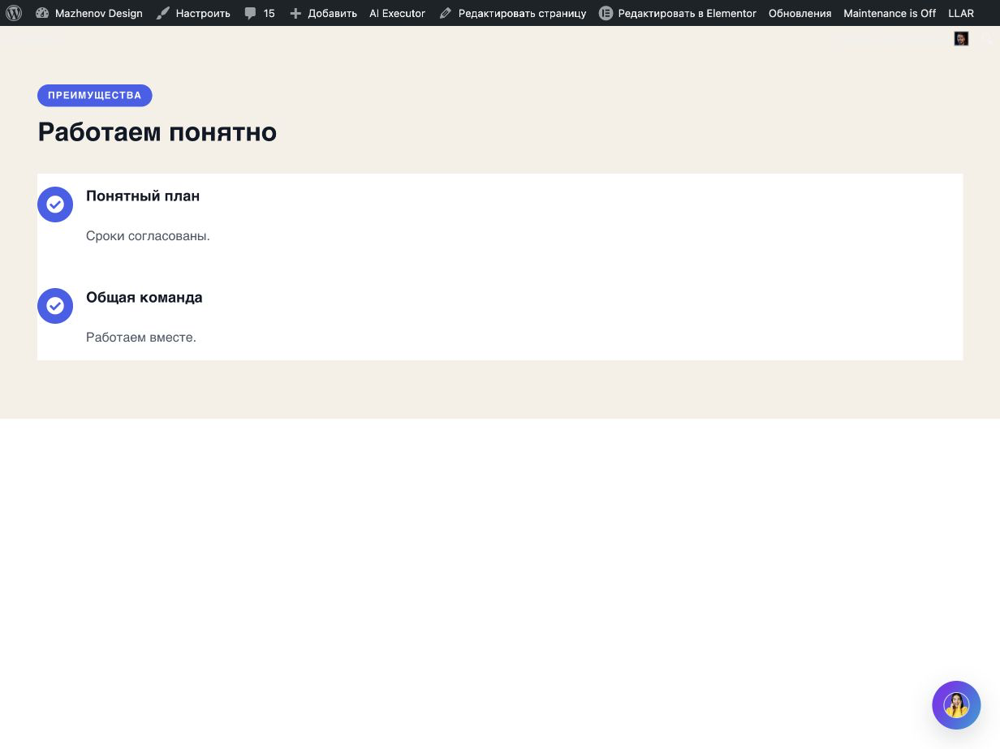
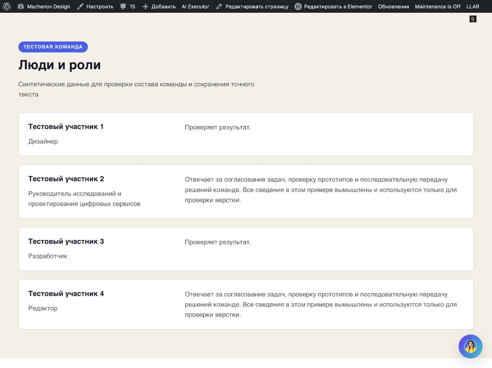
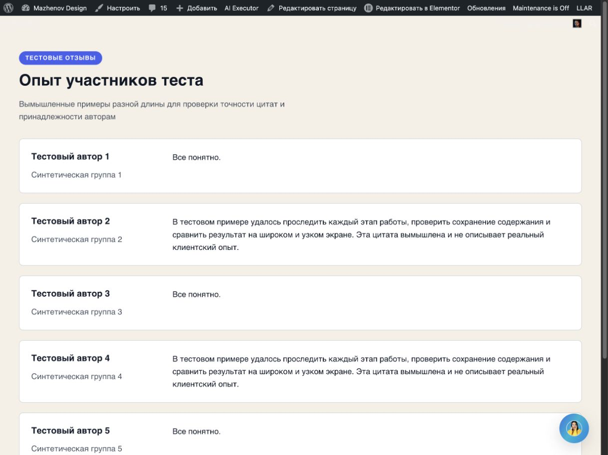

# Общая ширина коллекций v274 — live-приёмка

Дата: 2026-10-07. Страница: `post=5214`. Машинная матрица: [acceptance-matrix-v274.json](acceptance-matrix-v274.json). Исходное исправление находится в runtime-коммите `407f43e16cbc49946ab2e3884fb7726e95d58bef` (`v02.11.274`).

## Причина и изменение

В v273 три разные композиции сходились к коллекции шириной 864 px. Причина была в вычислении visual policy: legacy `composition=editorial_list` одновременно считалась основанием ограничить ширину всей коллекции `54rem`. В Team и Testimonials это имя оставалось историческим composition alias, тогда как фактические records выбирали `team.editorial_rows` и `testimonials.editorial_rows`. Поэтому настройка меры текста ошибочно стала настройкой внешней геометрии коллекции.

В v274 `collection.width` получает документированный default `100%` на desktop/tablet/mobile. Мера текста остаётся отдельно в `list_row.copy_measure` и `entity_layout.tracks.copy_measure`. Native compiler продолжает транслировать принятые ширины/оси в responsive controls; структурные records и старые composition IDs не менялись. Изменённые файлы runtime: `includes/llm/design-plan.php`, `tests/design-pipeline-contract.php`, `tests/m2-generation-contract.php`, `wp-ai-executor.php`, `wpae-package.json`. Общие регрессии проверяют две короткие строки Benefits, обе редакционные сущности, передачу ширины во все native breakpoints и сохранение естественной высоты Testimonials grid.

Публичный DOM подтвердил, что после reload коллекции всех трёх сценариев стали шириной 1140 px внутри секции шириной 1232 px. Исправление устранило общий 864 px clamp; оно не делает разреженный двухэлементный список Benefits автоматически плотным.

## Release и проверки

- Runtime/source: `v02.11.274`, commit `407f43e16cbc49946ab2e3884fb7726e95d58bef`.
- Runtime push had previously been reported successful. An independent `git ls-remote origin refs/heads/main` during this follow-up could not resolve `github.com`; the remote HEAD is not independently confirmed in this session.
- WP Pusher обновил только WP AI Executor. Plugins PHP и перезагруженная inline-конфигурация Elementor независимо показали `v02.11.274`.
- Локальные проверки runtime-коммита: `php tests/design-pipeline-contract.php` — PASS, 889 checks; `php tests/flex-generation-runtime.php` — PASS, 1414 checks; `php tests/elementor-patch-guard.php` — PASS; `node --test tests/*.test.js` — PASS, 18/18; lint изменённых PHP — PASS; catalog/package probe — PASS, 253 hashes без несовпадений; `git diff --check` — PASS.
- Live-матрица: три первые генерации, ноль повторов, ноль ремонтов, три transaction writes, provider calls — 0. Для каждого сценария выполнены Publish, editor/public reload readback и operation-scoped guarded Undo.
- Testimonials grid повторно live не запускался. Его natural-height сохранение проверялось существующей локальной regression suite.

## Сценарии

Запросы отправлялись по обычному plugin chat path на существующем `post=5214`; для каждого использован неизменённый exact-request fixture. На всех сценариях после предыдущего guarded Undo подтверждался пустой baseline `[]`.

### Benefits `benefits.editorial_list`

Fixture [F-G-H-exact-request.txt](../2026-10-05-visual-policy/F-G-H-exact-request.txt), SHA-256 `76c4e7077891d99eb2346d39dd5a298e1d77e28513794ab68d67a3933c709405`. Default profile; один Brief (`89aa68ad…c8c1f92`), один Plan (`3033b3fa…196664f`), record hash `de9ca242…1e2788`; typed preflight обозначен в trace как `reliable_structured`, выполнение — `local_deterministic`, provider calls `0`, write count `1`. Root `6a3d621`; operation `wpae-c48cde283a344462`; identity `06818206-033b-49d2-92ae-355ada6ff9f8`; accepted contract `contract-f8045f0c7c38ec14a7176d84`; generation revision `4`, свежий post-Publish descriptor revision `5`.

Независимый native JSON после reload сохранил точный intro и две title/body пары. Структура осталась вертикальным icon list: коллекция `x=46`, width `1140`, высота `230 px`; две строки по `105 px`, между строками `20 px`, icon/copy gap `16 px`. Public CSS viewport — `1232×923`; overflow нет. Native-файлы: [до Publish](screenshots/benefits-F-native-before-publish.json), [после reload](screenshots/benefits-F-native-after-reload.json); DOM snapshot: [metrics](screenshots/benefits-F-public-after-reload-metrics.json).

Первый результат сохранил прежний запрос и выбранную list-композицию, без repair. На проверенном public кадре список теперь занимает общую ширину, но две короткие строки остаются сгруппированы слева, а внизу страницы много свободного места. Это наблюдаемая плотность точного двухпунктного контента, а не повод добавлять вымышленные элементы; visual status остаётся **PARTIAL**. Editor mobile для этой операции не снимался; public mobile — **BLOCKED**: documented Browser Use API не предоставил viewport resize/emulation, фактический `window.innerWidth` оставался 1232 px.

[PNG Benefits](screenshots/benefits-F-public-after-reload-desktop.png) · [first result в editor до Publish](screenshots/benefits-F-first-editor.png) · [trace](screenshots/benefits-F-trace.json).

Guarded Undo прошёл; fresh public baseline не содержит fixture, `elementorRoots=[]`, `generatedRoots=[]`: [evidence](screenshots/benefits-F-undo-baseline.json). Следующая операция началась только после этого подтверждения.

### Team `team.editorial_rows`

Fixture [A-B-team-exact-request.txt](../2026-10-05-m3-1-entities/A-B-team-exact-request.txt), SHA-256 `13ed2c29b3c7e83b18a90413fa418d1dc0fc489ba491fc8c10c85fba2f82239b`. Default profile. Brief `8335a524…73b78dd`, Plan `325c786d…c0a7539`, record hash `ffaea52b…8450da8`; accepted record — `team.editorial_rows`, сохраняемая composition identity — legacy `team.editorial_list`. Typed preflight `reliable_structured`, исполнение `local_deterministic`, provider calls `0`, write count `1`. Root `4239089`; operation `wpae-e7efb62fe7148e7a`; identity `5c7f42ac-6718-47e6-9595-2e55bb500e53`; contract `contract-29e09fa5911c2bbc737696ac`; generation revision `4`, refreshed descriptor revision `6`.

После reload independent native JSON сохранил четыре синтетических name/position/bio набора; изображения и actions не появились. Public CSS viewport `1232×923`; коллекция `x=46`, width `1140`; natural row heights `111 / 136.6 / 111 / 126.8 px`. Длинная должность и длинные биографии переносятся без обрезки, overflow нет. Заголовки: eyebrow H6 `12px`, section H2 `32px`, entity H3 `18px`. Native: [до Publish](screenshots/team-G-native-before-publish.json), [после reload](screenshots/team-G-native-after-reload.json); geometry: [metrics](screenshots/team-G-public-after-reload-metrics.json).

Первичный editor capture, public после Publish и после reload доступны ниже. Editor device preview отдельно измерен при CSS `360×736`; это не public mobile. Public mobile **BLOCKED** по общей причине отсутствия документированного viewport control. В desktop кадре site avatar касается пустого нижнего правого края последней строки, authored copy не перекрывает. Geometry и content **PASS**, visual **PARTIAL_SITE_OVERLAY_EDGE**.

[PNG Team](screenshots/team-G-public-after-reload-desktop.png) · [первый editor result](screenshots/team-G-first-editor.png) · [Editor mobile preview 360×736](screenshots/team-G-editor-mobile-preview.png) · [trace](screenshots/team-G-trace.json).

Guarded Undo вернул `already_undone`; независимые editor/public snapshots подтвердили root set `[]`, Publish disabled и отсутствие test text: [editor](screenshots/team-G-undo-editor-baseline.json), [public](screenshots/team-G-undo-public-baseline.json).

### Testimonials `testimonials.editorial_rows`

Fixture [C-D-testimonials-exact-request.txt](../2026-10-05-m3-1-entities/C-D-testimonials-exact-request.txt), SHA-256 `9e754a6801ddab082faa49082bab44cb93919232c980d12e221f01c96987040d`. Default profile. Brief `53eedbed…c4e9978b`, Plan `77195f19…c1f9456d`, record hash `73e5a072…f2de56a`; selected record — `testimonials.editorial_rows`, legacy identity — `testimonials.editorial_list`. Typed preflight `reliable_structured`, execution `local_deterministic`, provider calls `0`, write count `1`. Root `600e501`; operation `wpae-e57dfb90fdcb9c78`; identity `5c03b246-cae4-424b-a33e-244d70cbee37`; contract `contract-8329c09bf8148bb88f4284f3`; generation revision `4`, refreshed descriptor revision `5`.

После reload native JSON сохранил intro и все шесть quote/author/meta associations, включая длинные цитаты. Фото, рейтинги, actions и ссылки не добавились. Public CSS viewport `1232×923`; коллекция `x=38.5`, `y=281.19`, width `1140`, высота `813.41 px`, row gap `20 px`; row heights `111 / 126.8 px` естественно чередуются. Внутренние tracks — identity `253.91 px`, gap `32 px`, copy `804.09 px`; текст не обрезан, document horizontal overflow нет. Native: [после reload](screenshots/testimonials-H-native-after-reload.json); geometry: [metrics](screenshots/testimonials-H-public-first-metrics.json).

Первый screenshot до Publish сохранён отдельно. Public кадр после Publish/reload показал greeting поверх части нижней цитаты; для чистого дополнительного кадра greeting был свёрнут через штатный site chat UI без изменения настроек/DOM/CSS. Avatar launcher остаётся поверх пустого края пятой строки и не закрывает текст на проверенных pixels. Desktop geometry/content **PASS**, visual **PARTIAL_SITE_LAUNCHER_EDGE**. Public mobile **BLOCKED**; editor preview `360×736` отдельно снят сверху и снизу и не считается public mobile.

[PNG Testimonials viewport](screenshots/testimonials-H-public-viewport-chat-collapsed.png) · [полный PNG](screenshots/testimonials-H-public-full-chat-collapsed.png) · [первый editor result](screenshots/testimonials-H-first-editor-before-publish.png) · [editor preview top](screenshots/testimonials-H-editor-mobile-preview-top.png) · [editor preview bottom](screenshots/testimonials-H-editor-mobile-preview-bottom.png) · [trace](screenshots/testimonials-H-trace.json).

Guarded Undo выполнен; refreshed operation state `already_undone`; editor/public root set — `[]`: [baseline](screenshots/testimonials-H-undo-public-baseline.json). Финальный editor readback также показывает пустые roots и disabled Publish: [snapshot](screenshots/final-editor-root-set.json).

## Итоговая матрица статусов

| Сценарий | Technical lifecycle | Content/native readback | Desktop geometry | Responsive | Visual composition | Restoration |
|---|---|---|---|---|---|---|
| Benefits editorial list | PASS | PASS | PASS, 1140 px list | PARTIAL; public mobile blocked, editor mobile not captured | PARTIAL: ровно два коротких пункта, остаётся разреженность | PASS, `[]` |
| Team editorial rows | PASS | PASS | PASS, 1140 px rows, natural heights | PARTIAL; public mobile blocked, editor preview 360×736 | PARTIAL: site avatar касается пустого края последней строки | PASS, `[]` |
| Testimonials editorial rows | PASS | PASS | PASS, 1140 px rows, natural heights | PARTIAL; public mobile blocked, editor preview 360×736 | PARTIAL: site avatar остаётся у пустого края строки; greeting пришлось штатно свернуть | PASS, `[]` |

Всего: три первичные генерации, ноль повторов/repair, три write transactions, ноль provider calls; все операции завершены scoped Undo. Финальный root set страницы — `[]`. Ни пользовательские roots, ни чужие плагины/настройки не менялись.

## Ограничения и статус

Подтверждён общий перенос полной доступной ширины в public DOM для трёх семейств. Testimonials grid не запускался live и не менялся; локальные tests сохраняют его естественные высоты. Technical lifecycle, content fidelity и desktop geometry прошли. Responsive acceptance остаётся неполным, потому что публичный viewport не удалось реально переключить ниже 1232 CSS px. Визуальная приёмка не полная: Benefits остаётся разреженным на точном коротком тексте; на Team/Testimonials присутствует ненастраиваемый site-owned avatar у края контента.

Практический следующий этап — отдельное решение в существующем visual policy о геометрии короткого editorial list (включая положение коллекции относительно intro), после чего его можно проверить тем же fixture; дополнительно потребуется документированный способ получить публичный mobile viewport.
