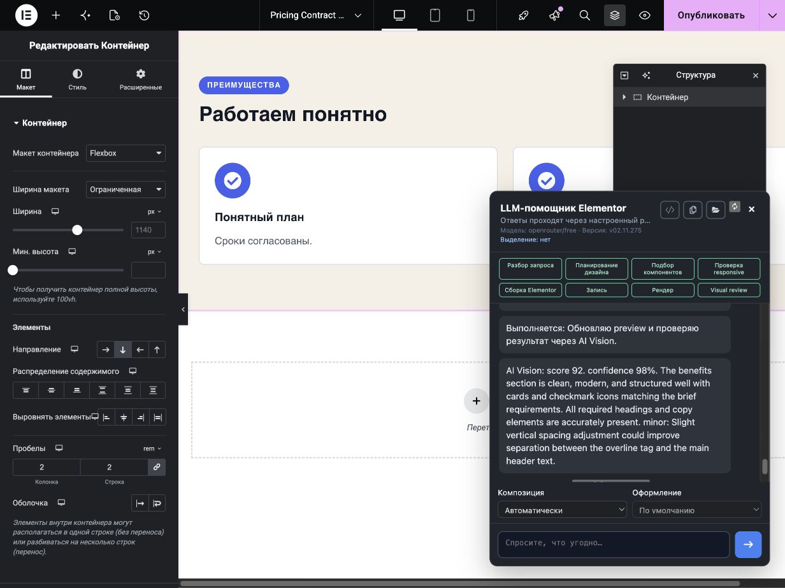
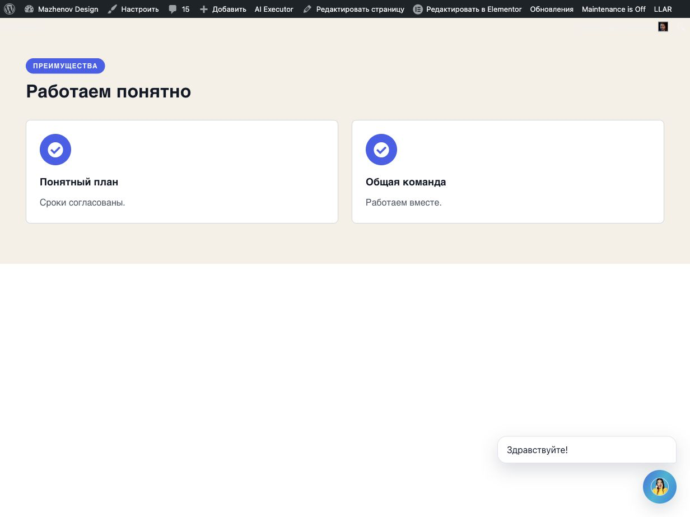

# Benefits density policy — v275 live acceptance

Date: 2026-10-07. Existing WordPress page: `post=5214`.

## Scope and decision ownership

v274 fixed the collection width clamp but left the exact two short Benefits entries in a wide vertical editorial list. The weak result was a composition choice made before compilation, so the fix belongs in the existing `DesignPlan` decision, before the Plan is frozen. This change does not add a planner, schema DSL, family-specific compiler fallback, filler copy, photos, or fixed-height treatment.

For canonical Benefits with exactly two complete title/body pairs and no explicit composition in the Brief or context record, `wpae_design_plan_visual_policy()` applies `benefits_two_item_copy_density_v1`. When each title is at most 48 Unicode characters, each body at most 84, and each combined item at most 120, the accepted Plan selects the existing `benefits.grid` record. Anything denser remains `benefits.editorial_list`. An explicit `benefits.editorial_list` selection always wins and remains a list. The policy and its measured inputs are stored in `composition_decision` before freeze. The existing compiler owns only translation of the accepted record into native Elementor controls; it does not choose the composition.

The grid changes native topology: two items compile as two equal desktop tracks with the existing responsive stack at tablet/mobile breakpoints. Legacy composition identity `benefits.three_cards` is retained for compatibility; it is not interpreted as a count. Existing Plans without the optional decision keep their historic behavior.

## Source, publish, install

- Runtime source: commit `c6034f566e9c34d8a56b6365e05dc4497ec7da1e`, plugin `v02.11.275`.
- `origin/main` was independently checked against that runtime commit before the documentation commit.
- WP Pusher's normal update action reported successful update for WP AI Executor only. WordPress Plugins PHP version and the reloaded editor inline bootstrap independently showed `v02.11.275`.
- No WordPress settings or other plugins were changed.

## Exact live request and pipeline

```text
Создай Benefits без фото
Надзаголовок: «ПРЕИМУЩЕСТВА»
Заголовок: «Работаем понятно»
Преимущество 1: «Понятный план»
Описание преимущества 1: «Сроки согласованы.»
Преимущество 2: «Общая команда»
Описание преимущества 2: «Работаем вместе.»
```

The existing page was empty and clean before the one generation. Ordinary plugin chat took the canonical `pipeline` route, `local_deterministic`, with one Brief, one accepted DesignPlan, one write, and zero provider calls. No retry or repair was issued.

| Field | Evidence |
|---|---|
| Brief SHA-256 | `89aa68ade81152988f2a7468191283d7d7f0a301b3fe25ba0b11d9622c8c1f92` |
| Plan SHA-256 | `2a9934b853b5916f8701ac60a456fde2b1db809da5ff6fd0f68387a5b4465d77` |
| Selection | `benefits.grid`, `automatic_density_policy`, `benefits_two_item_copy_density_v1` |
| Policy metrics | 2 items; max title 13 chars; max body 18; max item 31 |
| Visual profile | Default resolved profile; no explicit profile in the request |
| Operation / identity | `wpae-8118ac62c0878a4f` / `00fba9fd-6ce9-4575-b7ee-2d5d867771e6` |
| Accepted contract | `contract-dae0a478237312196148cd88` |
| Root / generation revision | `65e8e26` / revision 4 |
| Publish / refreshed descriptor | Publish succeeded; revision 6; descriptor available |
| Guarded Undo | revision 7, `already_undone` |

## Native and public readback

After Publish, reload and the read-only “Проверить owned модель перед Save” check, the editor reported that the owned model matched the accepted contract. The public root and authored fields matched the accepted tree. The captured native JSON was not separately exported as a file; this report does not claim an independent JSON export artifact.

At public CSS viewport `1232×923`, root `65e8e26` measured `1232×438.98px`; its collection measured `1140×185px`, with two `558px` tracks and a `24px` gap. Both cards were `558×185px`. All eyebrow/title/item copy remained exact; section title is H2 and item titles are H3. Text is left aligned, overflow is visible, and document `scrollWidth` equals `clientWidth` at this desktop viewport. The two checkmark icons rendered. There are no CTAs in this request. The site greeting/avatar sits below the generated root and does not overlap the cards. This is a single desktop geometry measurement, not proof of public mobile behavior.

## Screenshots and visual assessment

The first-result editor capture was saved before Publish; editor chrome, Navigator, and the open AI panel obscure part of the second card. It is retained as first-result evidence, not used as public visual acceptance.



After Publish and reload, the public viewport capture shows two distinct equal-width cards, aligned below the eyebrow and H2, with the supplied check icons and exact concise copy. The section is balanced at the tested desktop width; the previous sparse vertical stack is avoided without adding content or height fillers. The large blank area below is outside the generated root and remains page background.




Public mobile is **BLOCKED**: the documented Browser Use/iab controls exposed no public viewport resize or device emulation, and the actual public CSS width remained 1232px. No editor mobile preview is presented as public-mobile evidence. The local regression verifies the accepted tablet/mobile native controls, but that does not substitute for a browser render at those widths.

## Status by acceptance dimension

| Dimension | Status | Evidence / boundary |
|---|---|---|
| Lifecycle | PASS | One write; Publish; editor reload; owned-model check; guarded Undo |
| Content fidelity | PASS | Exact eyebrow, heading, two titles and bodies preserved |
| Native topology | PASS | Existing `benefits.grid`; two native tracks; distinct from explicit editorial list |
| Desktop geometry | PASS | 1140px collection, 558px tracks, 24px gap, no horizontal overflow at 1232×923 |
| Visual composition | PASS at tested desktop | Public screenshot visually reviewed; no invented copy/photos/fillers |
| Responsive proof | PARTIAL | Native responsive controls covered by local tests; public mobile BLOCKED |
| Overlay attribution | PASS | Site chat greeting/avatar below root; no overlap with authored text/cards |
| Document restoration | PASS | Undo revision 7; editor and public generated root sets `[]` |

## Local checks

The runtime commit was tested before push. Results: `php tests/design-pipeline-contract.php` — PASS, 892 checks; `php -d memory_limit=512M tests/flex-generation-runtime.php` — PASS, 1417 checks; `php tests/elementor-patch-guard.php` — PASS; `node --test tests/*.test.js` — PASS, 18/18; `php tests/imported-template-catalog.php` — PASS (158 manifest entries, 156 retrievable trees and previews); `php docs/audits/2026-09-12/package-probe.php` — PASS (253 manifest files, 0 hash mismatches); changed PHP lint — PASS; `git diff --check` — PASS. The package probe's full diagnostic JSON had a malformed-UTF8 serialization warning; its compact result completed and reported no hash mismatches.

The ordinary plugin chat lifecycle regression verifies one Brief/Plan and mock write/readback, with one transaction write and no provider call. Design pipeline checks also assert explicit editorial-list preservation, long-copy fallback, exact text, distinct topology, and responsive controls. Existing Team and Testimonials structure/natural-height checks continue to pass.

## Restoration and artifacts

The operation-scoped Undo succeeded without manual deletion. Fresh editor state is a valid intentional-empty document, Publish is disabled, public generated roots are `[]`, and the test copy is absent. The final root set on post 5214 is `[]`.

The machine-readable [acceptance matrix](acceptance-matrix.json), [DOM measurements](live-measurements.json), first-result [pipeline trace](screenshots/benefits-first-trace-v275.json), post-reload [operation descriptor](screenshots/operation-after-reload-v275.json), and [final baseline readback](screenshots/final-baseline-v275.json) preserve the source evidence. JPEG screenshot bytes were retained alongside the converted PNGs; PNG format and 1232×923 dimensions were checked, and each PNG was opened and visually inspected.

Generation count: 1. Retry/repair count: 0. Root: `65e8e26`. Overall: technical lifecycle, exact content, native topology, desktop geometry and desktop visual composition pass; public mobile remains blocked.

## Remote status and remaining evidence

Runtime commit `c6034f566e9c34d8a56b6365e05dc4497ec7da1e` was pushed and independently confirmed on `origin/main` before the documentation commit. The scoped report/evidence commit `787d5af5419936846908774be3332ef70bba4c6b` was then pushed; a separate `git ls-remote origin refs/heads/main` returned that exact SHA. The report, matrix, canonical context, handoff report, architecture note and checked screenshots are therefore published.

The only material browser-evidence gap is public mobile rendering. A practical follow-up is to capture this same accepted composition at a real public mobile CSS viewport once the documented Browser Use controls expose viewport emulation. The page is already restored to the empty root set, so that visual check does not require another generation.
