# Flex recipe migration — v02.11.277 live acceptance

**Дата:** 2026-10-07 · **Страница:** post=5214 · **Source:** `1ffb1fc099c1d14a721e416c72aca189955874e3` · **Версия:** `v02.11.277`

## Итог

Сохранённые recipe definitions и новые accepted typed Plans используют Elementor Flex containers. Для повторяемых групп compiler применяет `native_flex_equal`: ширина track учитывает сумму gap, направление/перенос и responsive controls следуют принятому Plan. Frozen старые Plans без новых layout-полей сохраняют совместимость; это не миграция уже сохранённых пользовательских roots.

В текущем v277 live-run выполнено **7 первичных генераций**, без повторов и repair, на **5 семействах** и **7 разных композициях**: Hero split, About split, Pricing cards, Team grid и editorial rows, Testimonials editorial rows и grid. На каждом root проверены publish/reload и operation-scoped Undo. Семейства Services, Benefits, FAQ и Process пропущены согласно пользовательскому scope. Финальные editor/public roots на post=5214 — `[]`.

WP AI Executor v02.11.277 подтверждён в установленной PHP-версии Plugins и inline-конфиге перезагруженного Elementor editor. Версия source — та же. В этой continuation source не менялся, version bump и повторный полный локальный набор не запускались. Для v277 до этого были зафиксированы: Design Pipeline Contract 892, Flex Runtime 1417, patch guard PASS, Node 18/18, PHP lint PASS, package probe 253 hashes / 0 mismatches, `git diff --check` PASS.

## Что именно переехало на Flex

- `DesignPlan.visual_policy.collection.implementation = native_flex_equal` разрешает одинаковые tracks с вычитанием межколоночных gap. Compiler переводит Plan в `container_type=flex`, `flex_direction`, `flex_wrap`, gap-aware ширину children и responsive dimensions.
- Новые grid-like repeating records сохраняют визуальную сетку через `flex row + wrap`; editorial/list records остаются вертикальными/строчными Flex-композициями.
- Recipes и imported-template catalog v277 нормализованы к Flex. В tracked manifest — 158 catalog entries, 156 доступных деревьев были проверены; активные Grid layout controls в них не оставлены. Историческая ветка native Grid сохранена только для frozen legacy Plan без новых collection tracks.
- Изменение source уже вошло в commit `1ffb1fc`. Runtime и package после него не менялись в этом продолжении.

## Live acceptance matrix

Подробные hashes, traces, measurements и скриншоты перечислены в [машинной матрице](acceptance-matrix-v277.json). Все записи прошли обычный plugin-chat pipeline, одна Brief и один accepted Plan, provider calls 0, transaction write 1, Publish/reload, свежий public кадр и scoped Undo.

| Композиция | Root / operation | Editor/public | Качество и ограничения |
|---|---|---|---|
| Hero `hero.split_60_40.right`, `editorial_light` | `a3b7647` / `wpae-0522bdba1ef9256d` | 60/40; public desktop и mobile | Exact copy/CTA/alt; photo загружено; mobile copy→CTA→photo; overflow нет. |
| About `about.split_60_40.left`, `editorial_light` | `a0212e4` / `wpae-14fc085e808724a6` | 60/40; public desktop и mobile | Полный текст, H2, загруженное фото слева; mobile copy→CTA→photo; overflow нет. Это editorial About, не Hero с заменённым заголовком. |
| Pricing, 2 tiers `pricing.tiers` | `c94a3ca` / `wpae-7ebc9bd141096e82` | public desktop; только editor mobile preview | Ровно два тарифа, 50 000 ₸/мес и 150 000 ₸/год, features/CTA `#start` и `#project` сохранены. Desktop две равные Flex tracks по 558px с gap 24px. Public mobile этого root не снят до Undo. |
| Team `team.grid` | `9be2730` / `wpae-14d16a8a643e2ede` | public desktop; editor mobile preview 360×736 | Четыре synthetic участника, точные name/position/bio; без фото и CTA. Flex wrap 2×2, естественная высота. Public mobile этого root не снят до Undo. |
| Testimonials `testimonials.editorial_rows`, `editorial_light` | `a1e7c85` / `wpae-16f34da43f39dbde` | public desktop/mobile | Все шесть quote/author/meta; фото/рейтинги отсутствуют. Редакционные строки не превращены в Services-карточки. Site greeting касается свободной области около последней строки. |
| Team — **второй вариант**, `team.editorial_rows` | `faf156d` / `wpae-1ba864a2453c984a` | public desktop/mobile | Это второй Team variant после grid; export пользователя относился ко второму варианту, а не к третьему. Desktop identity/copy rows, mobile stack; поля и принадлежность сохранены. Site avatar касается пустого края. |
| Testimonials `testimonials.grid` | `40f2079` / `wpae-149a17d653e7409a` | public desktop/mobile; editor после reload | Все шесть quote/author/meta exact; 17/17 native containers Flex. Desktop 2 колонки по 558px, gap 24px; mobile 1 колонка с естественной высотой short/long 148.6/302.2px. CSS viewport 1232×923 и 390×844. Chat greeting пересекает пустую нижнюю padding-зону карточки; авторский текст не закрыт. |

Для Team grid и 2-tier Pricing есть editor mobile preview, но нет public mobile evidence. Это `NOT RUN`, а не public-mobile PASS. Roots уже прошли guarded Undo; ради ретроспективного кадра новых повторов не создавал.

В матрице `undo: null` для About и Team grid означает, что точная числовая ревизия Undo не попала в сохранённый trace; это не означает пропущенный Undo. Guarded Undo и восстановление пустого root set подтверждены в live editor/public readback. Для остальных сценариев числовые Undo revisions сохранены.

## Новый testimonials.grid: точная фиксация

Fixture — [C-D-testimonials-exact-request.txt](../2026-10-05-m3-1-entities/C-D-testimonials-exact-request.txt), SHA-256 `9e754a6801ddab082faa49082bab44cb93919232c980d12e221f01c96987040d`. Из UI выбран record `testimonials.grid`; legacy composition identity `testimonials.three_cards` сохранён. Это название — compatibility identity, фактическая desktop policy в accepted Plan равна 2 колонкам, tablet/mobile — 1/1; в public DOM получились именно 2/1/1, поэтому Plan, IR и native render согласованы.

- Brief hash `53eedbedf3b4fd549bf506b17f614e4cc604e469a989ebd2d1809034c4e9978b`; Plan hash `0cdb3e19e58789c93bbc27fade7b19b62abc0ed313ffd53b0ee008517b82704a`; contract `contract-6215527d1dca2364b27112cc`, hash `6215527d1dca2364b27112ccb9a8adb66716f5bc1392adac227693bfeb41f1ca`.
- Operation `wpae-149a17d653e7409a`, identity `763c15d2-5843-4003-8201-796973eaa99c`, root `40f2079`; revision 4 at generation, 6 after Publish/reload and owned-model check, 7 after Undo (`already_undone`, `write_count=0`). Generation route `local_deterministic`, provider calls 0, write count 1.
- All 17 native containers are Flex. Compiler and transaction readback signatures both equal `dc93e3dc4ec1450a3346cc135b6303fb120e61774a72841a64ff8366cf6282ba`. After reload the editor displayed the same exact six review entries and the owned-model check passed. The plugin’s “Копировать JSON выделенного” control could not export a separate subtree because Elementor selection stayed empty; it displayed “Выделите элемент в Elementor и повторите.” This limitation is recorded; it does not replace the passing transaction signature/owned-model check.
- Public desktop CSS viewport 1232×923; collection x38.5, width1140; Flex row/wrap, gap24; children 558px. Mobile CSS viewport 390×844; collection width343px, 1 column, gap16; no horizontal overflow. Images, links and ratings are absent as requested.

### Testimonials.grid — свежие public screenshots

post=5214 · root `40f2079` · operation `wpae-149a17d653e7409a` · revision 6 after Publish/reload · source public page.

Desktop CSS 1232×923; viewport PNG 1217×912; full PNG 1217×1077.

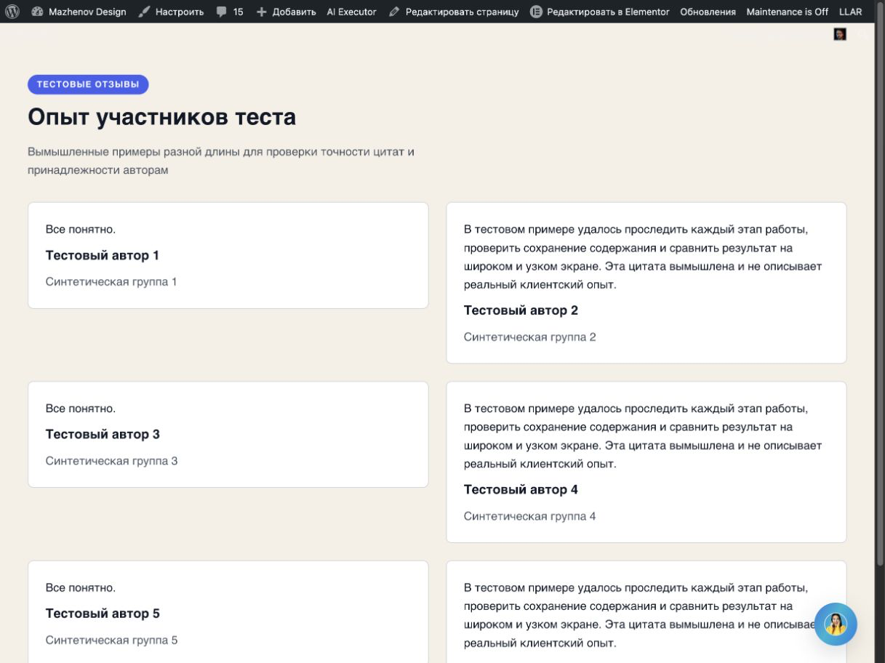

[Desktop viewport PNG](screenshots/testimonials-grid-public-viewport.png) · [Desktop full PNG](screenshots/testimonials-grid-public-full.png)

Mobile CSS 390×844; viewport PNG 375×812; full PNG 375×1735. This is real public mobile, not Elementor preview.

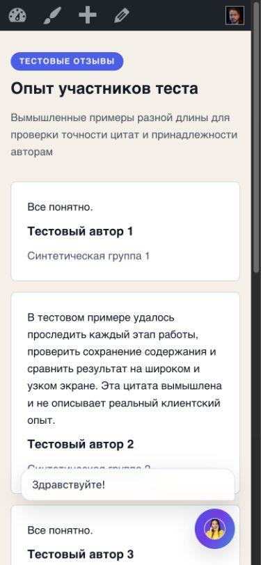

[Mobile viewport PNG](screenshots/testimonials-grid-public-mobile-viewport.png) · [Mobile full PNG](screenshots/testimonials-grid-public-mobile-full.png)

### Галерея остальных first results

**Hero split справа** — post 5214, root `a3b7647`, operation `wpae-0522bdba1ef9256d`, public CSS 1232×923 / 390×844.

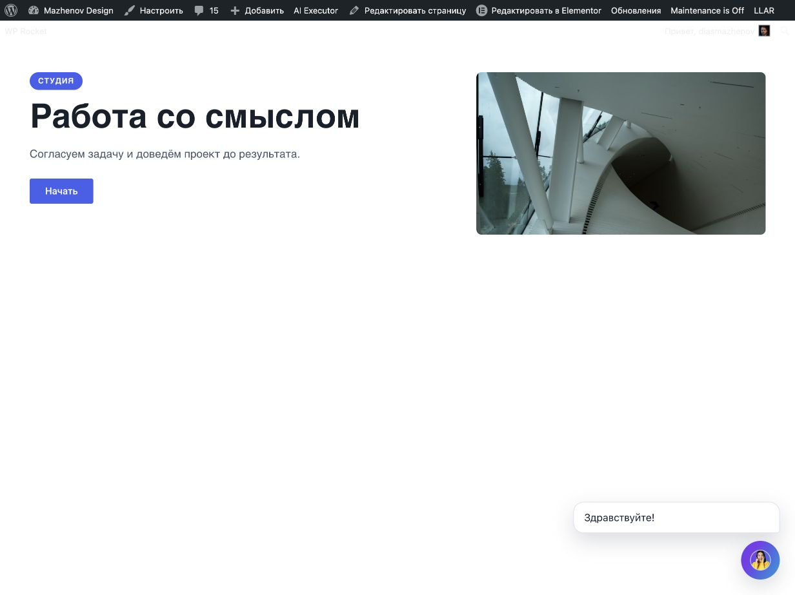
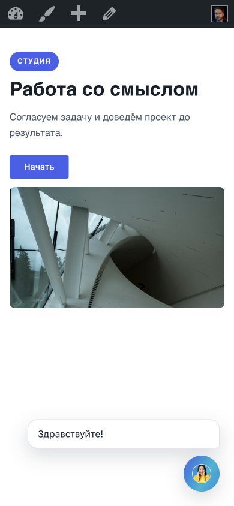

**About split слева** — post 5214, root `a0212e4`, operation `wpae-14fc085e808724a6`, public CSS 1232×923 / 390×844.

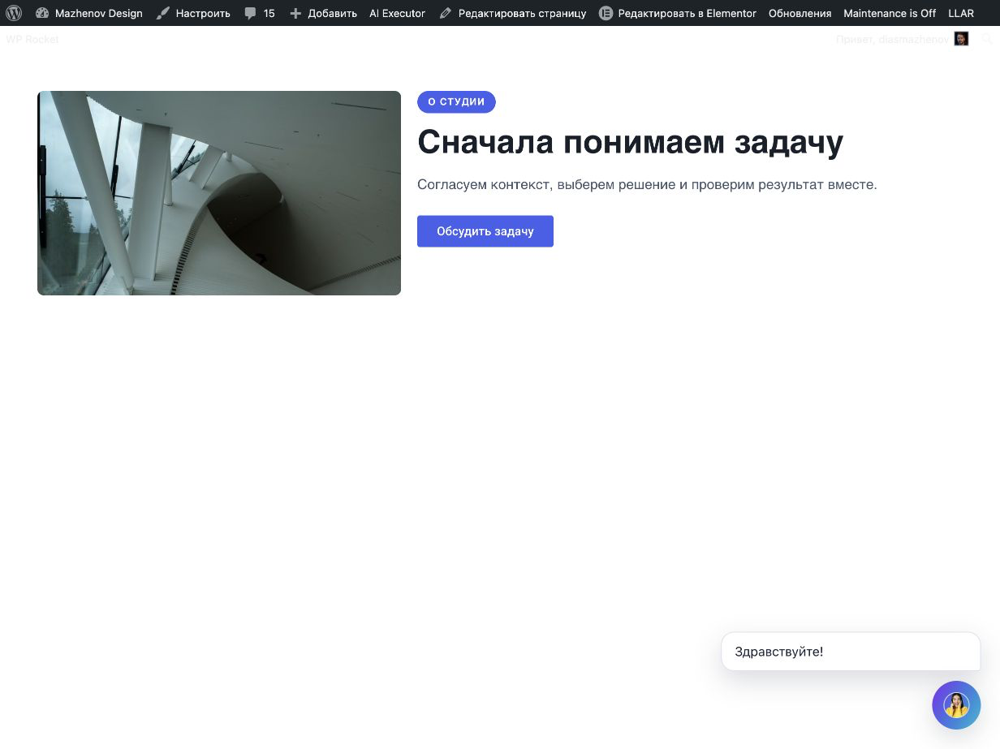
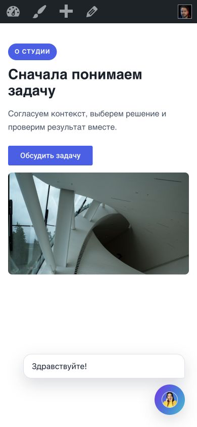

**Pricing, два тарифа** — post 5214, root `c94a3ca`, operation `wpae-7ebc9bd141096e82`, public CSS 1232×923. Public mobile не снимался; editor preview отдельно сохранён при 360×736.

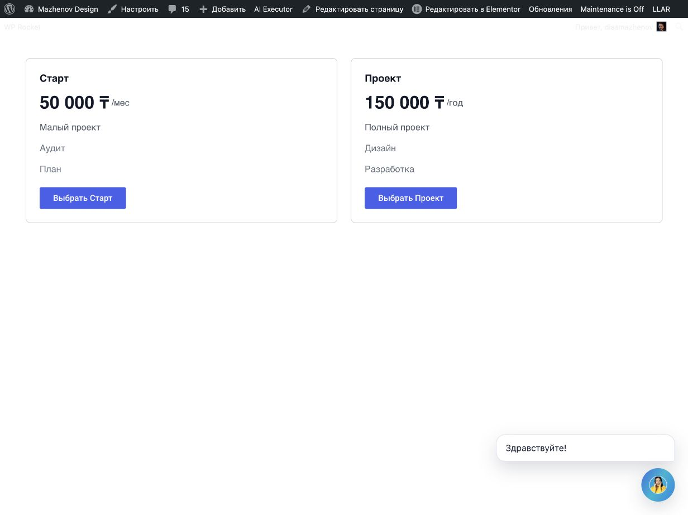

**Team grid** — post 5214, root `9be2730`, operation `wpae-14d16a8a643e2ede`, public CSS 1232×923. Public mobile не снимался; editor preview отдельно сохранён при 360×736.

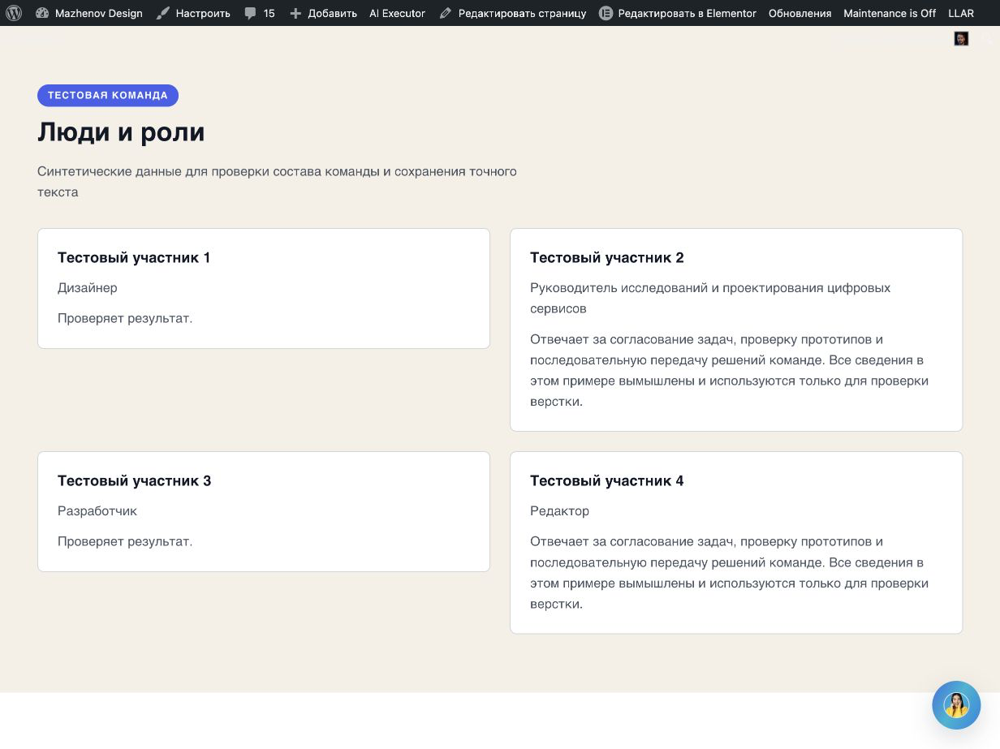

**Testimonials editorial rows** — post 5214, root `a1e7c85`, operation `wpae-16f34da43f39dbde`, public CSS 1232×923 / 390×844.

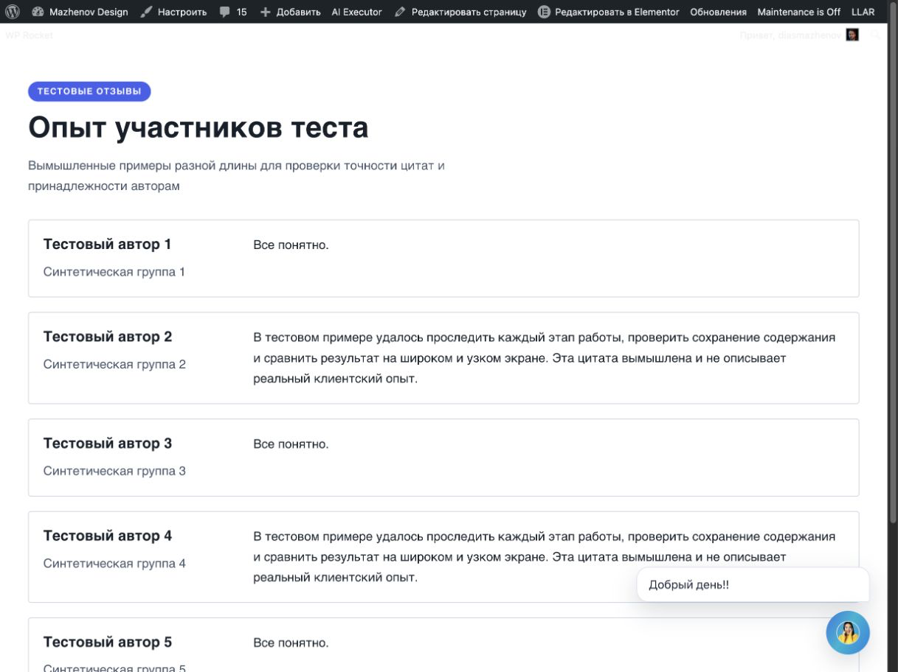
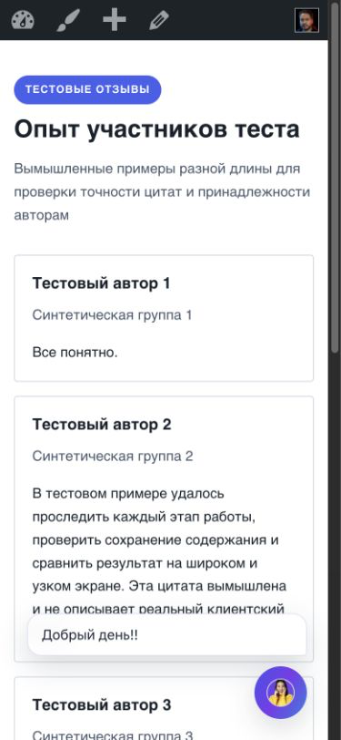

**Team editorial rows — второй вариант** — post 5214, root `faf156d`, operation `wpae-1ba864a2453c984a`, public CSS 1232×923 / 390×844.

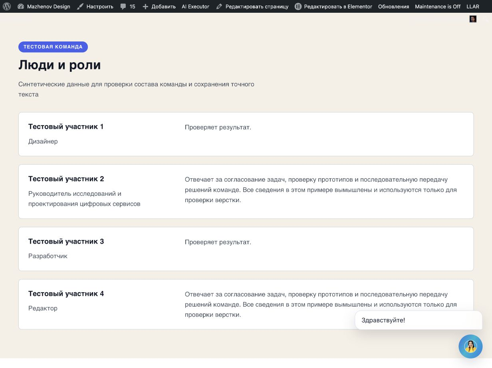
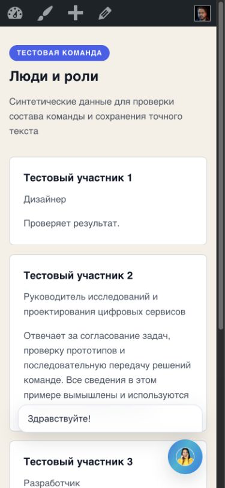

## Проверки и конечное состояние

- Источник: runtime v277 commit `1ffb1fc`; установленный PHP version и editor inline version — v277. Эта continuation не изменяла runtime и не выполняла повторный full-suite запуск.
- Семь first generations; семь guarded Undos; ноль repeat и zero repair. Ни один пользовательский root не удалялся вручную; каждый тестовый root снят только своей operation.
- Editor after final Undo: post=5214, inline v277, canvas пустой, Publish disabled. Public `https://mazhenov.kz/pricing-contract-live-v123/`: roots `[]`, CSS viewport 1232×923. Baseline восстановлен как `[]`.
- Скриншоты сохранены из Browser Use bytes через Node `fs/promises.writeFile`; JPEG source распознан по подписи и преобразован в PNG. Все PNG проверены `file`/`sips`, открыты и осмотрены. Полные measurements и hashes — [evidence JSON](testimonials-grid-evidence-v277.json).
- Успех генерации не равен полной визуальной приёмке: desktop evidence есть для семи сценариев, public mobile есть для пяти. Два public-mobile кадра отсутствуют, а chat overlay в некоторых результатах является внешним слоем страницы. Общее качество Flex-композиций подтверждено для inspected topology, но весь набор исторических record/profile combinations и все unsupported families здесь не объявляются принятыми.

- GitHub remote HEAD не подтверждён: `git ls-remote origin refs/heads/main` завершился `Could not resolve host: github.com`; push этого отчетного пакета ещё не проверен.
