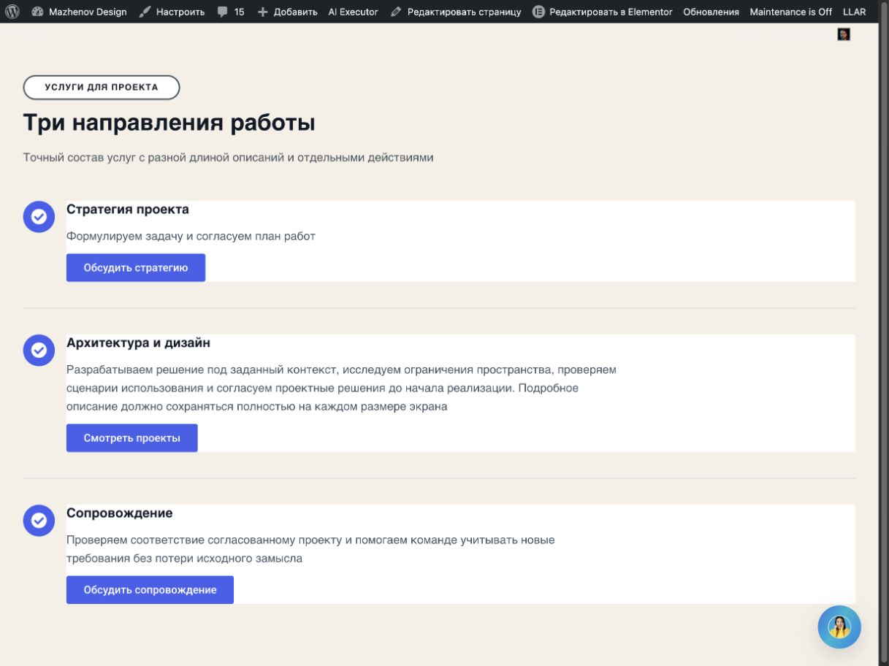
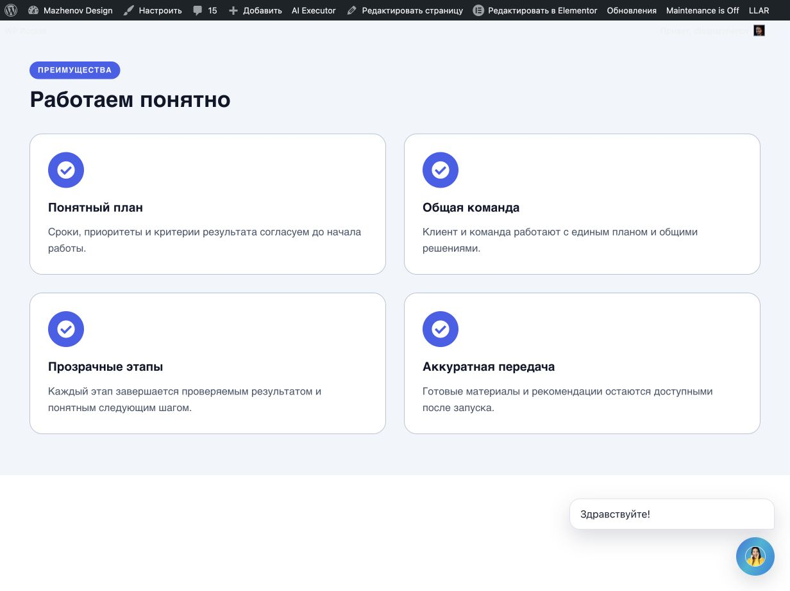
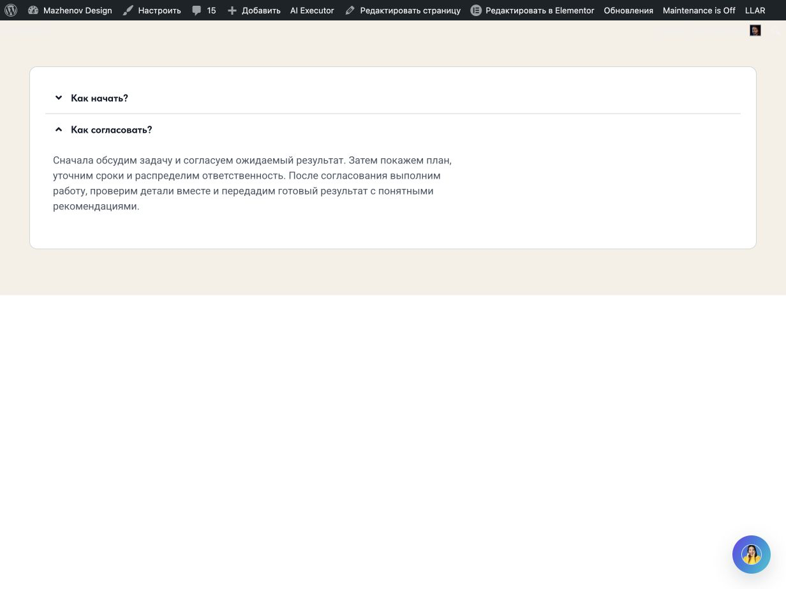
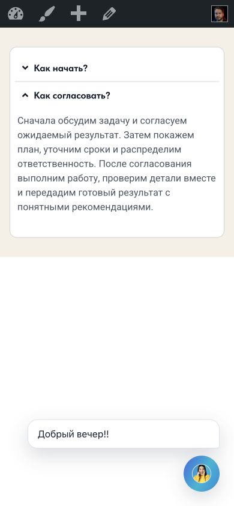

# Оставшиеся Flex-рецепты v02.11.277 — live continuation

Дата: 2026-10-07 · Существующая страница: post=5214 · Source/runtime: commit `1ffb1fc099c1d14a721e416c72aca189955874e3`, `v02.11.277` · Repository HEAD в начале: `5f668f4a1b5454f897f6f6fcc9f9c64ed48382fa`.

## Итог

После предыдущих семи v277 генераций проверены три разрешённых оставшихся сценария: `services.text_icon_list`, `benefits.grid` на четырёх парах и настоящий `faq.native` Accordion. В каждом было ровно одно создание через обычный plugin chat, один transaction write, Publish/reload и operation-scoped guarded Undo. Между тестами baseline заново читался; после каждого Undo editor/public roots возвращались к `[]`. Повторов, ручных правок, repair и неизвестных roots не было.

Process остановлен до записи: каталог содержит legacy recipe `process.steps`, а typed record catalog не содержит Process composition. Одного recipe недостаточно для требуемого соответствия Brief → выбранный record → accepted Plan → IR → compiler. Никакая Process генерация, provider call или запись не выполнялась.

Установленная PHP-версия плагина и inline-версия перезагруженного editor подтверждены как v02.11.277. Runtime не менялся, поэтому version bump и повтор полного локального набора не делались. Документальные изменения и выбранные evidence — в этом аудите. Полная матрица машинно читаемого статуса: [acceptance-matrix-remaining-v277.json](acceptance-matrix-remaining-v277.json).

## Исходное состояние и контроль записи

- До первой записи post=5214 имел пустой root set `[]`; редакторная вкладка уже была чистой/сохранённой. Установка и inline config показывали v02.11.277.
- Перед каждым следующим сценарием заново подтверждался пустой baseline и отсутствие незавершённой тестовой операции.
- Три операции выполнились обычным plugin-chat path через deterministic typed pipeline; для каждой сохранены один Brief, один accepted Plan, `provider_calls=0`, `write_count=1`.
- После каждого publish/reload выполнялись editor native readback и public DOM review. Затем кнопка Undo вызывалась по конкретному operation ID; baseline `[]` повторно подтверждался и в editor, и после public reload.
- Текущий конечный root set post=5214: `[]`.

## Сценарии

| Сценарий | Record/recipe и operation/root | Content и native readback | Desktop/public mobile | Restore |
|---|---|---|---|---|
| Services | `services.text_icon_list`; `wpae-6ec007474100025d` / `8e3d0dd` | Три точных услуги, 3 точных CTA href, 17 widgets, 19 Flex containers, фото и media placeholders отсутствуют | Desktop без overflow; public mobile CSS 390×844. Оба кадра PARTIAL из-за сайта: на desktop различный y у CTA строк разной высоты, на mobile greeting перекрывает длинный текст и CTA второго элемента | Guarded Undo PASS, roots `[]` |
| Benefits | `benefits.grid`, `soft_cards_light`; `wpae-0f910ad893de64a6` / `9cc9400` | Четыре точные упорядоченные пары; 2×2 native Flex wrap, без фото/CTA | Desktop 1140px collection, две колонки 556px + gap 28px. Public mobile CSS 390×844, одна колонка; PARTIAL: chat greeting перекрывает заголовок и описание третьего пункта | Guarded Undo PASS, roots `[]` |
| FAQ | `faq.native`; `wpae-d703ca87007f9393` / `effd65c` | Реальный `accordion.default`, обе пары точны; второй answer длиной 237 символов раскрывается | Desktop и public mobile CSS 1232×923 / 390×844; длинный ответ полностью виден, overflow/clipping нет, внешний greeting находится в свободной области | Guarded Undo PASS, roots `[]` |
| Process | Legacy recipe `process.steps`; typed Process record отсутствует | BLOCKED до записи; accepted record/Plan/IR не создавались | NOT RUN | Не применимо; baseline не менялся |

Полные hashes, revision, operation identity и evidence paths находятся в [matrix](acceptance-matrix-remaining-v277.json). Сводка Services основана на сохранённом live trace/descriptor, editor readback и public DOM; исходный raw JSON export этой операции не сохранялся, и это отдельно отмечено в [services-generation-summary.json](services-generation-summary.json). Raw pipeline trace Benefits и FAQ, а также предварительный native readback FAQ лежат в этом каталоге.

### Services — `services.text_icon_list`

Fixture: [services-text-icon-exact-request.txt](services-text-icon-exact-request.txt), SHA-256 `917afaa2133773d564f601be700a7820e6f1d8d9d735ad7173542a5dfc65fb04`. Надзаголовок, title/body, порядок трёх услуг, полные описания и `#strategy`, `#projects`, `#support` сохранены. Media запрещены, и native tree не содержит image/media placeholder.

Operation `wpae-6ec007474100025d`, identity `ed370486-8d33-4475-afa8-be6f7e669f42`, contract `contract-029059887d0ad275117106c1` / hash `029059887d0ad275117106c1269518d3beb579dfcbceca4b13270401796af113`, root `8e3d0dd`. Brief `66deee4445262c1ae1ddb84bcd643fa7021d64d735c02b7f2d66b7d07f9b6e95`, Plan `44088d8b27dbd6013ddbb69e2036f36a79ae1fec549147679d9405d2c0d53b53`. Revision: generation 4, read-only descriptor after Publish/reload 6. `local_deterministic`, provider calls 0, writes 1.

Desktop CSS viewport 1232×923, document width 1217. Root: x=0, y=32, width=1217, height=893. Rows are native Flex rows with 16px gap and heights 144/195/170; CTA top coordinates are y=351/588/798. Это естественная отдельная высота каждой записи, но не общая нижняя CTA-ось. Desktop композиция частично удачна: иерархия и содержание читаемы, у коротких строк не появляются искусственные пустые filler-блоки, однако выровнять три независимых действия по единому низу эта list-композиция не смогла.

Public mobile: фактический CSS viewport 390×844, документ шириной 375px, overflow отсутствует. Full-page кадр показывает сохранённую очередность и естественные переносы. Site-owned greeting перекрывает часть полного описания второй услуги и её CTA — доступность этого authored content частичная, поэтому mobile визуальная оценка PARTIAL.

post=5214 · root `8e3d0dd` · operation `wpae-6ec007474100025d` · revision 6 after Publish/reload · public source.

Desktop CSS 1232×923; PNG 1217×912:

[Download desktop PNG](screenshots/services-public-desktop.png) · [Full desktop PNG](screenshots/services-public-desktop-full.png)

Mobile CSS 390×844; full-page PNG 375×1115:

[Download mobile full-page PNG](screenshots/services-public-mobile-full.png)

### Benefits — four items, `benefits.grid`

Fixture: [benefits-grid-exact-request.txt](benefits-grid-exact-request.txt), SHA-256 `319ed0ed7284e53ec57992626ef4895048d2dd2177bb59eecea2aa9ef1ab0257`. Выбрана альтернативная композиция `benefits.grid` и профиль `soft_cards_light`, не двухпунктный `editorial_list`. Четыре title/body пары и порядок совпали. Изображений, кнопок и лишних claims нет.

Operation `wpae-0f910ad893de64a6`, identity `ce38cc8f-bb4f-4359-9e14-db9c984e4e59`, contract `contract-50c0da2d2da41e10059b268f` / hash `50c0da2d2da41e10059b268f0618c593fca9f31aa33637b256869dc56b5fe7b8`, record hash `6b3f121c7e7902b143e254507fb809c3c186b17e79c4aa551951197fd9fa0389`, root `9cc9400`. Brief `64bf9844fbfa17506b7ccf10c395430ee4c930089d306d960049b4e829473c76`, Plan `7272e063e1315d58756c829e72e10200a6f3a0ae1ff1389f2aad13e482fc72f2`; generation revision 4, post-Publish/reload descriptor revision 6, local deterministic, provider calls 0, write 1.

Desktop CSS viewport 1232×923: 1140px collection, two 556px columns with 28px gap; 2×2 Flex wrap and no horizontal overflow. Tablet policy in saved visual policy is one column; mobile is one column. On public mobile 390×844 the document is 375px wide and each card is 343px; content grows naturally and no overflow was measured. Визуальная композиция чистая и действительно отлична от editorial list. Однако mobile greeting overlays item 3 icon/title/body; visual/public accessibility status is PARTIAL. Vision score 92/confidence 98 found no content/structure defect, which does not override that pixel overlap.

post=5214 · root `9cc9400` · operation `wpae-0f910ad893de64a6` · revision 6 after Publish/reload · public source.

Desktop CSS 1232×923; PNG 1232×923:

[Download desktop PNG](screenshots/benefits-public-desktop.png) · [Full desktop PNG](screenshots/benefits-public-desktop-full.png)

Mobile CSS 390×844; full-page PNG 375×1173:

[Download mobile full-page PNG](screenshots/benefits-public-mobile-full.png)

### FAQ — `faq.native`

Fixture: [J-exact-request.txt](../2026-10-05-visual-policy/J-exact-request.txt), SHA-256 `bd52bb291c2ca737077875f2160dfa95e4e532a9b487957453c62dec33266424`. Использован настоящий Elementor `accordion.default`, а не декоративная имитация. Первый короткий ответ и второй длинный ответ сохранены. Штатное нажатие раскрывает второй ответ и закрывает первый; после окончания анимации все 237 символов видны.

Operation `wpae-d703ca87007f9393`, identity `b913540f-4b50-4831-a2b0-8e7259a7e646`, contract `contract-d289bb996a5c841ee50a7dff` / hash `d289bb996a5c841ee50a7dff1e44f2b2f7474692d0e11ce8de6a4bc11418cf0e`, record `faq.native` / record hash `b720ea8b934345ff1596ee893bf4cbce9500745a1a8a69f69d1f7dc6ea799f38`, root `effd65c`. Brief `6736225f9b09f80b93763a48b452499a9482b7a244f3f828bf97a750c4a0daac`, Plan `4c2321c0f7d748fbd2a4e231d514e90887acede680c4714ad260fee24d500a68`; generation revision 4, read-only descriptor after Publish/reload revision 5, provider calls 0, write 1. Frozen native signature and readback signature match.

Desktop CSS 1232×923; expanded item 187px, root 430px high, no clipping or horizontal overflow. Public mobile CSS viewport 390×844; expanded item 247px; answer scrollHeight equals clientHeight 202px and overflow is visible. Greeting occupies blank page area. Vision's truncation concern (score 85/confidence 95) was rejected by exact text checks against editor native state and public DOM plus the opened PNG; no repair was applied.

post=5214 · root `effd65c` · operation `wpae-d703ca87007f9393` · revision 5 after Publish/reload · public source, second answer open.

Desktop CSS 1232×923; PNG 1232×923:

[Download desktop PNG](screenshots/faq-public-desktop-long.png) · [Full desktop PNG](screenshots/faq-public-desktop-long-full.png)

Mobile CSS 390×844; PNG 390×844:

[Download mobile PNG](screenshots/faq-public-mobile-long.png) · [Full mobile PNG](screenshots/faq-public-mobile-long-full.png)

### Process — preflight blocked, no write

The saved legacy recipe `process.steps` at `includes/elementor/recipes.php:164` contains four ordered labels in a native Icon List, but the typed record factory `wpae_composition_records()` in the same file registers Hero/About/Benefits/Pricing/FAQ/Team/Testimonials and no Process record. Typed Plan code recognizes the Process archetype, which is not proof of a selected registered composition. Because the request requires a registered composition and forbids falling back to a saved legacy recipe, the live write was not submitted. Process: 0 operation, 0 root, 0 provider calls, 0 writes; content/native/public visual acceptance NOT RUN. The initial/final empty roots are unchanged.

## Контроль качества и ограничения

- Для всех PNG проверены PNG signature, `file` format and dimensions with `sips`; saved PNGs were opened and visually inspected. Captures came from the existing Browser Use iab public tab after Publish/reload. Original JPEG bytes are retained beside converted PNGs.
- Public CSS viewport was read from `window.innerWidth × window.innerHeight`. Actual screenshot pixel size is recorded separately. Editor mobile preview is not used as public mobile evidence.
- Services/Benefits mobile visual acceptance remains PARTIAL because site-owned chat greeting covers authored content; no CSS injection, DOM mutation or site setting was changed. FAQ greeting stays outside authored copy. Desktop CTA on Services have differing baselines because each list row follows content-driven height; the exact request did not impose a shared action axis.
- No repair, content substitution, manual Elementor controls or manual root deletion occurred.
- v277 local checks remain those already recorded by the source-release audit: Design Pipeline 892, Flex Runtime 1417, patch guard PASS, Node 18/18, PHP lint PASS, package probe 253 hashes / 0 mismatches. They were not rerun because runtime source was unchanged. This continuation ran document/evidence checks and `git diff --check`.
- Remote verification after this continuation is BLOCKED: `git ls-remote origin refs/heads/main` failed with `Could not resolve host: github.com`. No push was attempted; this continuation changes evidence/docs only and not runtime.
- The existing user diff in `context.md` is preserved and is not included in the scoped commit. The final document-only commit is reported separately from the runtime/install state.

## Раздельные статусы

| Семейство | Lifecycle | Content fidelity | Native structure | Desktop geometry | Public mobile | Visual composition | Restoration |
|---|---|---|---|---|---|---|---|
| Services | PASS | PASS | PASS | PASS, but CTA y differs by content row | PARTIAL, CSS viewport measured; site overlap | PARTIAL | PASS |
| Benefits | PASS | PASS | PASS | PASS | PARTIAL, CSS viewport measured; site overlap | PARTIAL | PASS |
| FAQ | PASS | PASS | PASS | PASS | PASS | PASS | PASS |
| Process | BLOCKED pre-write | NOT RUN | NOT RUN | NOT RUN | NOT RUN | NOT RUN | baseline unchanged |

Семь прежних композиций v277 описаны отдельно в [v277 Flex recipe audit](../2026-10-07-flex-recipes-v277/REPORT.md) и его [matrix](../2026-10-07-flex-recipes-v277/acceptance-matrix-v277.json); здесь они не запускались повторно.
