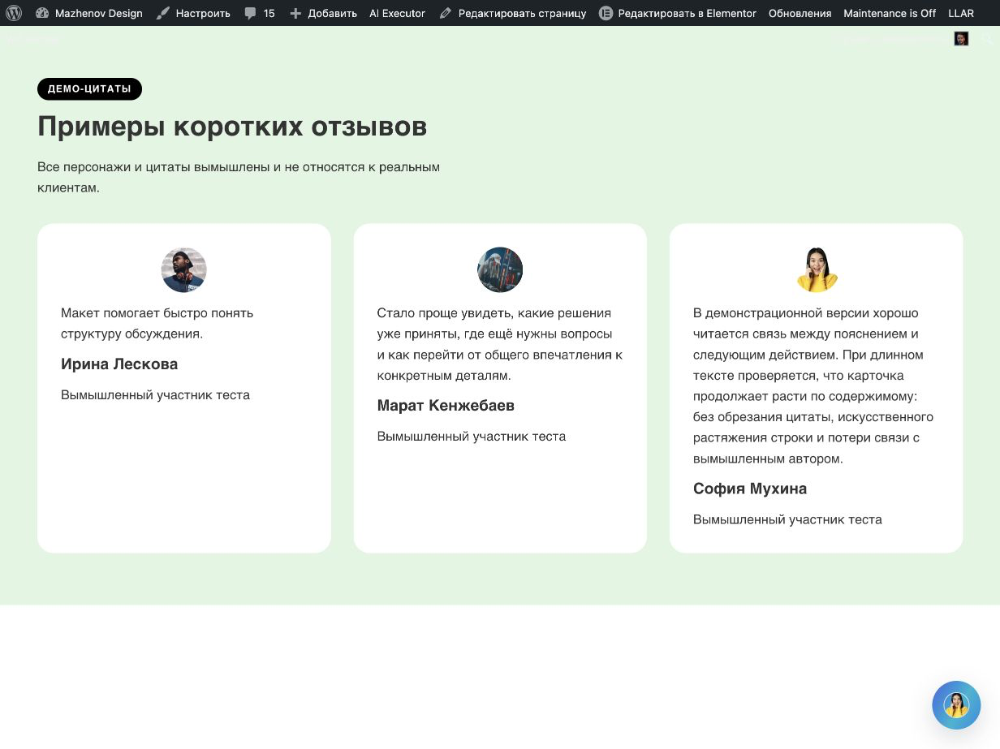
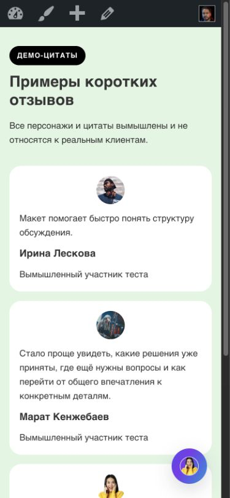
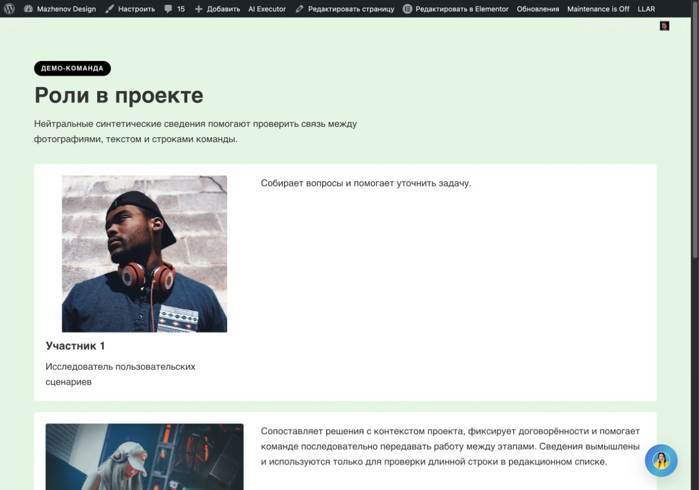
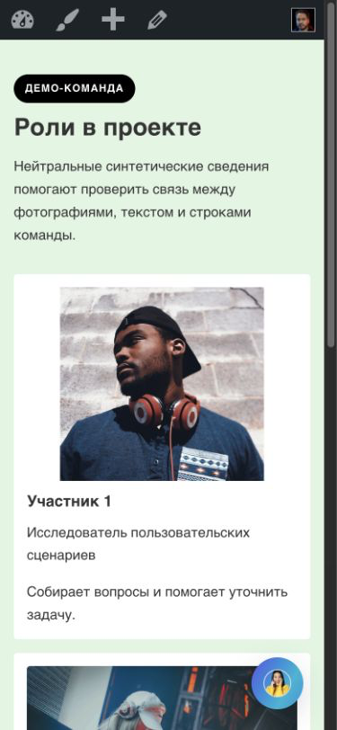
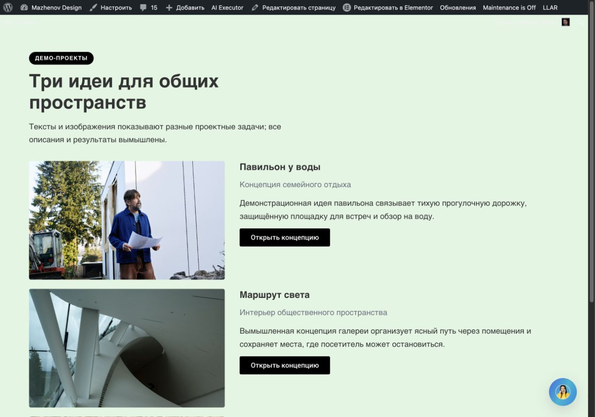
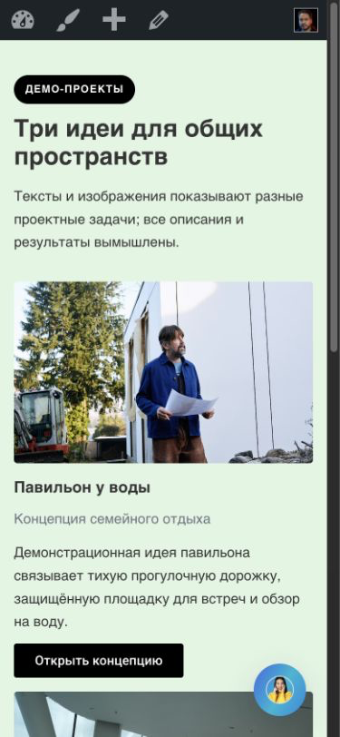
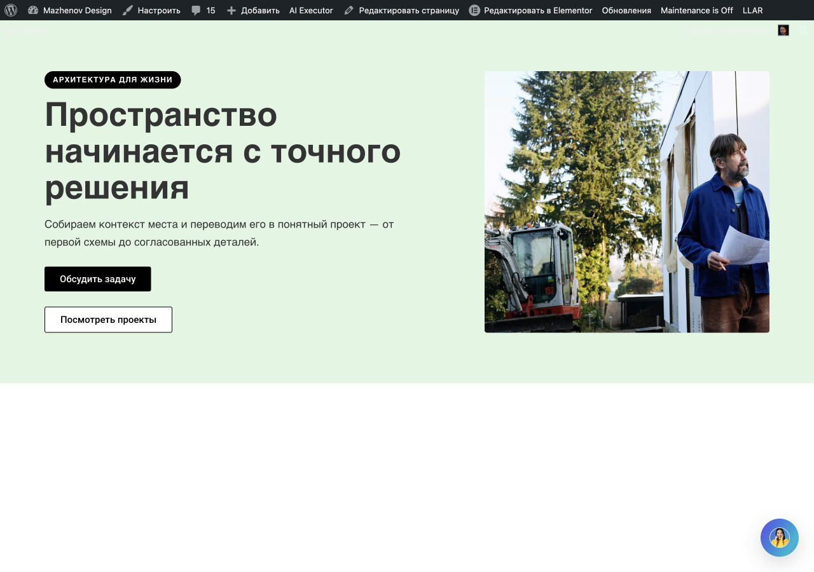
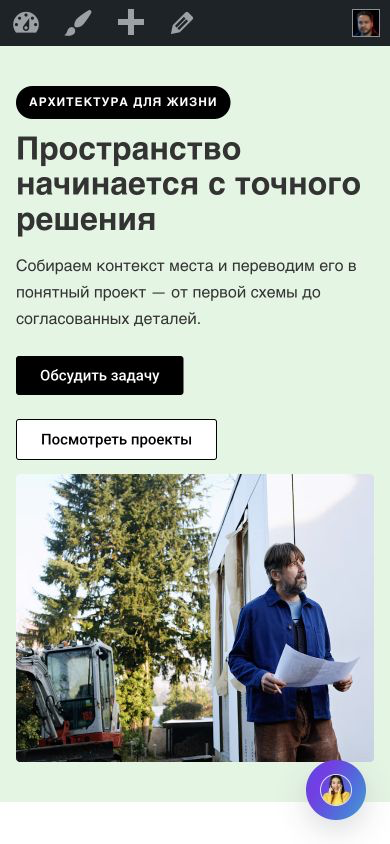

# Semantic media crop v301 — live acceptance checkpoint

**Date:** 2026-10-09

**Post:** 5214

**Runtime:** v02.11.301, source `8662a40564fe6cb5556e9e36e5ef2d6711d3e622`
**Gate:** **INCOMPLETE — 3 of 5 new full acceptances**

This checkpoint records the live work on the existing post and the point at which the required ownership guard stopped the next mutation. It does not claim the five-case task is complete.

## Source and install

The existing typed path remains `asset resolution → frozen BriefIR → one composition decision → frozen DesignPlan → ElementorIR/native compiler → validation → transaction/readback`. The source release already present in this checkout is v301. Commit `8662a40` parses explicit focal direction from the media's own Brief segment; commit `5228c27` carries the earlier semantic media crop provenance work. v301 was installed through WP Pusher before these live runs; Plugins and the reloaded Elementor editor both showed v02.11.301. No runtime source was changed during this continuation, so no version bump, package-hash rewrite, install, or runtime push was performed here. The prior push reported success, but independent `git ls-remote` failed to resolve `github.com`; current remote HEAD is not confirmed.

Current local checks were run against the installed source tree:

- `tests/design-pipeline-contract.php`: 982 checks OK.
- `tests/flex-generation-runtime.php`: 1497 checks OK; this harness includes `tests/m3-entities-contract.php` with its required `run_services_route` fixture context.
- `tests/elementor-patch-guard.php`: PASS.
- `tests/imported-template-catalog.php`: 158 manifest entries, 156 retrievable trees, 156 previews.
- `node --test tests/*.test.js`: 20/20 PASS.
- PHP lint for `includes/llm/brief-ir.php`, `tests/design-pipeline-contract.php`, and `tests/m3-entities-contract.php`: PASS.
- package probe: 253 files, zero manifest/hash mismatches, four validator scenarios passed. Its diagnostic attempt to JSON-encode opaque archive bytes reports malformed UTF-8; the probe documents that payload as out of scope and compact metadata round-trips.
- `git diff --check`: PASS at checkpoint time.

A direct standalone invocation of `tests/m3-entities-contract.php` fails because it is an include-only fixture that expects the harness variable `$run_services_route`; it passes when included by `flex-generation-runtime.php`. This is not counted as a passing standalone command.

## Baseline and method

Before the first v301 test, the user-cleared post 5214 had editor/public roots `[]`, and the Publish control was disabled. The baseline was confirmed before A. Each completed A–C operation was sent through the normal plugin chat path, followed by Publish/reload, independent native readback, public desktop/mobile measurement and screenshot review, then operation-scoped guarded Undo. The saved baseline was `[]` before the next scenario. Services and Process were not run.

Screenshots were captured from the existing public tab after Publish/reload with the bundled Browser Use runtime, saved as bytes, checked as PNG (JPEG sources converted where needed), opened, and visually reviewed. Public CSS viewports were 1280×900 and 390×844; raster dimensions are named in each file. The authenticated WordPress admin toolbar is present in the public captures. The fixed site-owned chat launcher was left unchanged and is reported separately from generated layout.

## A–E result matrix

| Case | Result | Generation | Lifecycle / restoration | Visual summary |
|---|---|---|---|---|
| A Testimonials `testimonials.grid` | **Accepted** | root `3cf7a71`; operation `wpae-5819cfe552194230`; identity `94ed1a85-54f8-4fb0-996a-c019662bd2b7`; generation revision 4, read-only descriptor revision 6 | Published/reloaded; native readback and public DOM checked; guarded Undo restored `[]` | All three small avatar images load and remain attached to the intended testimonial. The v301 native crop is top-center; the face that was vulnerable in v299 is visible. Grid cards keep equal row geometry, leaving natural extra blank area under shorter quotes. The external launcher only overlaps blank edge space in the reviewed public view. |
| B Team `team.editorial_rows` | **Accepted, SITE_OVERLAP noted** | root `d8a5d4d`; operation `wpae-eddeb29004a7fd74`; identity `1a2ab500-48bd-4a89-a650-65e296e7457b`; generation revision 4, descriptor revision 6 | Published/reloaded; 3-row native topology and exact participant/media bindings checked; guarded Undo returned `already_undone`, roots `[]` | Distinct editorial rows (not a repeated card grid), three synthetic participants and full biographies. Mobile stacks media/copy naturally. The fixed launcher overlaps a peripheral image edge; no external plugin/settings were changed. |
| C Portfolio `portfolio.editorial_rows` | **Accepted, SITE_OVERLAP noted** | root `a2fb9c8`; operation `wpae-4ee6a541a3ddc675`; identity `76b1e701-3393-4968-bf49-4c8bcd7d6a43`; generation revision 4, descriptor revision 6 | Published/reloaded; full generated subtree matched the native export with zero authored differences; guarded Undo restored `[]` | Three distinct image/copy/action rows; project media, full descriptions and hrefs stay entity-bound. Mobile order is image then copy/action. The fixed launcher touches the edge of a lower image; no generator-side spacing was added for it. |
| D Hero `hero.split_60_40.right` | **Partial — Undo blocked** | root `620e60e`; operation `wpae-2c4cd41e1ae6c757`; identity `2557eca5-59ba-4302-b22e-29935a61df96`; generation revision 4, refreshed descriptor revision 5 | Publish/reload, exact native subtree comparison, public DOM and screenshots passed. Guarded Undo refused before mutation; `undo_write_count=0`; baseline not restored. | The selected 60/40 right-media layout and copy-first mobile order are visible. The requested center-left focal direction lowered to Elementor's supported left-center position; the architect and plans remain visible at both widths. Both CTA labels and hrefs are present. The site launcher grazes only the bottom-right image edge on mobile. |
| E About `about.split_60_40.right` | **Not run** | no operation/root; write count 0 | Not started because D was still on the page and exact baseline `[]` was not confirmed | No screenshot or acceptance claim. |

Exact prompts, asset registry, hashes, raw traces, native exports, measurements and current PNGs are in `fixtures/`, `assets/`, `exports/`, `measurements/`, and `screenshots/`. `acceptance-matrix.json` is the machine-readable status source.

The real CSS viewport comes from the recorded page DOM and is separate from the saved PNG raster. In particular, the browser screenshot output for B/C is slightly smaller than the CSS viewport; the report keeps both dimensions rather than treating filenames as viewport evidence.

| Case | Public desktop CSS viewport | Desktop PNG raster | Public mobile CSS viewport | Mobile PNG raster |
|---|---:|---:|---:|---:|
| A | 1232×923 (baseline DOM immediately before A) | 1232×923 | 390×844 | 375×812 |
| B | 1280×900 | 1265×889 | 390×844 | 375×812 |
| C | 1280×900 | 1265×889 | 390×844 | 375×812 |
| D | 1280×900 | 1280×900 | 390×844 | 390×844 |

## D blocker and current page state

The required first read-only operation descriptor was refreshed for the exact D operation/identity/contract/root set. At revision 5 it was `available`; the owned native model check matched and had `write_count=0`. The ordinary “Отменить создание блока” control was then used once. It safely returned: **«Undo остановлен: несохранённые изменения редактора сохранены локально.»** The Undo request wrote nothing.

Inspection showed the editor had an extra empty `e-empty` root `f8deb7e`. It first appeared after an agent UI action while trying to select/export native JSON and survives an editor reload. The current public DOM still contains only generated Hero root `620e60e`; the editor canvas contains `620e60e` plus `f8deb7e`, and Publish is enabled. This extra root is not part of the accepted D operation. No one has manually removed it, the page has not been published again, and the ownership guard was not bypassed. Since the editor model remains dirty and the public/page baseline is not `[]`, E was not submitted.

As requested earlier for recovering a dirty editor, the existing Elementor URL was opened in a fresh Browser Use tab (`6`). It loaded the same Hero preview and empty “add container” area; Publish remained enabled. The prior dirty editor tab (`5`) was then closed. This reproduced the blocker on a fresh tab, so the guarded Undo was not retried and no page mutation was made.

At this checkpoint, public root IDs are `[620e60e]`; editor canvas root IDs are `[620e60e, f8deb7e]`; the operation-owned root for D is `[620e60e]`. Full document restoration is **not confirmed**.

The next state transition required by the acceptance contract is unresolved; until the dirty editor state is safely cleared through an authorized editor workflow and the D operation can be guarded-Undone, the five-acceptance gate remains open. A–C are three full acceptances; D is not counted; E has no write. Two full acceptances remain.

## `ui-ux-pro-max` review

The review used the skill's `--design-system` query for an architecture portfolio, plus targeted UX and typography searches. Its generic Portfolio Grid / motion-led suggestion, stock palette and font pairings were not applied: this is an existing branded WordPress page with accepted composition/profile decisions, and the skill's stack examples are not Elementor Flex rules. The applicable review criteria were image scaling and focal visibility, readable hierarchy and text measure, responsive ordering, and unobstructed controls. The saved viewport and full-mobile PNGs above were opened and inspected.

- A Testimonials: measured 48×48 top-center avatar renders keep all three faces visible; the longer quote grows naturally. Equal-height grid rows leave substantial blank space beneath shorter quotes. On full mobile the site launcher touches only blank card-edge space.
- B Team: the three entries remain editorial rows rather than a repeated grid, with complete biographies and each synthetic participant's image/title/position kept in the same row. The short first row has visible negative space set by its large image; no filler copy was added. The site-owned launcher overlaps a peripheral image edge on mobile but not the face or text.
- C Portfolio: all three project images remain attached to their own copy and action; images scale across the mobile stack and the exact CTAs remain visible. The launcher covers a small corner of the second image on mobile, away from its main subject and authored text.
- D Hero: the subject remains visible with the accepted Elementor left-center crop, the 60/40 desktop split is balanced, and both CTAs precede the image on mobile. The fixed launcher touches the lower-right photo edge without obscuring the subject or CTAs.

These overlay notes describe page integration and do not attribute the launcher to generated layout. E About has no render or visual finding because it was not run.

## Screenshots

### A — Testimonials, post 5214, root `3cf7a71`, operation `wpae-5819cfe552194230`, revision 6, public

CSS viewport: desktop 1232×923, raster 1232×923; mobile 390×844, raster 375×812. Full mobile raster: 375×1175.

[Desktop PNG](screenshots/A-public-desktop-after-reload.png)

[Mobile PNG](screenshots/A-public-mobile-390x844-site-chat-collapsed-after-open.png) · [Full mobile PNG](screenshots/A-public-mobile-full-390-site-chat-collapsed-after-open.png)

### B — Team, post 5214, root `d8a5d4d`, operation `wpae-eddeb29004a7fd74`, revision 6, public

CSS viewport: desktop 1280×900, raster 1265×889; mobile 390×844, raster 375×812. Full desktop raster: 1265×1699; full mobile raster: 375×1760.

[Desktop PNG](screenshots/B-public-desktop-1280x900.png)

[Mobile PNG](screenshots/B-public-mobile-390x844.png) · [Full mobile PNG](screenshots/B-public-mobile-full-390.png)

### C — Portfolio, post 5214, root `a2fb9c8`, operation `wpae-4ee6a541a3ddc675`, revision 6, public

CSS viewport: desktop 1280×900, raster 1265×889; mobile 390×844, raster 375×812. Full desktop raster: 1265×1235; full mobile raster: 375×1755.

[Desktop PNG](screenshots/C-public-desktop-1280x900.png)

[Mobile PNG](screenshots/C-public-mobile-390x844.png) · [Full mobile PNG](screenshots/C-public-mobile-full-390.png)

### D — Hero, post 5214, root `620e60e`, operation `wpae-2c4cd41e1ae6c757`, descriptor revision 5, public

CSS viewport: desktop 1280×900, raster 1280×900; mobile 390×844, raster 390×844. Full desktop/mobile rasters are also 1280×900 and 390×844. Visual/render acceptance passed; operation-scoped Undo and document restoration remain blocked as described above.

[Desktop PNG](screenshots/D-public-desktop-1280x900.png) · [Full desktop PNG](screenshots/D-public-desktop-full.png)

[Mobile PNG](screenshots/D-public-mobile-390x844.png) · [Full mobile PNG](screenshots/D-public-mobile-full-390.png)

## Separate statuses

- Source: v02.11.301 at `8662a40564fe6cb5556e9e36e5ef2d6711d3e622`.
- Push: prior git push reported success; independent remote HEAD remains unverified because GitHub DNS resolution failed.
- Install/editor: WP Pusher, Plugins PHP and reloaded editor inline version all v02.11.301, confirmed before live scenarios.
- Local checks: results above; runtime unchanged during this closeout.
- Live generation: four writes across A–D, all through the typed plugin-chat pipeline. A is the single justified exact-fixture replay after the v301 focal-intake source fix; B–D are one first generation each. There was no evidence-only replay.
- Full acceptance: 3/5. A–C count; D is partial due blocked guarded Undo; E not run.
- Page restoration: incomplete; public D root and dirty editor-only empty root remain as above.

## Publication verification after checkpoint commit

The scoped evidence/documentation commit `d3f55168c9cbd41cbf874202cbeb85b5fd6cdcc8` was pushed (`8662a40..d3f5516 main -> main`). `git ls-remote` could not resolve `github.com`, but the connected GitHub API compare of `main` against this SHA returned `identical`, `ahead_by=0`, `behind_by=0`; remote `main` is independently confirmed as `d3f55168c9cbd41cbf874202cbeb85b5fd6cdcc8`. This verifies the evidence commit and its runtime ancestor; it does not change the live acceptance status (3/5).
