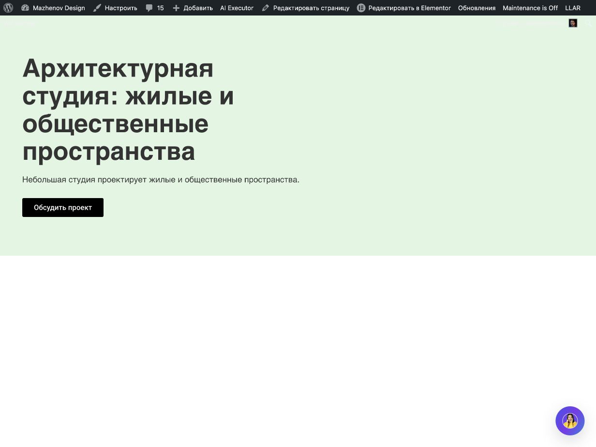
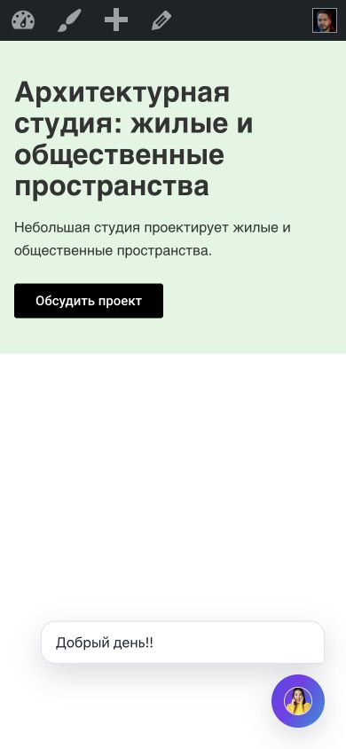
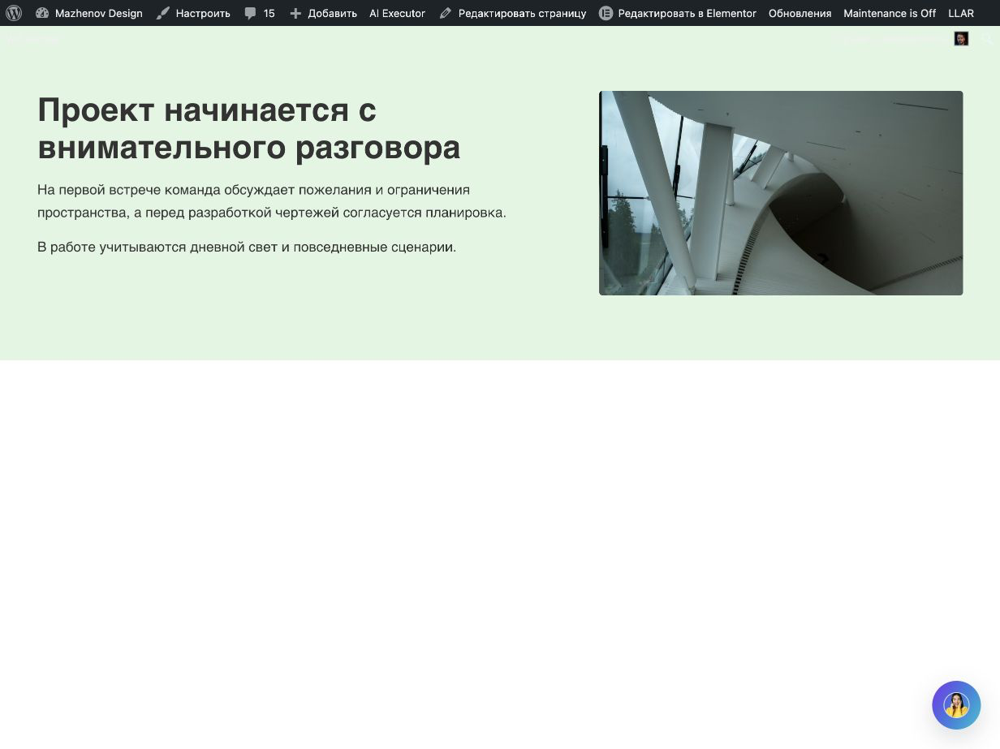
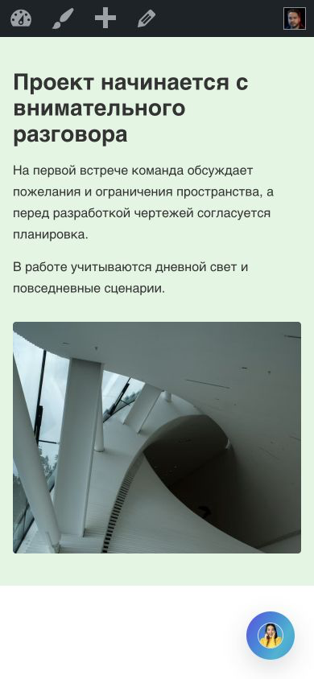
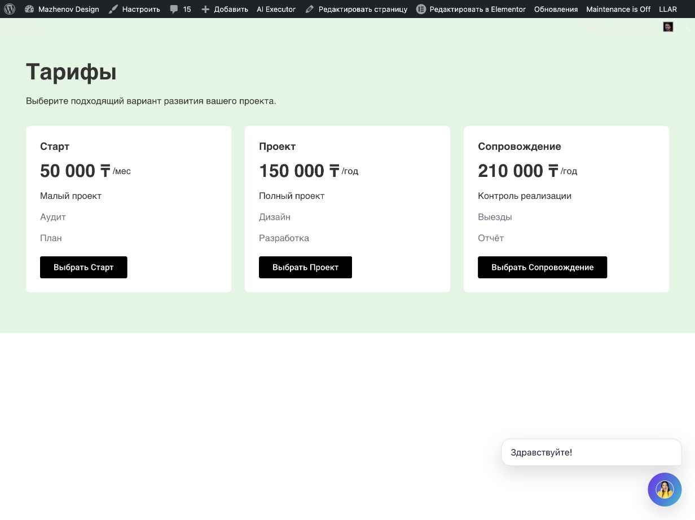
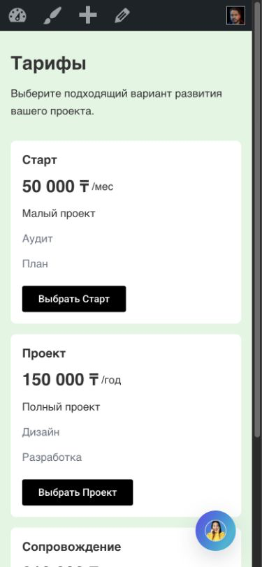
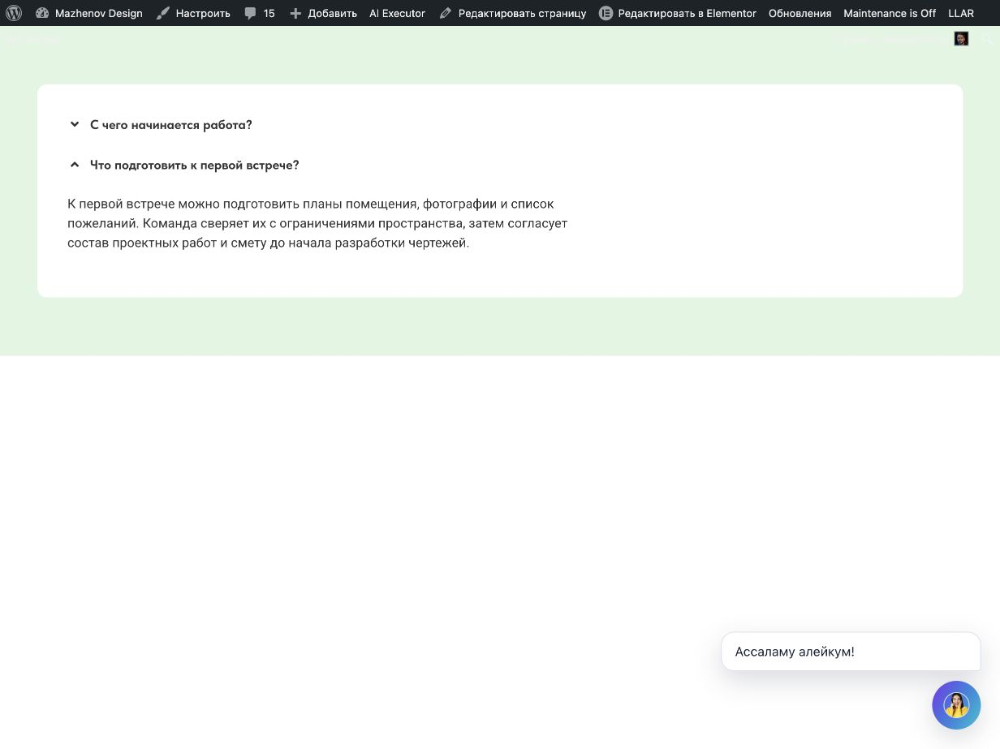
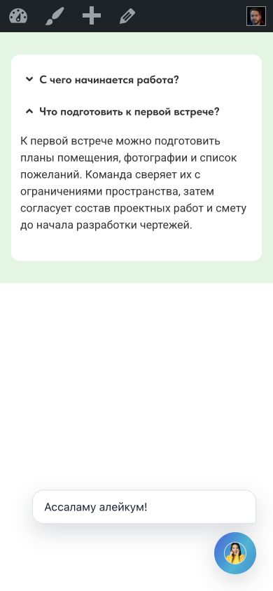

# Общий typed intake и generated/hybrid copy — итог live-приёмки v02.11.320

Дата фиксации: 2026-10-09
Страница: существующая `post=5214` (`https://mazhenov.kz/pricing-contract-live-v123/`)
Исходный runtime: v02.11.320, commit `5e7647193b6524a6609ccd0626139e23cb945c77`
Текущее закрытие live-gate: **не завершено**.

## Итог

За stage A–E получили четыре полных live-результата из пяти: Hero и About были опубликованы и приняты на v316; Pricing и FAQ — после фиксов на v320. Benefits завершился внешним отказом typed provider intake до transaction: `openrouter/free` вернул сначала `finish_reason=length`, затем некорректный JSON при HTTP 200; запись и root не создавались. Этот запрос после внешнего отказа не повторяли. Поэтому обязательный gate — **4/5; не хватает одной полной приёмки Benefits**.

Версии результатов различаются. A/B прошли на v316; затем общий intake/copy source продолжал меняться до v320. Их успешные сценарии намеренно не запускались повторно. На установленном v320 напрямую приняты D Pricing и E FAQ; следовательно, полный набор из пяти на точном v320 не доказан. Формальный этап также остаётся открытым: один обязательный fixture не принят, а A/B не были переисполнены на финальном source.

Дополнительный CTA smoke F также отказал до записи после двух provider calls; он не входит в A–E и не засчитывается. Ни один тестовый root не остался на странице: финальный editor/saved/public root set — `[]`.

## Source, install и границы реализации

- Source release: `v02.11.320`, HEAD `5e7647193b6524a6609ccd0626139e23cb945c77`. Этот runtime commit был опубликован в `origin/main` и независимо сверялся с remote HEAD.
- WP Pusher установил WP AI Executor v320. Plugins row показал v320; после reload inline editor config также показал v320. Снимки — `screenshots/plugins-php-v320.png` и `screenshots/wppusher-after-update-attempt-v320.png`.
- Runtime-путь использует общий typed intake в `includes/llm/brief-ir-structured.php`: request/family/copy policy/entity groups/facts/approved links/media intent и provenance валидируются до frozen Brief. Разрешённый provider copy привязывается к конкретным slots и утверждённым фактам; provider не создаёт Elementor JSON, widget controls или IDs.
- Composition/record/profile и responsive intent разрешаются в существующем DesignPlan до freeze; `ElementorIR` и native compiler переводят принятые решения в controls. Transaction, ownership/revision guards, native readback и operation-scoped Undo остаются write/lifecycle boundary. Library retrieval в этих обычных typed create запросах пропущен штатно.
- Lifecycle refresh перед Undo находится в `assets/js/elementor-llm-chat.js`; regression — `tests/typed-lifecycle-ui.test.js`. Intake source и entrypoint regression — `includes/llm/brief-ir-structured.php`, `tests/intake-production-contract.php`. Native paragraph serialization regression — `includes/elementor/elementor-ir.php` и Design Pipeline harness.
- Последующие source fixes до v320 закрывали обнаруженные общие отказы: facts inline в запросе; целостность точных multi-sentence facts; разбиение generated slots и About paragraph constraints; locale и grounded claims; generated slot IDs; сохранение paragraph breaks; синхронизацию descriptor lifecycle после native save.
- Production-intake поддержка в этом этапе перечислена для Hero, About, Benefits, Pricing, FAQ и CTA. Team, Testimonials и Portfolio сохраняют строгие entity/media bindings; генерация неподтверждённых участников, клиентов, цитат или проектов не разрешается. Stats/Metrics, карусели, tabs, forms, dynamic queries, header/footer/navigation, Theme Builder/popups, полный caller audit и независимый holdout остаются за границами этапа.

## Старый lifecycle gate v301

Историческая операция Hero из v301 (`wpae-2c4cd41e1ae6c757`, root `620e60e`) не была завершена operation-scoped Undo: проверка отказала до записи из-за дополнительного dirty editor root `f8deb7e`. После этого пользователь подтвердил, что очистил страницу. Это пользовательское изменение вернуло рабочий baseline к пустому документу; оно не превращает старый отказ в успешный Undo. Позднее descriptor старой операции стал недоступен (`contract_missing`), поэтому повторять mutation или подменять документ было небезопасно.

Перед v320 кейсами editor, saved native bootstrap и public DOM независимо показывали пустую страницу; Publish был disabled — согласно пользовательскому правилу это опубликованная и сохранённая страница. Каждый принятый сценарий начинался с этого baseline и завершался штатным Undo только собственного operation/root. Соседних или пользовательских roots не было.

## Матрица обязательных сценариев A–E

Все точные исходные запросы лежат в `fixtures/`. Метрики provider из trace, а не из operation-ledger latency, где latency отображается как ноль. SHA — frozen Brief и accepted Plan.

| Case | Live result | Record / композиция / профиль | Operation / identity / root / revision | Brief / Plan | Provider | Отдельные статусы |
|---|---|---|---|---|---|---|
| A Hero, generated | Принят на v316; 1 transaction write | `hero.text_only` / `hero.stacked_left` / `editorial_light` | `wpae-43faaa89c500ce46` / `94b7f560-a292-4a6e-a105-6cc0c02a4188` / `86f632a` / generation rev4, refreshed descriptor rev5 | `55db8372b46becadd4cb8fe88c9ec0c958abe35ccf80d6133d92a482a8de69c4` / `5302938a39b9568775fa456cbb36584ac5d50d4ae9863a87a929c2634f3cdc99` | OpenRouter `openrouter/free`, 1 call, 26.291 s, no retry, 2 generated slots | Lifecycle PASS; copy/readback PASS; responsive geometry PASS; visual PASS с заметкой о крупном четырёхстрочном H1; structural variation PASS; Undo восстановил `[]` |
| B About, hybrid | Принят на v316; 1 transaction write | `about.split_60_40.right` / `about.split_60_40` / `editorial_light` | `wpae-828235637ae7a3b4` / `d3d72eae-4fd9-462a-9bee-9f36a31c8256` / `2e88706` / generation rev4, refreshed descriptor rev5 | `412cf28b34d2760c98cb67d562122c9d5862b59c02833e1f12e25ea36bb499f3` / `4fb83cdf2e9ca56871729e12785c1120f7812bdcc4e77a344f796a0090d75042` | OpenRouter `openrouter/free`, 1 call, 8.814 s, no retry, 1 generated body slot containing 2 paragraphs | Lifecycle PASS; exact title/media alt + generated copy/readback PASS; responsive geometry PASS; visual PASS; image loaded/crop verified; Undo восстановил `[]` |
| C Benefits, generated descriptions | **BLOCKED / no-write** на v317; 0 transaction writes, root нет | До Plan не дошло | operation/root отсутствуют | frozen Brief/Plan отсутствуют | OpenRouter `openrouter/free`, 2 calls (1 schema retry), 64.635 s; first finish `length`, retry finish `stop` but 687-byte malformed JSON (`json_decode_error=4`, HTTP 200) | Technical no-write guard PASS; content/readback, layout, screenshot, Undo — NOT RUN; не засчитывается |
| D Pricing, hybrid | Принят на v320; 1 transaction write | `pricing.tiers` / `pricing.three_cards` / visual profile не задан (auto/default) | `wpae-cfdd03b533ba499a` / `3f91a581-0c11-4a62-832d-526e6e6ffacc` / `49f75d9` / generation rev4, refreshed descriptor rev5 | `c144d6959d95824d9bfdeee86b946e2c0d0326fba1a19817ea526bccb3d08a69` / `41087ec5a3467784bbbf0d3a2474d5d3147427a6cdefcad4f496d438dae1c1c3` | OpenRouter `openrouter/free`, 1 call, 15.810 s, no retry, 2 generated intro slots | Lifecycle PASS; exact three tiers/CTA/native readback PASS; desktop/tablet/mobile geometry PASS; visual PASS after native chat collapse (initial `SITE_OVERLAP` documented); Undo восстановил `[]` |
| E FAQ, hybrid | Принят на v320; 1 transaction write | record `faq.native`; composition identity `faq.linear` (native Elementor Accordion widget) / profile auto/default | `wpae-7780549fdb1b84d9` / `b8d3f2b1-c7bb-4e8b-8172-4edb8a345259` / `d304cd6` / generation rev4, refreshed descriptor rev6 | `8e23ef8c79c9504620522325bb966920966618ca78788b37285fc4ce838cd398` / `6508dfd9aa7a4b109da3f938fd373c7e6f65f3b314ffe183a992c2d1e97bc0c7` | OpenRouter `openrouter/free`, 1 call, 23.774 s, no retry, 2 generated answer slots | Lifecycle PASS; exact Q order + fact-bound native answer readback PASS; native Accordion interaction PASS; desktop/mobile PASS; visual PASS; Undo восстановил `[]` |

### Content, topology и render observations

- **A Hero.** Fixture: `fixtures/A-hero-generated.txt`. Получен fact-bounded заголовок «Архитектурная студия: жилые и общественные пространства», краткое описание о проектировании жилых и общественных пространств и точная CTA «Обсудить проект» → `#contact`. Фото запрещено и отсутствует. На desktop CSS 1232×923 H1 — 52 px, box x46/y112, ширина 608 px, высота 228.8 px; CTA y408.9. На mobile CSS 390×844 H1 — 28 px, ширина copy 358 px, CTA видна. Overflow/clipping не обнаружены. PNG: desktop 1232×923, mobile 390×844.
- **B About.** Fixture: `fixtures/B-about-hybrid.txt`. Заголовок точный: «Проект начинается с внимательного разговора». Generated paragraphs: «На первой встрече команда обсуждает пожелания и ограничения пространства, а перед разработкой чертежей согласуется планировка.» и «В работе учитываются дневной свет и повседневные сценарии.» Они выведены из разрешённых фактов; неподтверждённых обещаний и CTA нет. Разрешённая фотография loaded (`naturalWidth=1200`, `naturalHeight=675`), точный alt; desktop image box 448×252 справа от текста, crop `cover`, `object-position:50% 0%`; mobile copy предшествует изображению, которое занимает 358×288. Root: desktop 1232×412, mobile 390×681.8. Overflow/clipping нет. PNG: desktop 1232×923, mobile 390×844.
- **C Benefits.** Fixture: `fixtures/C-benefits-generated.txt`; точные три заголовка сохранены в запросе. Для предыдущего v307 отказа trace показал подтверждённую source-причину: parser сохранил quoted headings как generic text без `feature_title` roles и stable group IDs, поэтому provider не вызывался и Plan отклонил incomplete Benefits groups. Исправление v308 добавило ограниченный parser exact heading list. Одно повторное обращение по тому же fixture на v317 прошло provider intake, но внешний ответ после schema retry был malformed JSON. `write_count=0`, editor/public roots оставались `[]`. После этой внешней ошибки exact fixture не повторяли; он не принят и не заменён другим кейсом.
- **D Pricing.** Fixture: `fixtures/D-pricing-hybrid.txt`. Brief сохранил три тарифа и точные цены/периоды/features/CTA: Старт — `50 000 ₸/мес`, `Аудит`, `План`, «Выбрать Старт» → `#start`; Проект — `150 000 ₸/год`, `Дизайн`, `Разработка`, «Выбрать Проект» → `#project`; Сопровождение — `210 000 ₸/год`, `Контроль реализации`, `Выезды`, `Отчёт`, «Выбрать Сопровождение» → `#support`. Generated intro: «Тарифы»; «Выберите подходящий вариант развития вашего проекта.» Native readback authored fields совпали; расхождение serialized trees только в Elementor-normalized fields. Desktop root x0/y32/w1232/h559.2; три карточки x46/434/822, ширина 364 px, gap 24 px; CTA выровнены по нижней оси. Tablet CSS width 1024, effective root/document width 1009, Plan stack выполнен. Mobile CSS viewport `window.innerWidth=390`, `innerHeight=844`; screenshot raster 375×812. Карточки сложены вертикально, растут по содержимому, горизонтального overflow нет. Initial public кадр сохранил перекрытие второй CTA site-owned greeting; greeting был свёрнут штатным UI, без CSS/DOM подмены, после чего все три CTA доступны. Есть отдельный кадр нижней CTA.
- **E FAQ.** Fixture: `fixtures/E-faq-hybrid.txt`. В native output имеется Elementor `accordion` widget с точными ordered questions. Короткий ответ: «Работа начинается с обсуждения задачи, пожеланий и исходных материалов.» Длинный ответ: «К первой встрече можно подготовить планы помещения, фотографии и список пожеланий. Команда сверяет их с ограничениями пространства, затем согласует состав проектных работ и смету до начала разработки чертежей.» DOM после завершения раскрытия показал полный текст без clipping/горизонтального overflow; заголовки и ответы остаются связаны в двух элементах Accordion. В first v319 result parser отсёк часть approved facts, а второй ответ продублировал первый. v320 source correction сохраняет предложения фактов до boundary и проверяет дубликаты между slots; тот же exact fixture после этого дал оба разных ответа. Native root в readback имеет 1 Accordion widget; Elementor сериализация отличается только нормализованными платформенными значениями. Desktop/mobile CSS viewport 1232×923 и 390×844.

## Generation history и повторы

| Fixture | Попытки и основание | Итог |
|---|---|---|
| A | Один accepted submit на v316. | Не повторяли после успеха. A/B не доказывают визуальное поведение именно v320. |
| B | Один accepted submit на v316. | Не повторяли после успеха. |
| C | v307: confirmed source parser defect, provider 0/write 0. После v308 parser fix точный fixture отправлен один раз на v317: 2 provider calls, malformed retry, write 0. | Не повторяли после внешнего отказа. Не засчитан. |
| D | v317 first live result (`wpae-18bff12aaae6edb1`, root `2456a75`, rev4; provider 1 / 27.198 s) был сохранён и позже operation-scoped Undone. v319 (`wpae-78fd4d88c11c961d`, `f197063`, rev4; 1 / 5.759 s) не получил валидного public-mobile screenshot: viewport override не действовал; root был undone. v320 повторён после общего source изменения, влияющего на typed intake/approved facts; final evidence полный. | 3 generation writes за stage, один финальный полный pass; прошлые промежуточные evidence сохранены в `history/prior-attempts/`. |
| E | v319 (`wpae-6b23f64a0c7c25c8`, root `5e2450f`, rev4) содержал подтверждённый общий parser defect: lost facts и duplicated answer; operation была Undone. После v320 parser source fix тот же exact fixture выполнен один раз. | 2 generation writes; финальный v320 результат полный pass; первый дефект сохранён в `history/prior-attempts/`. |
| F CTA smoke | Один обычный plugin-chat submit на v320; 2 provider calls за 90.169 s, первый finish `length`, затем HTTP request failure. | `write_count=0`; не входит в A–E и не засчитывается. Никакой замены Benefits этим сценарием не делали. |

Всего для обязательных A–E зафиксированы девять submit/operation попыток: A1, B1, C2 включая исходный v307 parser отказ и post-fix provider отказ, D3, E2; только четыре полных принятия. Число внутренних provider calls отдельно указано в таблице. CTA F — одна дополнительная no-write попытка. Это не цикл генераций: повторы D/E соответствовали указанным source/evidence изменениям; C после внешнего отказа не повторялся.

## Lifecycle, readback и root restoration

На каждом принятом v320 D/E перед Undo получен свежий read-only descriptor для той же operation/identity/accepted contract/root. Owned-model и full-document checks прошли; guarded Undo вызван один раз на operation. После Undo editor bootstrap, saved state и public DOM показывали `[]`. A/B также имеют собственные post-Undo editor/public exports с `[]`. C/F не записывали root и не требовали Undo.

Итоговые независимые baseline evidence: `exports/D-pricing-post-undo-baseline-v320.json`, `exports/E-faq-post-undo-baseline-v320.json`, `history/prior-attempts/A-post-undo-baseline-v316.json`, `history/prior-attempts/B-post-undo-editor-baseline-v316.json`, `history/prior-attempts/B-post-undo-public-baseline-v316.json`. Финальный root set в editor/saved/public: `[]`.

## Скриншоты и visual review

Свежие public PNG были получены после Publish/reload, байты сохранены, MIME/PNG dimensions проверены; JPEG источники преобразованы, затем PNG открыты и визуально проверены. Фактический CSS viewport взят из `window.innerWidth/innerHeight` и DOM measurements отдельно от raster size. Разбор дополнен `ui-ux-pro-max` design-system, landing, style, typography и UX searches; это advisory, а не замена DOM и PNG review.

### A — Hero, post=5214, root `86f632a`, operation `wpae-43faaa89c500ce46`, generation rev4 / refreshed descriptor rev5

Public desktop CSS 1232×923, PNG 1232×923:

[PNG](history/A-B/screenshots/A-public-desktop-v316.png)

Public mobile CSS 390×844, PNG 390×844:

[PNG](history/A-B/screenshots/A-public-mobile-390x844-v316.png)

### B — About, post=5214, root `2e88706`, operation `wpae-828235637ae7a3b4`, generation rev4 / refreshed descriptor rev5

Public desktop CSS 1232×923, PNG 1232×923:

[PNG](history/A-B/screenshots/B-public-desktop-v316.png)

Public mobile CSS 390×844, PNG 390×844:

[PNG](history/A-B/screenshots/B-public-mobile-390x844-v316.png)

### D — Pricing, post=5214, root `49f75d9`, operation `wpae-cfdd03b533ba499a`, generation rev4 / refreshed descriptor rev5

Public desktop CSS 1232×923, PNG 1232×923:

[PNG](screenshots/D-pricing-public-desktop-v320.png)

Public mobile after native collapse of site greeting: CSS 390×844, PNG 375×812; full screenshot PNG 375×1089. Initial overlay frame and third-CTA accessibility frame are retained separately.

[PNG](screenshots/D-pricing-public-mobile-after-chat-close-v320.png)

### E — FAQ, post=5214, root `d304cd6`, operation `wpae-7780549fdb1b84d9`, generation rev4 / refreshed descriptor rev6

Public desktop CSS 1232×923, PNG 1232×923:

[PNG](screenshots/E-faq-public-desktop-v320.png)

Public mobile CSS 390×844, PNG 390×844:

[PNG](screenshots/E-faq-public-mobile-v320.png)

## Проверки и публикация

Проверки выполнены после source v320 и не повторялись при последующей документационной работе, так как runtime не менялся:

- Design Pipeline Contract — **986 checks OK**.
- Flex Runtime — **1579 checks OK**.
- Elementor patch guard — **PASS**.
- Node suites — отдельный rerun **27/27 PASS** после timeout одного дочернего процесса в параллельном запуске.
- PHP lint изменённых PHP-файлов — **PASS**.
- Каталог: 158 manifest, 156 retrievable, 156 previews; FAQ candidates 5, Services 2.
- Package probe — 253 hashes, 0 mismatches.
- `git diff --check` для исходной версии — **PASS**.
- Documentation/evidence diff check выполняется при финализации этого отчёта.

| Публикационный статус | Значение |
|---|---|
| Runtime source commit | `5e7647193b6524a6609ccd0626139e23cb945c77` |
| Runtime push / remote HEAD | Подтверждены для source commit |
| WP Pusher install | v320, WP AI Executor only |
| Plugins PHP plugin version | v320 |
| Reloaded editor inline version | v320 |
| Final live root set | `[]` |
| Current docs/evidence commit | Фиксируется отдельно от runtime commit в handoff после scoped commit |
| Current docs/evidence push | Отдельно от runtime push; подтверждается remote HEAD check |

Это фактический промежуточный результат, а не закрытие задачи: Benefits остаётся внешне заблокирован, и принятых A–E всего четыре.
